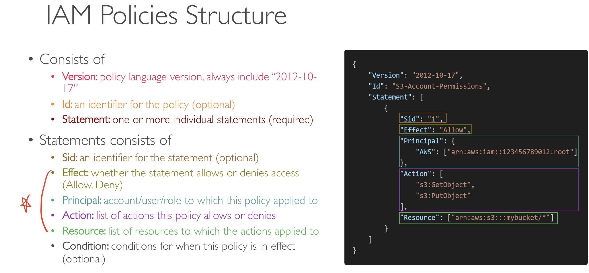

## IAM(Identity Access Manangement)

User나 Group에 least privilege principle(user가 필요로한 permission 그 이상을 부여하지 않는다.)를 따르는 policy를 적용하여 permission을 관리할 수 있다.

- Root Account는 기본적으로 생성된다.
- Users는 조직에 들어가는 사람들을 의미한다. 한 User가 여러 Group에 속할 수 있다.
- Groups에는 오직 User만 들어갈 수 있다. 다른 Group은 불가능

### Policy inheritance

그룹마다 Policy를 지정할 수 있고 해당 그룹에 속하는 유저에게 적용된다. 유저가 여러 그룹에 속한다면 해당 그룹들의 Policy를 모두 적용받게 된다.

### Policy Structure

  
Password Policy  
IAM User들이 따라야하는 Password Policy를 설정한다.  
Policy에는

- password 최소 길이
- 특정 character 타입 포함
- User들이 직접 password 변경 가능 여부
- password 만료 시점
  존재한다.

### MFA(Multi Factor Authentication)

MFA = password + security device you own
password가 유출되더라도 account를 계속 지켜낼 수 있다.
MFA 사용 가능한 옵션들:

- Virtual MFA device: 한 device에서 여러 계정에 대한 multiple token들을 가질 수 있게한다.
- Universal 2nd Factor(U2F) security key: 물리적인 Device로 이 또한 하나의 Key에서 multiple token들을 가질 수 있다.
- Hardware Key Fob MFA Device: OTP같은거
- Hardware Key Fob MFA Device for AWS GovCloud

### User가 AWS를 접근할 수 있는 방법

- AWS Management Console(password+ MFA 필요)
- AWS Command Line Interface(Access Key 필요): command-line shell을 통해 AWS Service를 cmd 입력을 통해 사용 가능(SDK for Python으로 만들어짐)
- AWS Software Developer Kit(Access Key 필요): 라이브러리들로 프로그래밍적으로 AWS Service를 사용 가능하다.
  Access key들은 secret이므로 password와 같은 역할을 한다.

### IAM Roles for Service

AWS Resource에 접근하는 것은 항상 User만 있는 것이 아니다. 필요에 따라 Service에서 Resource로 접근하는 경우가 많이 존재한다.
따라서 Service에게 Resource 접근 Permission을 부여 및 관리를 IAM Role에서 할 수 있다.
Ex) EC2 Instance Role, Lambda Function Role 등

### IAM Security Tools

- IAM Credentials Report(account-level): 해당 계정에 있는 모든 User들과 그들의 Credential 상태를 Listing한 Report
- IAM Access Advisor(user-level): User에게 허용된 Service들과 그 Service들이 마지막으로 접근된 시점을 보여준다.

### IAM Guidelines & Best Practices

- AWS account setup에만 Root account를 사용한다.
- 실제 User 당 하나의 AWS User 생성
- User들은 Group에 포함시키고 해당 Group에 Permission을 부여한다.
- Strong password Policy + MFA 사용
- AWS Service들에 Permission을 줄 때는 IAM Role 사용
- 부여된 Permission들을 검토하고 싶으면 IAM Credentials Report & Access Advisor 사용한다.
- IAM User와 Access Key들은 절대로 공유하지 않는다.
- least privilege principle

### Summary

- Users: 실제 User와 mapping, AWS Console에 대한 password들을 가진다.
- Groups: User들만을 가질 수 있음
- Policies: User 또는 Group에 대한 Permission 부여를 나타낸 JSON doc
- Roles: Service에 Permission 부여
- AWS CLI: cmd를 이용한 AWS service 사용
- AWK SDK: 프로그래밍을 통한 AWS service 사용
- Access Keys: CLI 또는 SDK를 활용하여 AWS에 access할 때 필요한 secret
- Audit: Credentials Report & IAM Access Advisor
