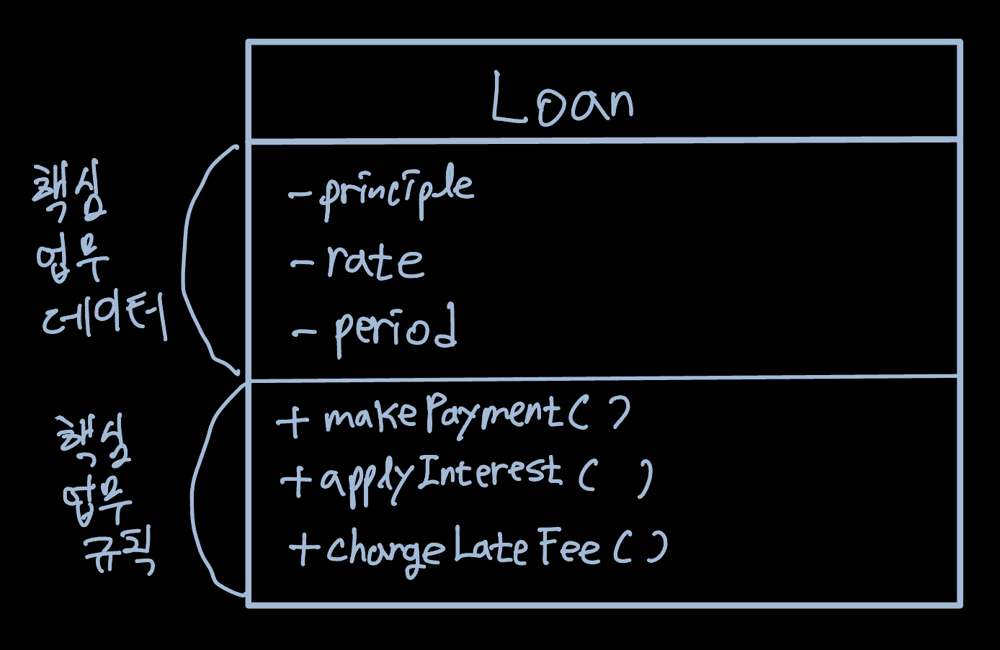
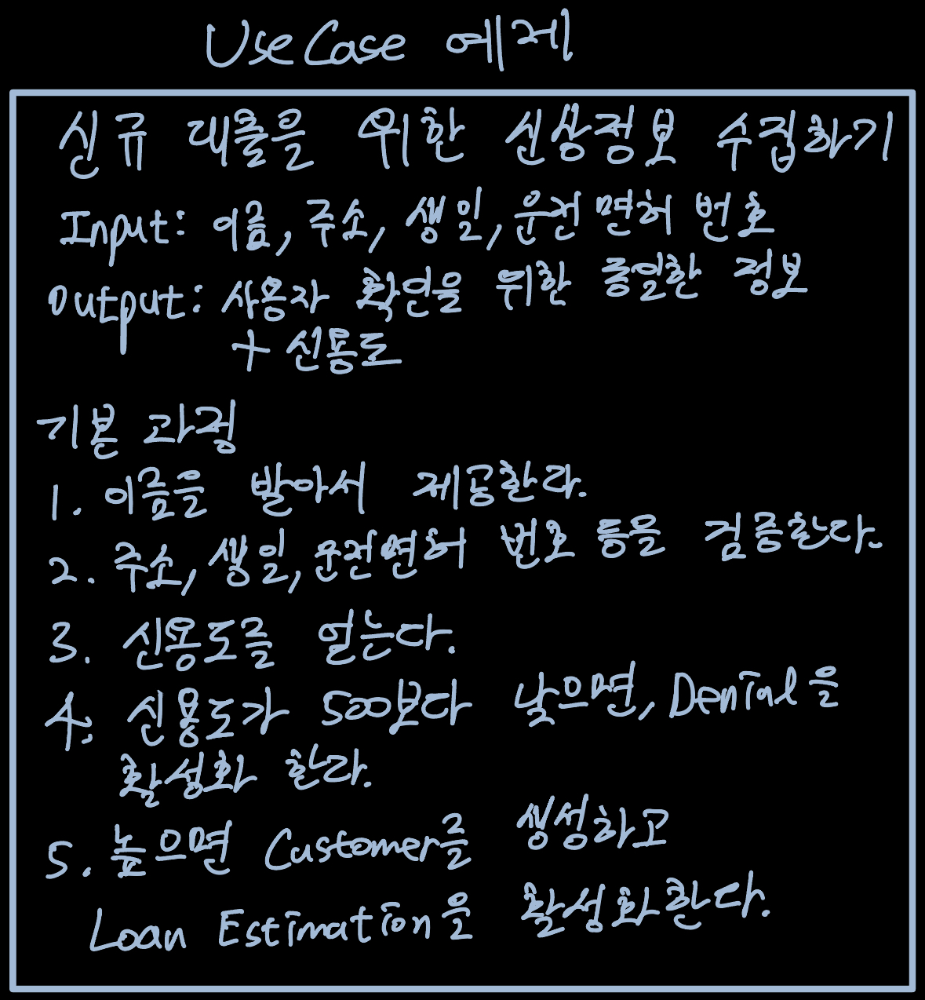

Business Rule은 컴퓨터 상으로 구현했는지와 상관없이 사업적으로 수익을 얻거나 비용을 줄일 수 있어야 한다.  
그리고 사업 자체에 핵심적이며, 시스템에 없더라도 그대로 존재하는 경우 Critical Business Rule(핵심 업무 규칙)이라 부른다.

이러한 Critical Business Rule에는 항상 Critical Business Data(핵심 업무 데이터)가 요구된다.  
이러한 Data는 시스템이 없어도 존재하는 Data이다.  
Critical Business Rule과 Data는 본질적으로 결합되어 있기에 객체화하기 좋다. 그리고 이러한 유형의 객체를 **Entity**라고 한다.

# Entity

Entity는 핵심 업무 데이터를 직접 포함하거나 매우 쉽게 접근할 수 있고 이를 기반으로 핵심 업무 규칙을 구체화한다.  
따라서 Entity의 인터페이스는 핵심 업무 데이터를 기반으로 동작하는 핵심 업무 규칙을 구현한 함수로 구성된다.

이러한 종류의 클래스를 만들 때 시스템의 나머지 모든 고려사항과 분리시킨다.  
따라서 DB, UI, framework 등은 여기에 전혀 포함되지 않고 오직 업무에 관한 내용만 들어간다.

Entity의 유일한 조건은 핵심 업무 데이터와 규칙을 하나로 묶어서 별도의 소프트웨어 모듈로 만들어야 한다는 것이다.

# UseCase

UseCase는 app에 특화된 업무 규칙으로 시스템이 사용되는 방법을 설명한다.  
사용자가 제공해야하는 입력, 사용자에게 보여줄 출력 그리고 해당 출력을 생성하기 위한 처리 단계를 기술한다.  
따라서 시스템의 요소로 존재해야만 의미가 있고 시스템이 동작하는 방법을 정의하고 제약함으로서 수익을 얻거나 비용을 줄이는 업무 규칙이다.

UseCase에는 인터페이스로 들어오는 데이터와 되돌려주는 데이터를 형식 없이 명시한다는 점을 제외하면 어떠한 UI도 명시하지 않는다.  
UseCase만 봐서는 이게 웹을 통해 전달되는지, 콘솔 기반인지, 순수 서비스인지 구분하기 불가능하다.  
이 점은 UseCase에서 사용자와 Entity 사이의 상호작용을 규정하며 시스템에서 데이터가 들어오고 나가는 방식과는 무관하다는 것을 보여준다.

Usecase 또한 객체로써 app에 특화된 업무 규칙을 구현하는 하나 이상의 함수를 제공한다. 입력 데이터, 출력 데이터, Usecase가 상호작용하는 Entity에 대한 참조 데이터 등의 데이터 요소를 포함한다.
고수준 Entity에서는 상대적으로 저수준인 Usecase에 대해 아무것도 알지 못하며 Usecase에서는 Entity에 대해 알고 있다.  
Usecase가 Entity보다 더 저수준인 이유는 시스템의 입력과 출력에 보다 더 가깝게 위치하기 때문이다. Entity는 수많은 app에서 사용될 수 있도록 일반화된 것이므로 입출력에서 더 멀리 떨어져 있다.

# 요청 및 응답 모델

Usecase에서는 단순한 요청 데이터 구조를 입력으로 받아드리고 단순한 응답 데이터 구조를 출력으로 반환한다. 데이터 구조는 어떤 것에도 의존하지 않는다. 따라서 웹에 대해서 알지 못하며 그 어떤 UI에도 종속되지 않는다.  
만약 요청 응답 모델이 독립적이지 않다면 그 모델에 의존하는 Usecase도 모델이 수반하는 의존성에 간접적으로 결합되어 버린다.

Entity와 요청 및 응답 모델은 상당히 많은 데이터를 공유하므로 Entity 객체를 가리키는 참조를 요청 및 응답 모델에 포함하고 싶어진다.  
하지만 이 둘의 목적은 완전히 다르기에 두 객체를 묶는 행위는 SRP와 OCP를 위배하게 된다.

# 결론

업무 규칙은 소프트웨어 시스템의 핵심적인 기능으로 시스템이 존재하는 이유다.  
이러한 업무 규칙은 UI나 DB와 같은 저수준 고려 사항으로 인해 오염되서는 안되며 이를 위해 업무 규칙은 시스템의 심장부에 위치하고 나머지가 이 심장부에 plugin되어야 한다.
**시스템에서 가장 독립적이며 가장 많이 재사용할 수 있는 코드가 바로 업무 규칙이다.**
