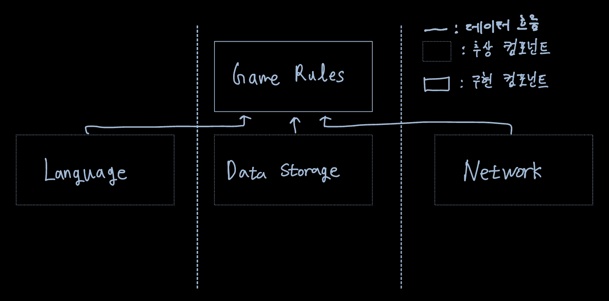
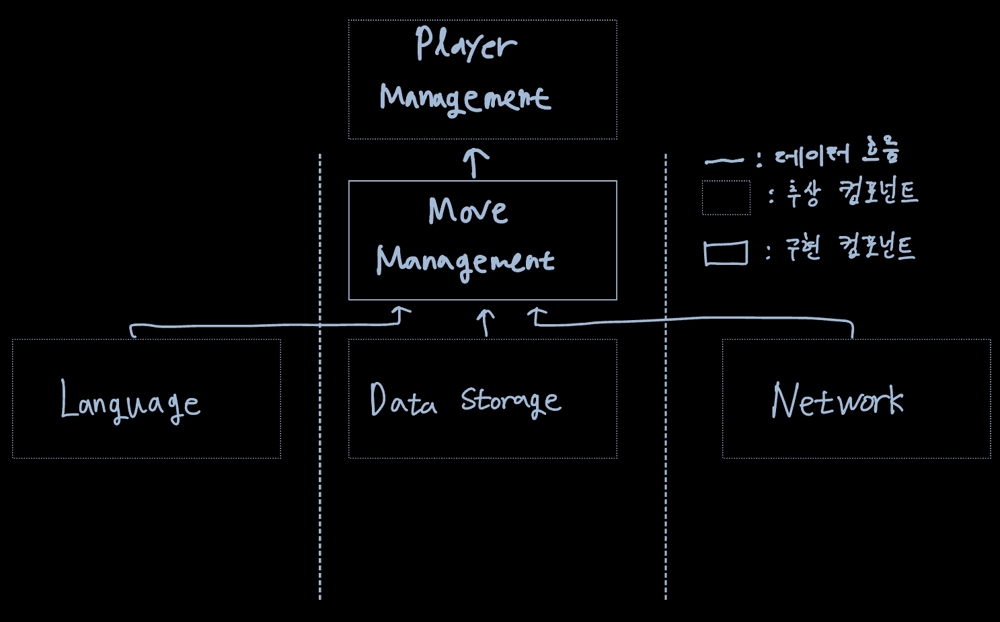
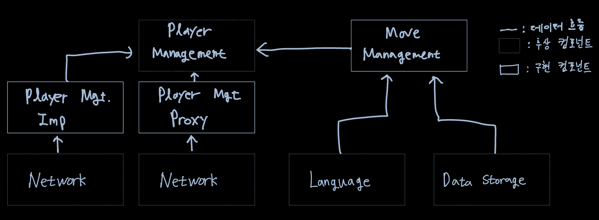

시스템이 UI,Business Rules, DB 세 가지 컴포넌트로만 구성된다고 생각하지 쉽다.  
단순한 시스템이면 그럴 수 있지만 대다수의 시스템에서 컴포넌트의 개수는 이보다 많다.

간단한 게임을 통해 이 세 가지 컴포넌트를 쉽게 상상해보고 이게 정말 전부일지 알아본다.

# 움퍼스 사냥 게임

텍스트 기반으로 하는 이 게임은 플레이어가 명령어를 입력하며, 컴퓨터는 플레이어가 보고, 듣고, 경험한 것들로 응답한다.  
텍스트 기반 UI는 그대로 유지하되 게임 규칙과 UI를 분리해서 볼 수 있을 것이며 UI는 언어별로 나누고 게임 규칙에서는 언어 독립적인 API를 사용해서 UI 컴포넌트와 통신할 것이다. 또 게임의 상태를 저장한다고 가정하면 게임 규칙에 API를 생성하여 데이터 저장소 컴포넌트와 통신하도록 한다.  
그러면 아래와 같이 의존성 규칙을 준수하는 그림이 나올 것이다.

# 클린 아키텍처?

아키텍처 접근법을 적용해서 UseCase, 경계, Entity 그리고 관련 데이터 구조를 모두 만드는 일은 쉬운 것처럼 보인다.
하지만 UI에서 언어가 유일한 변경의 축이 아니며 이 밖에도 텍스트를 주고받는 메커니즘을 다양하게 만들고 싶을 수 있다.  
따라서 변경의 축에 의해 정의되는 아키텍처 경계가 잠재되어 있을 수 있고 이 경계를 가로지르는, 그래서 언어를 통신 메커니즘으로부터 격리하는 API를 생성해야 할 수도 있다.

그림의 점선 테두리들은 API를 정의하는 추상 컴포넌트이며, 해당 API는 위/아래의 컴포넌트가 구현한다.  
API는 구현하는 쪽이 아닌 사용하는 쪽에 정의되고 소속된다.  
GameRules 내부 코드에는 Language 내부 코드에서 구현하는 다형적 Boundary 인터페이스를 가지고 있다. 또한 Language에서 사용하고 GameRules 내부에서 구현하는 Boundary 인터페이스도 존재한다.
Boundary 인터페이스가 정의하는 API는 의존성 흐름의 상위에 위치한 컴포넌트에 속한다.

인터페이스를 구현하는 변형들은 모두 제거하고 순전히 API 컴포넌트만 그린 다이어그램으로 단순화할 수 있다.

이 다이어그램에서 데이터 흐름은 두 개로 분리된다.  
왼쪽의 흐름은 사용자와의 통신에 관여하며, 오른쪽의 흐름은 데이터 영속성에 관여한다.  
두 흐름은 최상단 GameRules에서 서로 만나며, GameRules는 두 흐름이 모두 거치게 되는 데이터에 대한 최종 처리기가 된다.

# 흐름 횡단하기

그럼 데이터 흐름은 항상 두 가지일까?  
절대로 아니다. 만약 게임에서 여러 사람이 함께 플레이할 수 있도록 한다고 해보자.

네트워크 컴포넌트가 추가되어 이제 데이터 흐름이 3개로 분리되고 이는 모두 GameRules에서 제어한다.  
따라서 **시스템이 복잡해질수록 컴포넌트 구조는 더 많은 데이터 흐름으로 분리될 것이다.**

# 흐름 분리하기

그럼 모든 흐름이 결국에는 상단의 단일 컴포넌트에서 서로 만난다고 생각할 수 있지만 이 또한 아니다.  
GameRules 컴포넌트를 보면 게임 규칙 중 일부는 지도와 관련된 메커니즘을 처리한다. 그리고 이러한 움직임을 처리하는 정책보다 더 고수준인 플레이어의 상태를 관리하는 정책이 존재한다.

그리고 MoveManagement는 플레이어의 움직임을 컴퓨터에서 직접 처리하지만 PlayerManagement를 서버에서 처리된다고 가정해보자.  
그러면 PlayerManagement는 접손된 모든 MoveManagement 컴포넌트에 Micro-service API를 제공한다.

따라서 MoveManagement와 PlayerManagement 사이에는 완벽한 형태의 아키텍처 경계가 존재한다.

# 결론

이 예제를 가져온 이유는 **아키텍처 경계가 어디에나 존재한다**는 사실을 보여주기 위함이다.  
아키텍트로서 어디에 경계를 둘지, 완벽하게 구현할 경계는 무엇인지, 무시할 경계는 무엇인지를 계속해서 지켜봐야 한다.  
만약 경계를 무시했는데 경계의 필요성에 대한 조짐이 보이면 이를 구현하는 비용과 무시해서 생기는 비용을 따지고 무시해서 생기는 비용보다 더 적어지는 변곡점에서 그 경계를 구현하자.
