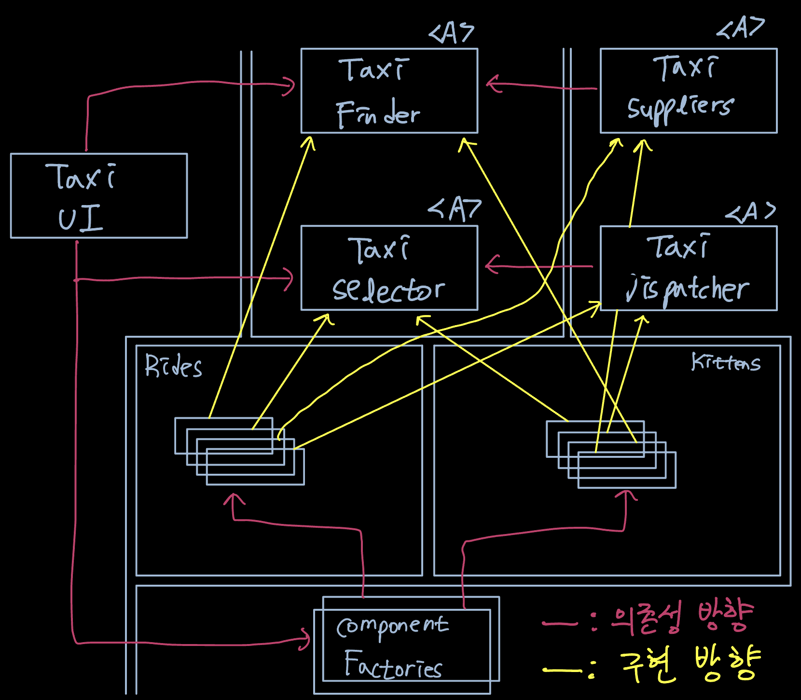
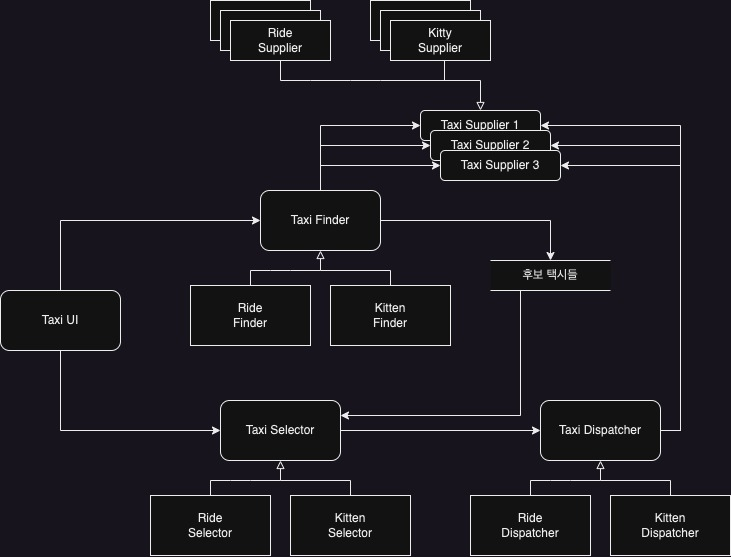

SOA와 micro-service 아키텍처는 아래와 같은 이유로 큰 인기를 끌고 있다.

- 서비스를 사용하면 상호 결합이 철저하게 분리되는 것처럼 보인다.
- 서비스를 사용하면 개발과 배포 독립성을 지원하는 것처럼 보인다.

이는 일부만 맞는 말이다.

# 서비스 아키텍처?

서비스 그 자체로는 아키텍처를 정의하지 않는다.  
서비스는 단지 시스템의 행위를 분리할 뿐인 값비싼 함수 호출에 불과하다.  
아키텍처를 정의하는 요소는 바로 의존성 규칙을 따르는 아키텍처 경계를 넘나드는 함수 호출들이다. 시스템의 나머지 많은 함수들은 행위를 서로 분리할 뿐이며, 아키텍처적으로 중요하지 않다.  
따라서 시스템의 아키텍처는 의존성 규칙을 준수하며 고수준의 정책을 저수준의 세부사항으로부터 분리하는 경계에 의해 정의된다.

# 서비스의 이점?

## 결합 분리의 오류

시스템을 서비스들로 분리함으로써 얻게 되리라 예상되는 이점은 서비스 사이의 결합이 확실히 분리된다는 점이다. 각 서비스는 서로 다른 프로세스 또는 서로 다른 프로세서에서 실행되기에 다른 서비스의 변수에 직접 접근할 수 없다. 그리고 모든 서비스의 인터페이스는 잘 정의되어 있어야 한다.

어느정도 일리가 있지만 꼭 그런 것만은 아니다. 서비스가 개별 변수 수준에서 각각 결합이 분리되지만 프로세서 내의 또는 네트워크 상의 공유 자원 때문에 결합될 가능성이 여전히 존재하기 때문이다.  
만약 서비스 사이에 오가는 데이터 레코드에 새로운 필드를 추가한다면, 이 필드를 사용해 동작하는 모든 서비스는 반드시 변경되어야 한다. 또 이 서비스들은 이 필드에 담긴 데이터를 해석하는 방식을 사전에 완벽하게 조율해야 한다. 따라서 서비스는 이 데이터 레코드에 강하게 결합되고 서비스들 사이는 서로 간접적으로 결합되어 버린다.

## 개발 및 배포 독립성의 오류

서비스를 사용하여 예측되는 또 다른 이점은 dev-ops 전략의 일환으로 서로 다른 팀에서 각 서비스를 작성하고, 유지보수하며, 운영하는 책임을 질 수 있다.  
이러한 개발 및 배포 독립성은 Scalable한 것으로 가준되며 대규모 시스템을 독립적으로 개발하고 배포 가능한 무수한 서비스들을 이용하여 만들 수 있다고 믿는다.

이 또한 극히 일부일 뿐이다. 대규모 시스템은 서비스 기반 시스템 이외에도 monolithic 시스템이나 컴포넌트 기반 시스템으로도 구축할 수 있다. 따라서 서비스는 확장 가능한 시스템을 구축하는 유일한 선택지가 아니다.  
두 번째로는, '결합 분리의 오류'에 따라 서비스라고 해서 항상 독립적으로 개발하고, 배포하며, 운영할 수 있는 것은 아니다. 데이터나 행위에서 어느 정도 결합되어 있다면 결합된 정도에 맞게 개발, 배포, 운영을 조정해야만 한다.

# 야옹이 문제

고객이 승차 시간, 비용 등 다양한 기준에 따라 택시를 선택할 수 있는 서비스 시스템을 가정하자.  
수많은 작은 micro-service를 기반으로 이를 구축하였고 서비스는 아래와 같이 구성된다.

- TaxiUI 서비스는 고객을 담당하며, 고객은 모바일 기기를 이용해 택시를 호출한다.
- TaxiFinder 서비스는 여러 TaxiSupplier의 현황을 검토하여 사용자에게 적합한 택시 후보들을 선별한다.
  TaxiFinder 서비스는 해당 사용에 할당된 단기 데이터 레코드에 후보 택시들의 정보를 저장한다.
- TaxiSelector 서비스는 사용자가 지정한 기준에 따라 후보 택시 중 적합한 택시를 선택한다.
- TaxiDispatcher 서비스는 TaxiSelector로부터 전달 받은 택시에 배차 지시를 한다.

이러한 시스템에 야옹이를 배달하는 서비스를 추가한다고 생각해보자.  
이를 위해 TaxiUI 변경을 시작으로 야옹이를 배달할 수 있는 조건을 가진 Taxi들만 가져오기 위해 TaxiSupplier에서 데이터 필드 추가와 TaxiFinder에서 데이터 선별 기준을 수정해야 한다. 그리고 TaxiSelector에서는 야옹이 알러지가 있는 고객을 위해 최근 야옹이 배달을 한 택시들을 필터링하는 기능을 추가해야 할 것이며, TaxiDispatcher의 경우 야옹이를 픽업 가능한 지점으로만 배차 지시를 내려야 할 것이다.
이처럼 현재 서비스들은 같은 종류의 기능적 분해이기에 새로운 기능이 기능적 행위를 횡당하는 횡단 관심사(cross-cutting concern) 상황이다. 따라서 현재 서비스들은 모두 결합되어 있기에 모든 서비스들을 전부다 변경해야만 한다.

# 객체가 구출하다.

컴포넌트 기반 아키텍처에서는 위와 같은 문제를 SOLID 설계 원칙에 따라 다형적으로 확장할 수 있는 클래스 집합을 생성해 새로운 기능을 처리하도록 함을 알 수 있다.  
기존에 존재하고 있는 서비스들을 객체 지향 클래스들로 만들어 택시 컴포넌트 Rides, 새로운 기능은 야옹이 컴포넌트 Kittens로 추가한다.

두 개의 신규 컴포넌트인 Rides와 Kittens는 의존성 규칙을 준수하고 이 기능들을 구현하는 클래스들은 UI의 제어 하에 Factory로 생성한다는 점에 주목하자.  
이 전략을 따르면 기능 추가를 위해 UI를 제외한 나머지 기존 컴포넌트들을 변경할 필요가 없다. 대신 야옹이 기능을 추가한 새로운 DLL을 시스템에 추가하고 런타임에 동적으로 로드하면 된다. 따라서 야옹이 기능은 결합이 분리되며, 독립적으로 개발하여 배포할 수 있다.

# 컴포넌트 기반 서비스

서비스도 소규모 monolith일 필요가 없기에 컴포넌트 기반과 같이 할 수 있다.
JAVA의 경우 서비스를 하나 이상의 DLL 파일에 포함되는 추상 클래스들의 집합이라고 생각하자. 새로운 기능 추가/확장은 기존 jar파일에 정의된 추상 클래스들을 확장하여 새로운 jar파일로 만든다. 따라서 새로운 기능 배포는 서비스를 재배포하는 문제가 아니라 서비스를 로드하는 경로에 단순히 jar파일을 추가하는 문제가 된다.

{: width="700" height="400"}

서비스들의 존재하는 이전과 동일하지만, 각 서비스의 내부는 자신만의 컴포넌트 설계로 되어 있어 파생 클래스를 만드는 방식으로 신규 기능을 추가할 수 있다.

# 횡단 관심사

아키텍처 경계는 서비스 사이에 있지 않는다. 경계는 오히려 서비스를 관통하며, 서비스를 컴포넌트 단위로 분할한다.  
모든 주요 시스템이 직면하는 횡단 관심사를 처리하려면 서비스 내부를 의존성 규칙을 준수하는 컴포넌트 아키텍처로 설계해야 한다.  
**이 서비스들은 시스템의 아키텍처 경계를 정의하지 않는다. 아키텍처 경계를 정의하는 것은 서비스 내에 위치한 컴포넌트다.**

# 결론

서비스는 시스템의 확장성과 개발 가능성 측면에서 유용하지만, 그 자체로는 아키텍처적으로 중요한 요소는 아니다.  
시스템의 아키텍처는 시스템 내부에 그어진 경계와 경계를 넘나드는 의존성에 의해 정의된다. 구성요소가 통신하고 실행되는 물리적 메커니즘에 의해 정의되는 것이 아니다.

서비스는 단 하나의 경계로 둘러싸인 단일 컴포넌트로 만들 수 있고 여러 아키텍처 경계로 분리된 다수의 컴포넌트로 구성할 수도 있다.
