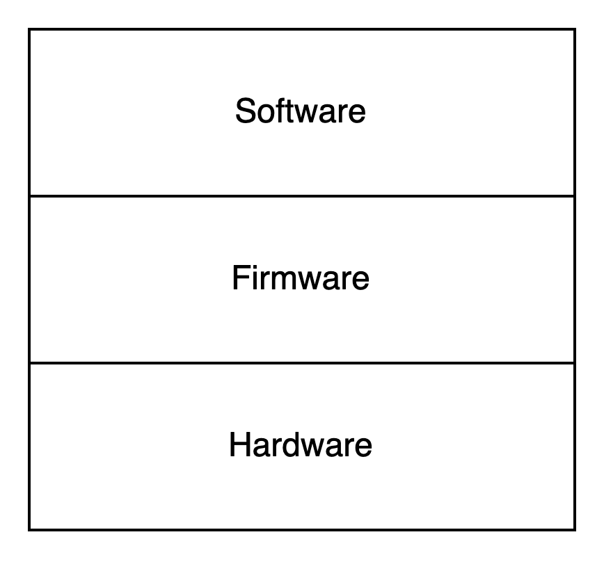
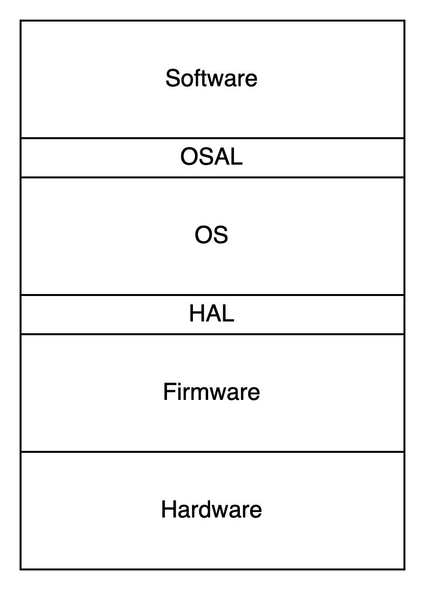

임베디드의 경우 소프트웨어와 펌웨어라는 용어의 상호 관계를 명확히 이해하면 다음과 같다.

- 소프트웨어: 코드가 제품의 하드웨어에 전혀 의존하지 않는다. 특정 세부사항이나 플랫폼 의존성에서 벗어난 코드이다.
- 펌웨어: ROM에 저장된다고 해서 펌웨어가 아니다. 코드가 하드웨어 발전(또는 플랫폼)에 맞춰져 수정하기가 얼마나 어려운지에 따라 정의된다.

이 정의에 따르면 코드 상에 SQL이 들어가 있으면 이는 펌웨어로 볼 수 있기에 소프트웨어 개발자도 언제든 펌웨어를 작성할 수 있게 된다.

# App-titude Test

소프트웨어를 구축하는 세 가지 활동은 다음과 같다.

- "먼저 동작하게 만들어라" 동작하지 않는다면 사업은 망한다.
- "그리고 올바르게 만들어라" 코드를 리팩터링해서 사람들이 이해할 수 있게 만들고, 요구가 변경되거나 더 잘 이해되었을 때 코드를 개선할 수 있게 만든다.
- "그리고 빠르게 만들어라" 코드를 리팩터링해서 '요구되는' 성능을 만족시킨다.

App-titude란 오직 첫 번째 활동에만 집중하여 앱이 그저 동작하도록 만드는 것을 일컫는다.  
만약 App이 동작하면 엔지니어는 App-titude test를 통과했다. 하지만 이 app이 클린 임베디드 아키텍처를 가진다고 말하기는 어렵다.

클린 임베디드 아키텍처를 위해서는 코드를 특정 Tool chain과 micro-processor에 구성해 버리는 구조를 사용하지 않아야 한다.

# 타깃-하드웨어 병목현상

임베디드 코드가 클릭 아키텍처 원칙과 실천법을 따르지 않고 작성된다면, 대개의 경우 코드를 테스트할 수 있는 환경이 해당 특정 target으로 국한될 것이다.  
그리고 그 target이 테스트가 가능한 유일한 장소라면 target-hardware bottleneck이 발생하여 진척이 느려질 것이다.

## 클린 임베디드 아키텍처는 테스트하기 쉬운 임베디드 아키텍처다.

몇가지 아키텍처 원칙을 임베디드 소프트웨어와 펌웨어에 적용하여 target-hardware bottleneck을 줄이는 방법을 살펴보자.

### 계층

소프트웨어와 펌웨어가 섞이는 일은 Anti-pattern이다. 이러한 코드는 변화에 저항하게 된다.  
따라서 맨 하단의 하드웨어가 무어의 법칙에 따라 계속해서 변하면 그 때마다 얽힌 코드는 변경을 위해 매우 힘든 과정을 거쳐야 한다.  
단지 하드웨어 뿐만 아니라 사용자가 변경을 요청하거나 버그를 고쳐야 할 때도 마찬가지다.

{: w="300" h="200" }

### 하드웨어는 세부사항이다.

소프트웨어와 펌웨어 사이의 경계는 코드와 하드웨어 사이의 경계와 같이 잘 정의하기 힘들다.  
임베디드 소프트웨어 개발자는 이러한 소프트웨어와 펌웨어 사이의 경계를 HAL(Hardware Abstraction Layer)을 잘 정의함을 통해 분명히 한다.

HAL은 자신보다 위에 있는 소프트웨어를 위해 존재하므로, HAL의 API를 소프트웨어의 필요에 맞게 만든다. 그리고 이 과정에서 추상화 수준을 소프트웨어/제품 관점으로 올려 생각하여 app에서 필요로 하는 서비스를 제공한다.  
HAL을 통해 소프트웨어에서는 GPIO 등 하드웨어 관련 설정 일은 몰라도 된다.

## HAL 사용자에게 하드웨어 세부사항을 드러내지 말라

HAL을 제대로 만들었다면, HAL은 target에 상관없이 테스트할 수 있는 경계층을 제공한다.

### 프로세서는 세부사항이다.

임베디드 app이 특수한 tool chain을 사용한다면 이러한 tool chain은 주로 헤더 파일을 제공할 때가 많다.  
이러한 tool chain의 컴파일러는 C 언어를 제멋대로 변경하여 해당 업체의 프로세서 기능에 접근할 수 있는 새로운 keyword를 제공하곤 한다. 그러면 이 코드는 C처럼 보이겠지만, 더 이상 C가 아니다.

이 코드를 사용하면 다른 프로세서에서는 컴파일되지 않을 것이고 심지어 동일한 프로세서라도 다른 컴파일러로는 컴파일하지 못할 수 있다.  
이를 해결하기 위해 펌웨어가 하드웨어에 의존성을 가지는 저수준 함수들을 프로세서 추상화 계층(Processor Abstraction Layer)의 형태로 격리시키고 PAL 상위에 위치하는 펌웨어는 target-hardware에 관계없이 테스트할 수 있게 할 수 있다.

### OS는 세부사항이다.

OS는 소프트웨어를 펌웨어로부터 분리하는 계층이다. 그리고 OS를 직접 사용하면 나중에 소프트웨어에서 수많은 코드를 수정해야 할 수 있다.  
따라서 OSAL(Operating System Abstraction Layer)를 통해 소프트웨어를 운영체제로부터 격리시킨다.

소프트웨어가 OSAL에 의존하면 다른 OS로의 이식 작업의 대부분은 기존 OSAL과 호환되도록 새로운 OSAL를 작성하는 데 소요될 것이다. 그리고 이는 기존의 복잡한 코드 덩어리를 수정하는 일보다 훨씬 낫다!

또한 OSAL는 테스트 지점을 만드는데 도움이 되며, 덕분에 소프트웨어를 OS에 관계없이 테스트할 수 있게 된다.

{: w="300" h="200" }

## 인터페이스를 통하고 대체 가능성을 높이는 방향으로 프로그래밍하라

HAL, OSAL 뿐만 아니라 모든 주요 계층(소프트웨어, OS, 펌웨어, 하드웨어) 내부에는 이 책에서 설명한 원칙을 적용할 수 있다.  
관심사를 분리시키고, 인터페이스를 활용하여, 대체 가능성을 높이는 방향으로 프로그래밍한다.

계층형 아키텍처(Layered Architecture)는 모듈들이 서로 인터페이스를 통해 상호작용하기에 특정 서비스 제공자를 다른 제공자로 쉽게 대체할 수 있다.  
그리고 인터페이스는 타깃과는 별개로 테스트할 수 있도록 해주는 경계층을 제공하기에 각각의 계층 내부에서 테스트가 가능하다.

## DRY원칙: 조건부 컴파일 지시자를 반복하지 말라

임베디드 시스템의 경우 target-hardware의 유형을 식별하는 조건부 컴파일을 반복해서 사용할 때가 많아 특정 구문을 반복해서 사용하게 된다.  
이러한 경우 DRY 원칙을 위배하는 것이기에 대신 HAL이 조건부 컴파일 대신 사용할 수 있는 인터페이스를 제공한다면, 링커 또는 어떤 형태의 실시간 바인딩을 사용해서 소프트웨어를 하드웨어와 연결할 수 있다.

# 결론

모든 코드가 펌웨어가 되도록 내버려두면 제품이 오래 살아남을 수 없게 된다. 오직 target-hardware에서만 테스트할 수 있는 제품도 마찬가지다. 클린 임베디드 아키텍처는 제품이 장기간 생명력을 유지하는 데 도움을 준다.
