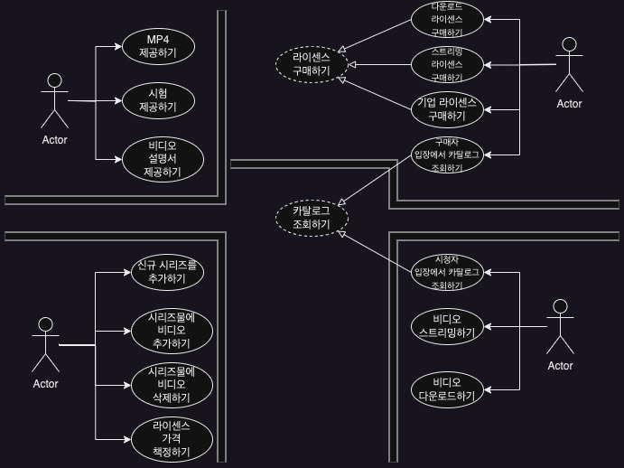
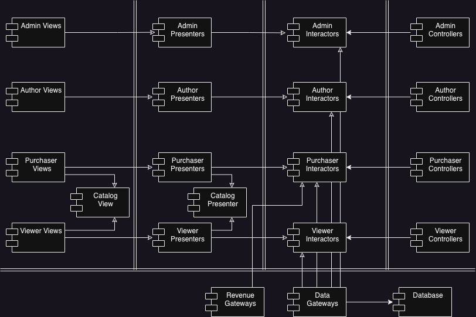

지금까지 살펴본 아키텍처에 대한 규칙과 견해를 종합해서 사례 연구로 적용해 보자.

# 제품

웹 사이트에서 비디오를 판매하는 소프트웨어를 사례로 한다.

- 개인과 기업에게 비디오를 웹을 통해 판매한다.
- 개인은 단품 가격을 지불해 스트리밍으로 보거나, 더 높은 가격을 지불해 영구 소장이 가능하다.
- 기업은 스트리밍 전용이며, 대량 구매 시 할인을 받을 수 있다.

사례의 Actor들은 다음과 같다.

- 개인은 Viewer임과 동시에 Purchaser이며
- 기업은 Viewer와 Purchaser가 나뉜다.
- 비디오 제작자는 Author로 비디오 파일과 설명서, 부속 파일(시험, 문제, 해법, 소스 코드 등)을 제공해야 한다.
- 관리자는 Admin으로 비디오를 추가하거나 삭제하고 다양한 라이센스에 맞춰 가격을 책정한다.

시스템의 초기 아키텍처를 결정하는 첫 단계는 Actor와 Usecase를 식별하는 일이다.

# UseCase 분석

4 Actor가 시스템이 변경되어야 할 네 가지 주요 근원이 된다. 따라서 SRP에 따라 시스템을 분할하여, 특정 Actor를 위한 변경이 나머지 Actor에게는 전혀 영향을 미치지 않게 만들어야 한다.

{: w="900" h="700" }

중앙의 점선으로 된 UseCase는 추상 UseCase이다.  
추상 UseCase는 범용적인 Policy를 담고 있으며, 다른 Usecase에서 이를 더 구체화한다.  
UseCase를 추상화를 꼭 생성해야하는 건 아니지만 카탈로그 조회하기 UseCase가 Viewer와 Purchaser 모두 비슷하기에, 유사성을 식별해서 분석 초기에 통합하는 방법을 찾을 수 있다.

# 컴포넌트 아키텍처

Actor와 UseCase를 식별했으므로, 예비 단계의 컴포넌트 아키텍처를 만들어 본다.

{: w="900" h="700" }

이중선으로 아키텍처 경계를 나타냈고 대응되는 Actor에 따라 카테고리를 분리했다.  
그림에서 각 컴포넌트는 단일 .jar파일에 해당하며 각각 자신에 할당된 역할을 포함한다.
Catalog View와 Catalog Presenter는 추상 Usecase를 처리하는 저자만의 방식으로 해당 컴포넌트 내부에 추상 클래스로 코드화 될 것이다. 이를 상속하는 컴포넌트에서는 상속받은 View와 Presenter 클래스들을 포함한다.

시스템을 이러한 컴포넌트들로 모두 분할해서 여러 개의 .jar파일로 전달해야 할까?  
그럴 수도 있고 아닐 수도 있다.  
View, Presenter, Interactor, Controller, Utility 이렇게 5개의 jar파일로 합처 큰 컴포넌트들을 독립적으로 배포할 수도 있다. View,Presenter를 합치고 나머지 3개는 그대로 개별 jar파일로 생성할 수도 있다.

**즉, 각 컴포넌트를 독립적으로 컴파일하고 빌드할 수 있는 환경을 구성하면 후에 시스템이 변경되는 양상에 맞춰 시스템 배포 방식을 조정할 수 있다.**

# 의존성 관리

그림에서 제어흐름은 오른쪽에서 왼쪽으로 흐른다.  
input -> Controller -> Interactor(inupt에 따른 결과 반환) -> Presenter(결과 포맷 변경) -> View(화면 표시)  
그리고 모든 의존성은 경계선을 항상 더 고수준인 컴포넌트를 향한다. 이는 OCP를 적용했음을 보여준다.

# 결론

그림의 아키텍처는 두 가지 서로 다른 차원의 분리 개념을 보여주고 있다.

1. SRP에 기반한 Actor의 분리, 서로 다른 이유로 변경되는 컴포넌트 분리
2. OCP에 기반한 의존성 규칙, 서로 다른 속도(policy 수준과 관련 있다.)로 변경되는 컴포넌트 분리

이런 방식으로 코드를 한번 구조화하고 나면 시스템을 실제로 배포하는 방식은 다양하게 선택할 수 있게 된다.  
상황에 맞게 컴포넌트들을 배포 가능한 단위로 묶을 수도 있고, 상황이 변하면 변한 상황에 맞춰 묶는 단위를 바꾸기도 쉬워진다.
