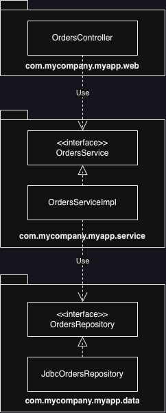
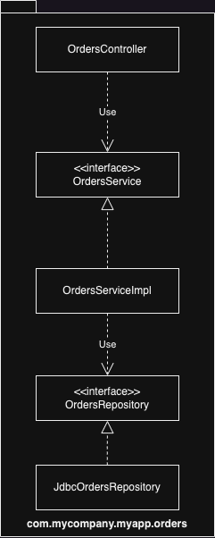
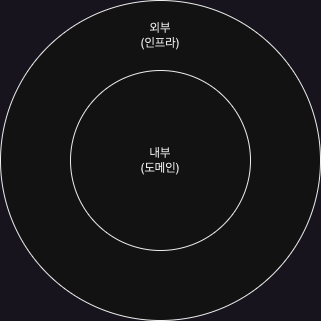
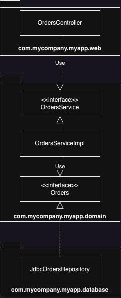
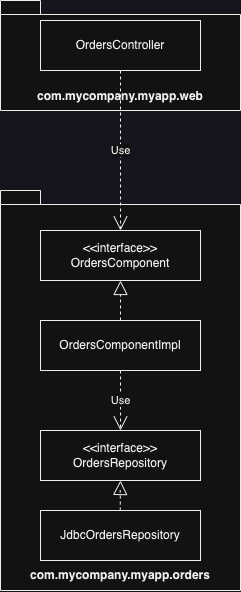
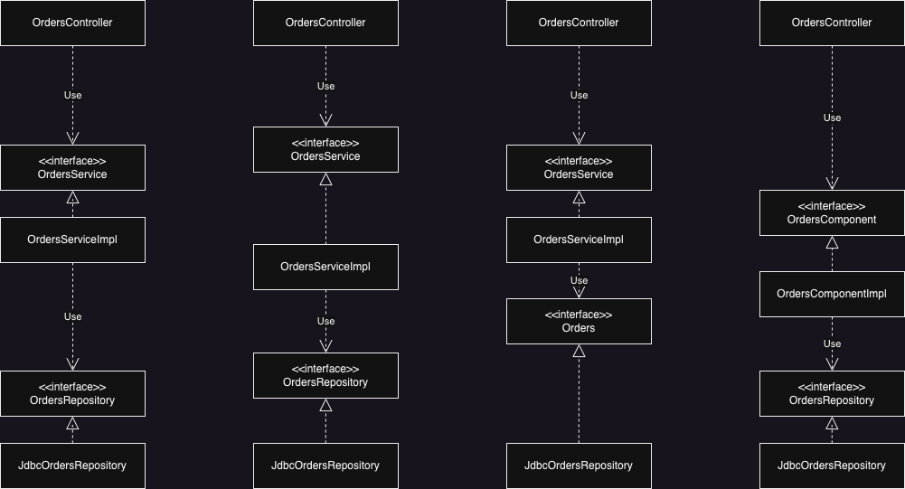
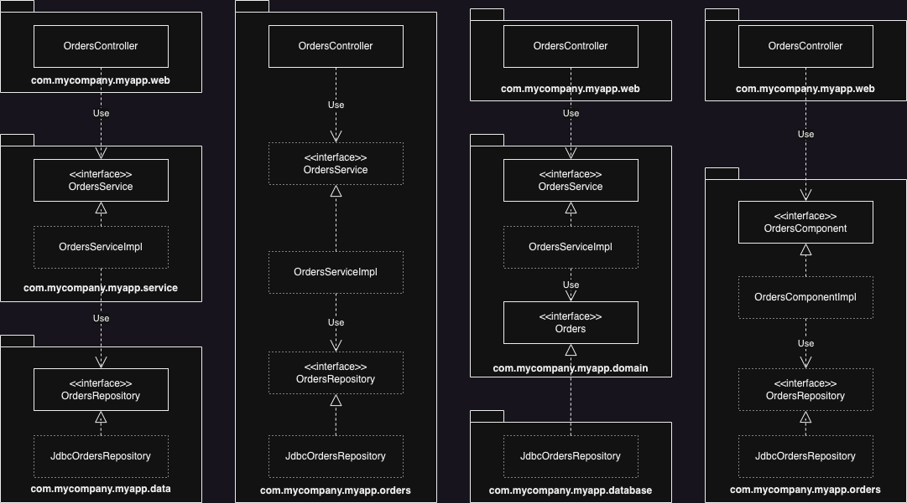

앞서 배운 것들을 활용하여 소프트웨어는 올바르게 정의된 경계, 명확한 책임, 그리고 통제된 의존성을 가진 클래스와 컴포넌트로 구성될 것이다.  
하지만 악마는 항상 Detail(구현 세부사항)에 있는 법이며, 이점을 심사숙고해야 한다.
따라서 클린 아키텍처는 잠시 제쳐 놓고, Java를 기반 설계나 코드 조직화와 관련된 몇 가지 접근법을 살펴보자.

# 계층 기반 패키지

가장 단순한 전통적인 수평 계층형 아키텍처다.  
기술적인 관점에서 해당 코드가 하는 일에 기반해 그 코드를 분할한다.

웹, '업무 규칙', 영속성 코드를 위해 계층이 나뉜다. 다시 말해 코드는 계층이라는 얇은 수평 조각으로 나뉘며, 각 계층은 유사한 종류의 것들을 묶는 도구로 사용된다.

{: w="300" h="100" }

Java의 경우 계층은 주로 패키지로 구현되며, 엄격한 계층형 아키텍처의 경우 계층은 반드시 바로 아래 계층에만 의존해야 한다.

- OrdersController: 웹 컨트롤러이며, 웹 기반 요청을 처리한다. Spring MVC 컨트롤러 등이 여기에 해당한다.
- OrdersService: 주문 관련 '업무 규칙'을 정의하는 인터페이스
- OrdersServiceImpl: OrdersService의 구현체
- OrdersRepository: 영구 저장된 주문 정보에 접근하는 방법을 정의하는 인터페이스
- JdbcOrdersRepository: OrdersRepository 인터페이스의 구현체

이 아키텍처는 엄청난 복잡함을 겪지 않고도 무언가를 작동시켜 주는 아주 빠른 방법이다.  
하지만 소프트웨어가 커지고 복잡해지기 시작하면, 모든 코드를 담기에 3 계층은 부족하다는 사실을 깨닫고, 더 잘게 모듈화해야 할지를 고민하게 될 것이다.  
또한 계층형 아키텍처는 업무 도메인에 대해 아무것도 말해주지 않는다는 문제가 있다. 전허 다른 업무 도메인이라도 코드를 계층형으로 만들어서 나란히 놓고 보면 전부 웹,서비스,repo로 구성된 모습을 볼 수 있을 것이다.

# 기능 기반 패키지

서로 연관된 기능, 도메인 개념 또는 Aggregate Root에 기반하여 수직의 얇은 조각으로 코드를 나누는 방식이다.
(Aggregate Root란 domain 내에서 결합적이면서 의미있는 개념을 나타내는 객체들의 집합인 Entity로 사용자는 해당 도메인과 상호작용하기 위해서는 반드시 이 Entity인 Aggregate Root를 거쳐야만 한다.)
전형적인 구현에서는 모든 타입이 하나의 Java 패키지에 속하며, 패키지 이름은 그 안에 담긴 개념을 반영해서 짓는다.

{: w="300" h="100" }

인터페이스와 클래스는 이전과 같지만, 모두가 단 하나의 패키지에 속하게 된다.  
이를 통해 이제 코드의 상위 수준 구조가 업무 도메인에 대해 알려주게 된다. 또 다른 이점으로는 UseCase가 변경될 경우 변경해야 할 코드를 모두 찾는 작업이 더 쉬워질 수 있다. 변경해야 할 코드가 모두 한 패키지에 담겨 있기 때문이다.

# 포트와 어댑터

업무/도메인에 초점을 둔 코드가 프레임워크나 DB와 같은 기술적 세부 구현과 독립적이며 분리된 아키텍처이다.

{: w="300" h="200" }

그림처럼 코드 베이스는 '내부'(도메인)과 '외부'(인프라)로 구성된다.  
내부 영역은 도메인 개념을 모두 포함하는 방면, 외부 영역은 UI, DB, 3rd와의 상호작용을 포함한다.  
여기서 외부는 항상 내부에 의존하는 의존성 규칙을 가진다.

{: w="300" h="100" }

com.mycompany.myapp.domain 패키지가 내부이며 나머지가 외부이다.  
OrdersRepository가 Orders라는 간단한 이름으로 바뀐 이유는 DDD에서 비롯된 명명법으로 내부에 존재하는 모든 것의 이름은 반드시 '유비쿼터스 도메인 언어'(Ubiquitous domain language)관점에서 기술하라고 조언한다.

# 컴포넌트 기반 패키지

컴파일러를 사용해 기대하는 형태로 아키텍처가 구현됨을 강제하기 위한 아키텍처로 큰 단위(coarse-grained)의 단일 컴포넌트와 관련된 모든 책임을 하나의 패키지로 묶는데 주안점을 둔다.  
이 접근법은 서비스 중심적인 시각으로 소프트웨어 시스템을 바라보는 micro-service 아키텍처가 가진 시각과 동일하다.

책의 앞 부분에서 '컴포넌트'에 대한 정의는 아래와 같다.

```
컴포넌트는 배포 단위다. 컴포넌트는 시스템의 구성 요소로, 배포할 수 있는 가장 작은 단위다. Java의 경우 jar파일이 컴포넌트다.
```

하지만 이 접근법에서의 컴포넌트 정의는 다르다.  
**컴포넌트는 멋지고 깔끔한 인터페이스로 감싸진 연관된 기능들의 묶음으로, app과 같은 실행 환경 내부에 존재한다.**

{: w="300" h="100" }

이 방법론에서 소프트웨어 시스템은 하나 이상의 컨테이너(웹 app, 모바일 app 등)로 구성되며, 각 컨테이너는 하나 이상의 컴포넌트를 포함한다. 또한 각 컴포넌트는 하나 이상의 클래스(또는 코드)로 구현된다.  
각 컴포넌트가 개별 jar파일로 분리될지 여부는 한 요소에서 발생한 변경이 다른 변경에 영향을 미치지 않는가에 대한 관심사이다.

컴포넌트 내부에서 관심사 분리는 여전히 유효하기에 업무 로직은 데이터 영속성은 분리되어 있지만 이는 구현과 관련된 세부사항으로 사용자는 알 필요가 없다. 즉, Usecase와 관련된 모든 것들을 캡슐화하는 별도의 OrdersService가 존재하고 micro-service 아키텍처와의 큰 차이는 결합 분리 모드에 있다.

이 접근법을 통해 Monolithic app에서 컴포넌트를 잘 정의하면 micro-service 아키텍처로 가기 위한 발판으로 삼을 수 있다.

# 구현 세부사항엔 항상 문제가 있다

표면상으로 위 네 가지 접근법이 코드를 조직화하는 완전히 서로 다른 방식처럼 보이며, 따라서 서로 다른 아키텍처 스타일로 여길 수도 있다.  
하지만 Java와 같은 언어에서 public 접근 지시자를 지나칠 정도로 방만하게 사용하게 되면 캡슐화 관련 이점이 없어지게 되고 이로 인해 누구가가 구체적인 구현 클래스의 인스턴스를 직접 생성하는 코드를 작성하는 일을 절대로 막을 수 없기에 아키텍처 스타일을 위반하게 된다.

## 조직화 vs 캡슐화

app에서 모든 타입을 public으로 지정한다면, 패키지는 단순히 폴더처럼 사용되어 캡슐화를 위한 메커니즘으로 활용될 수 없다.  
그리고 이러한 패키지의 목적을 무시해버리면 어떤 아키텍처 스타일이든 아무런 의미가 없다.

{: w="1800" h="900" }

그림을 보면 개념적으로 위 네 가지 접근법들은 매우 다르지만, 화살표 모두 동일한 방향을 가리키기에 구문적으로는 완전히 똑같다.

반면 타입을 패키지로 배치하는 방식에 따라서 각 타입에 접근할 수 있는 정도가 크게 달라지게 할 수 있다.

{: w="1800" h="900" }

- 계층 기반의 경우 외부 패키지의 클래스로부터 자신이 속한 패키지 내부로 들어오는 의존성이 존재하므로 인터페이스가 public이며, 구현체 클래스들은 누구도 알 필요가 없기에 protected와 같이 제한적으로 선언된다.
- 기능 기반 패키지의 경우 controller가 패키지로 들어올 수 있는 유일한 통로이기에 public이며 나머지는 모두 제한적으로 선언된다.
  따라서 반드시 controller를 통하지 않으면 주문 관련 정보에 접근할 수 없게 된다.
- 포트와 어댑터 접근법의 경우 인터페이스는 외부로부터 들어오는 의존성을 가지기에 public이고 나머진 제한된다.
- 컴포넌트 기반 패키지의 경우 controller에서 컴포넌트로 들어오는 인터페이스로 의존성을 가지기에 이것만 public 이다.

이처럼 public 타입이 적을 수록 필요한 의존성의 수도 적어진다. 그리고 컴파일러의 도움을 받아서 아키텍처 접근법을 강제할 수 있다.

# 결론: 빠져 있는 조언

최적의 설계를 꾀했더라도, 구현 전략에 얽힌 복잡함을 고려하지 않으면 설계가 순식간에 망가질 수 있다는 사실을 강조한다.  
설계를 어떻게 해야만 원하는 코드 구조로 매핑할 수 있을지, 그 코드를 어떻게 조직화할지, 런타임과 컴파일 타임에 어떤 결합 분리 모드를 적용할지 고민하고 가능하면 선택 사항을 열어둔다.  
또한 아키텍처 스타일을 강제하는 데 컴파일러의 도움을 받을 수 있을지 고민하고, 데이터 모델 같은 다른 영역과 결합되지 않도록 주의한다.
