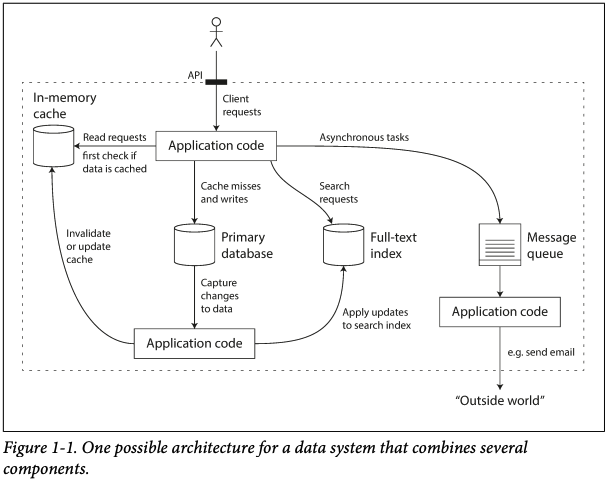
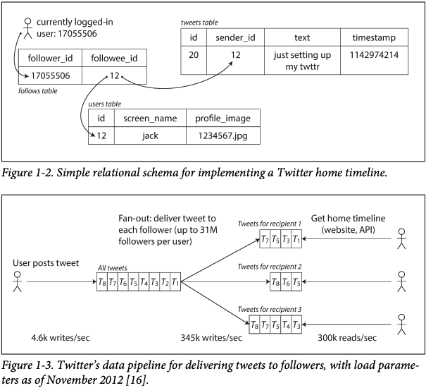
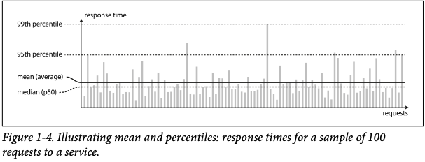

많은 app들은 이제 compute-intensive 대신 data-intensive 하다.  
따라서 이러한 data들의 양, 복잡성 그리고 변화 속도가 시스템의 제한 요소로 작용한다.

보통 이러한 data-intensive한 app은 아래와 같이 기본적인 기능을 제공을 하는 표준 구성 요소들로 이뤄진다.

- DB: data를 저장 및 공유
- Cache: read 작업 성능 향상
- Search Index: keyword 또는 다양한 방법으로 data 필터링을 통한 search
- Batch Processing: 주기적으로 누적된 많은 양의 데이터 처리

이러한 표준 구성 요소들은 우리가 app을 만들 때 필요한 복잡한 기능들을 추상화하여 숨기고 단순화한다.

현실에서는 시스템 저마다 적합한 DB, cache 방법 그리고 search index 생성 방법 등이 모두 다르며 상황에 맞는 tool을 선택하는 것은 쉽지 않다.  
따라서 이 책을 통해 여러 tool들에 대해 살펴보면서 data system의 원칙과 실용성 그리고 어떻게 data-intensive app을 구성할지 배운다.

이번 장에서는 우리가 추구해야할 data system의  신뢰성(Reliability), Scalability(확장성) 그리고 Maintainability(유지보수성) 에 대해 명확히 하고 이후 chapter를 위해 필요한 기본 내용에 대해 알아본다.

## Thinking About Data Systems

message queue나 DB와 같이 data system을 구성하는 tool들은 서로 다른 access pattern을 가지고 따라서 서로 다른 특징과 구현 방식을 가지지만 하나로 뭉뚱그려 data system으로 묶어 들어간다. 이렇게 묶는 이유는 아래와 같다.

- datastore가 메인이지만 message queue로도 활용될 수 있는 Redis 또는 message queue이지만 DB처럼 data의 지속성을 보장하는 Apache Kafka와 같이 tool들간 명확한 구분이 어렵다.
- 요구 사항의 범위가 넓어짐에 따라 하나의 tool로만 이를 만족할 수 없어 이러한 요구 사항을 여러 작은 task들로 쪼개 여러 tool들을 app 코드 상 조합하여 요구 사항을 만족한다.

위 그림과 같이 여러 tool들을 조합해 서비스를 제공하는 경우 API를 통해 client상에서는 구현의 detail을 감추고 간단히 사용할 수 있도록 한다. 그리고 이렇게 여러 tool들을 조합한 data system을 통해 요구 조건들을 보장할 수 있다.

data system에서는 ACID와 같은 조건이나 성능 등 상황마다 다른 여러 요구 조건들이 존재하며 이번 장에서는 가장 중요한 조건 3가지에 대해 알아본다.

-  신뢰성(Reliability) : hardware/software fault 그리고 human-error가 발생해도 시스템은 정상적으로 작동해야 함을 의미
-  Scalability(확장성) : 시스템이 성장할 수록 data의 양, traffic 그리고 복잡성이 증가할 수 있고 이때 이를 얼마나 잘 처리할 수 있는지 의미
-  Maintainability(유지보수성) : 많은 사람들이 같은 시스템에 대해 작업을 할 때, 얼마나 쉽게 현재 시스템의 기능을 유지/운영 및 새로운 Usecase에 대한 기능을 추가할 수 있는지 의미

## Reliability

뭔가 잘못되어도 시스템이 정상적으로 작동해야 함을 구체적인 예시로 표현하면 다음과 같다.

- user가 예상하는대로 app이 기능을 수행한다.
- user가 실수를 하거나 software를 예상치 못한 방향으로 사용해도 정상 작동한다.
- 예상되는 부하나 data 양에서 요구 사항을 수행하는 성능이 괜찮아야 한다.
- 비인가된 접근을 차단해야 한다.

어떠한 것이 잘못되는 경우를 fault라 부르며, 이러한 예상되는 fault를 잘 처리하는 것을 fault-tolerant(내결함성)라 부른다.  
이러한 fault가 발생할 수 있는 모든 경우를 고려하는 것은 현실적으로 불가능하며, 우리는 예측 가능한 fault에 대해서만 논한다.

failure와 fault의 차이는 fault는 보통 system 구성 요소 중 하나가 정상적인 범주에서 벗어난 상황을 말하지만 failure는 system 전체가 기능을 수행하지 못하는 상황을 말한다. 따라서 보통 fault -> failure로 진행된다.  
그리고 여러 요소들을 조합해 fault가 발생해도 failure가 되지 않도록 하는 것이 핵심이다.

이따금 Netflix에서 하는 Chaos Monkey와 같이 의도적으로 system에 치명적인 bug를 유발하여 이를 처리하는 과정에서 system의 fault-tolerance를 증대시킬 수 있다.

보통 fault를 사전에 방지하는 것보단 발생 후 이를 복구하는 방법이 선호되지만 admin 계정 해킹과 같이 복구할 방법이 없는 fault의 경우에는 이를 사전에 방지하는 것이 요구된다.

### Hardware Faults

정전이나 HDD 또는 RAM이 고장나는 등 물리적인 부분에서 fault가 발생하는 것을 의미한다.  
이러한 fault를 복구하는 방법은 hardware 요소를 중복적으로 구성하여 하나가 fault가 나면 다른 하나가 대신 정상적으로 기능을 수행하는 방식을 통해 failure를 방지할 수 있다.  
만약 중복되는 요소 둘다 평상 시에 기능을 수행하면 이를 Hot-Hot 하나는 백업 상태로 작동만 하는 중이면 Hot-Warm이라 한다.

AWS와 같이 많은 cloud 플랫폼에서는 현재 flexibility와 elasticity를 장비의 realiability보다 우선시 하고 있기에 hardware적인 중복성에 이어 추가적으로 software적 내결함성 기법을 많이 도입하고 있다. 이를 통해 전체 장비들이 멈춰도 계속해서 정상적인 수행이 가능한 system을 구성한다.

### Software Errors

hardware적 fault는 random하고 각 fault간 서로 독립적이다. 하지만 software fault의 경우 여러 요소간 얽혀있기에 더욱 빈번하고 예측하기 힘든 형태로 발생한다.  
때로는 실행환경을 가정하여 동작하는 경우 software적 fault는 장기간 숨어있다가 실행환경이 가정한 것과 다른 특정 상황에서 발생할 수 있다.

software적 fault를 최대한 피하기 위해서는 아래와 같은 작은 것들이 도움이 될 수 있다.

- 시스템 내 상호작용과 가정되는 상황을 신중히 살핀다.
- 테스트를 작성한다.
- 프로세스를 격리한다.
- 프로세스가 crash하고 재시작할 수 있게 한다.
- 시스템이 특정 조건에 대한 수행을 보장하는 경우 이를 면밀히 모니터링하여 기대와 실제 수행 결과가 일치하는지 살핀다.

### Human Errors

사람은 그냥 신뢰할 수 없고 실수를 하게 되어 있다.  
이러한 사람들이 최대한 실수를 하지 않도록 시스템을 만드는 방법은 아래와 같은 것들이 있다.

- 추상화를 이용한 좋은 design을 통해 API를 제공하여 의도한 방향으로 사람이 시스템을 활용하도록 유도한다. 하지만 이를 위해 API가 너무 제한적인 경우 오히려 사람들이 이를 우회하여 활용할 수 있기에 밸런스를 잘 맞춘다.
- 사람들이 자주 실수하여 failure를 유발할 수 있는 부분은 다른 부분과 따로 분리한다. 특히 sandbox환경을 제공해 실제 data를 활용해 안전하게 실험하거나 작업할 수 있게 한다.
- 모든 level에 대한 테스트를 진행하고 이를 자동화시킨다. 엣지 case에 대한 테스트들도 꼭 수행한다.
- 새로운 코드를 점진적으로 추가하는 등 빠르게 이전 상태로 rollback 할 수 있는 상태에서 작업한다.
- 세밀하고 명확한 모니터링을 구축하여 성능 지표나 error율을 살펴 빠르게 문제를 진단할 수 있게 한다.
- 좋은 management 사례를 따르는 것과 이에 대한 연습을 진행한다.

### How Important Is Reliability?

non-critical한 system이라도 reliability가 떨어지면 이에 대한 손해를 감수해야하는건 동일하다.  
때로는 개발 비용을 줄이기 위해 reliability를 희생해야할 때도 있고 이 경우에는 수익과 비용을 잘 따져 판단해야 한다.

## Scalability

시스템이 증가하는 traffic에 따른 부하를 얼마나 잘 처리할 수 있는지를 의미한다.  
이는 단순히 "system이 확장 가능하다 아니다"라는 것처럼 단순하게 판단하는 것이 아니라 "system이 특정 방향으로 성장한다면 어떤 옵션을 통해 대처가 가능한가?" 그리고 "어떻게 자원을 추가하여 증가된 부하를 처리할 것인가?"에 대한 논의가 이뤄져야 한다.

### Describing Load

load(부하)는 request per second to web, DB 읽기/쓰기 작업 비율, 채팅방 활동 유저 수, cache의 hit 비율 등 여러 parameter로 볼 수 있다. system에서 일반적으로 발생하는 경우를 load parameter로 고려할 수도 있고 드물게 발생하는 극단적인 경우에 발생되는 병목현상(bottleneck)을 고려할 수도 있다.

Twitter를 예시로 load에 대해 자세히 알아보자.  
먼저 Twitter에서는 두 가지 핵심 operations들이 존재한다.

1. Post tweet: user가 자신의 follwer들에게 작성한 tweet을 게시한다.(평균 4.6k requests/sec, 최대 12k)
2. Timeline: user가 자신들이 follow하는 user들이 작성한 tweet을 본다.(300k requests/sec)

이러한 Twitter의 해결해야할 load는 tweet의 request 수가 아닌 followee가 작성한 tweet이 follower들에게 fan-out되는 패턴에 의해 발생되는 load이다. 그리고 이를 두 가지 구현 방식을 통해 해결했었다.

1. tweet을 작성할 때마다 tweet global collection에 추가된다. 그리고 follower들이 timeline을 볼 때마다 followee들을 모두 찾고 이들이 작성한 tweet을 JOIN을 통해 가져와 시간 정렬을 하는 fan-out 패턴의 read 작업을 수행한다. 즉, write 작업은 간단하지만 read 작업에 큰 load가 발생하는 구현 방식이다.
2. 각 user마다 timeline에 대한 cache를 가진다. followee가 tweet을 작성하면 follower들의 mailbox에 들어가는 형태로 write 작업에 대한 fan-out 패턴을 가진다. 따라서 read 작업이 간단하지만 write에 큰 load가 발생한다.

Twitter에서는 첫 번째 구현 방식을 사용했었지만 매번 timeline을 가져올 때마다 발생하는 load를 감당하기 힘들었기에 두 번째 방식으로 바꿨다. 하지만 유명한 샐럽과 같이 수많은 follower를 가지는 경우 write에서 fan-out되는 경우 한 명에 의해 순간적으로 너무나 많은 부하가 발생하였기에 이러한 극단적인 경우에만 첫 번째 방식을 사용하는 hybrid형식을 가지고 있다.

Twitter에서는 follower에 대한 tweet 분배가 확장성을 위한 핵심 load parameter였음을 알 수 있으며, 다른 app에서는 다른 load가 핵심이 될 것이다.

### Describing Performance

Hadoop과 같은 Batch processing system에서는 throughput(초당 데이터 처리량)을 server에서는 response time 등 여러 성능 지표들이 존재하며 이는 하나의 고정된 값이 아닌 값들의 분포도로 나타나게 된다.

이러한 지표들을 가장 쉽게 분석하는 방법은 이 값들의 평균을 보는 것이다.  
하지만 평균은 평상 시 성능 지표를 파악하는데 좋은 방법이 아니며 특정 최대,최소 값에 의해 쉽게 왜곡될 수 있다.  
따라서 percentiles를 주로 사용한다.

median은 p50으로 나타낼 수 있으며, 이는 값들을 크기 순으로 정렬했을때 중간에 존재하는 값이다. 이러한 median 값을 기준으로 절반은 이보다 느리고 절반은 이보다 빠르다는 것, 즉 평상 시 성능 지표를 알 수 있다.

만약 그림에서 볼 수 있듯 p95를 threshold로 잡으면 100개 중 5개는 해당 값보다 느리며 나머지는 전부 더 빠르다는 뜻이된다. 이렇게 높은 percentile을 잡는 이유로는 보통 가장 느린 response time을 가지는 경우 user가 많은 data를 소비하고 있다는 뜻이며 이는 제일 수익을 많이 가져다 주는 고객이라는 뜻이기 때문이다. Amazon에서는 p99.9를 threshold로 삼아 쇼핑하는 고객들에게 최대한의 편의성을 제공하고자 하고 있다.

반면에 만약 p99.99를 threshold로 잡는다고 생각하면, 상대적으로 매우 드물게 발생하는 경우를 최적화하기 위해 얻을 수 있는 수익보다 많은 비용들을 사용할 수 있게 된다. 그리고 이러한 0.01%의 경우 보통 예측할 수 없는 다양한 요소들에 의한 delay이기에 지나친 최적화는 불필요하다.

보통 프로그램을 계약하는 경우 이러한 percentiles를 계약서에 명시하여 성능 지표로 따진다.

Head-Of-Line Blocking으로 알려진 queueing delay가 보통 성능에 가장 많은 영향을 끼친다. 앞의 작업들이 하나씩 지연되면 뒤에서는 이러한 지연된 시간들이 누적되어 점차 성능이 크게 떨어지게 되는 것이다. 따라서 항상 client쪽에서 request에 대한 응답을 기다리지 않고 계속 server에 보내면서 이러한 response time을 측정해보는 것이 중요하다.

### Approaches for Coping with Load

load와 이에 대한 성능 지표를 알아봤으니 이제 이러한 load를 어떻게 얼마나 잘 처리할 수 있는지 알아보자.

보통 사람들은 Scalability에 대해 scale-up과 scale-out 두 가지로 나눠서 구분한다.  
그리고 현실에서는 실용적으로 이 두 가지 방향을 혼합하여 scaling을 진행한다.

AWS와 같이 어떤 system들은 elastic, 즉 load가 증가하면 이를 발견하고 자동적으로 resource를 증가시킨다. 이는 load를 예측할 수 없는 경우에 유용하다.

stateful한 system에서는 scale-out을 진행할 경우 data들의 일관성을 유지하기 위해 system 복잡성이 크게 증가하게 된다. 따라서 보통 RDS와 같은 경우 버틸 때까지 scale-up으로 진행하다가 가용성이나 다른 요구사항에 의해 scale-out을 해야만 하는 경우가 오면 진행한다.

분산 system에 대해 사용하는 tool과 추상화가 갈수록 좋아짐에 따라 앞으로 미래에서는 모든 system이 분산화될 것으로 보고 있다. 그리고 이를 통해 유지보수성과 사용 그리고 확장성을 증대할 수 있는 방법에 대해 추후 알아본다.

system에서 read/write 작업, data의 양, 접근 패턴 또는 복잡성 등 여러 요인이 혼합되어 확장의 이유가 될 것이다. 따라서 silver bullet은 없다. 매 system마다 적합한 architecture를 매번 구성해야 한다.

## Maintainability

system을 개발하는 초기 비용보다 계속해서 유지보수하는 비용이 더 크다는 것은 잘 알려져있다.  
이러한 유지보수는 legacy system에 대한 운영과 작업을 보통 의미하며 많은 개발자들이 이를 기피한다.  
그마나 이러한 system들을 운영하는 고통을 줄이기 위한 software 개발 원칙 3가지에 대해 알아보자.

- Operability(운용성): system 운영하는데 드는 노력 감소시킨다.
- Simplicity(단순성): 새로 들어온 개발자들이 system을 이해하기 쉽게 복잡성을 줄인다.
- Evolvability(발전성): 개발자들이 system에 기능 추가나 수정하기 쉽도록 한다.

### Operability: Making Life Easy for Operations

운영팀에서는 system이 항상 작동하게 유지하는 것이 핵심이다. 그리고 이를 위해 보통 아래와 같은 것들을 책임진다.

- system의 상태를 모니터링하고 fault를 발견하면 이를 빠르게 복구한다.
- system failure 또는 성능 저하 등의 원인을 빠르게 찾아 해결한다.
- 항상 보안 패치를 포함해 system을 최신 상태로 유지한다.
- 서로 다른 시스템 간 영향을 줄 수 있는 부분을 확인하고 문제가 발생할 수 있는 변경을 사전에 방지한다.
- 추후 발생 가능한 문제를 파악하고 발생하기전에 해결한다.(e.g, capacity planning)
- 배포와 설정 관리 등에 대한 모범 사례와 도구를 마련한다.
- app을 특정 플랫폼에서 다른 플랫폼으로 이동하는 등 복잡한 유지보수 작업 수행한다.
- 설정이 변경되어도 system의 보안성을 유지하도록 한다.
- 예측된 작업 수행 결과와 production 환경을 안정적으로 유지하기 위한 절차를 정의한다.
- system에 대해 조직이 가지고 있는 정보를 보존하여, 새로운 개발자로 대체되더라도 정보를 볼 수 있게 한다.

좋은 운용성을 위해서는 반복되는 루틴 작업들을 자동화하여 팀에서는 중요한 일에만 집중할 수 있게 한다.  
다양한 루틴 작업들은 아래와 같다.

- 런타임 동작과 system 내부를 모니터링을 통해 살필 수 있게 한다.
- tool들을 활용해 자동화와 integration을 지원한다
- system에서 단일 장비에 대한 의존성을 가지지 않게 하여 하나의 장비가 유지보수 작업을 위해 빠져도 system이 운영될 수 있게 한다.
- 운영 모델을 쉽게 이해할 수 있는 문서를 제공한다.("X를 만약 수행하면 Y가 발생할 것이다.")
- system이 self-healing 할 수 있게 하지만 관리자가 이를 직접 override하여 조작할 수 있게도 한다.
- system이 예측 가능하게 동작하고 예기치 않은 상황을 최소화 한다.

### Simplicity: Managing Complexity

system이 커질 수록 복잡성이 커지게 되며 점차 system을 한 눈에 이해기 어려워진다.  
결과적으로 유지보수하는 작업이 지연되게 되며, 많은 비용이 소모된다.

복잡성을 나타내는 많은 증상들로는 아래와 같다.

- explosion of the state space
- tight coupling of modules
- tangled dependencies
- inconsistent naming and terminology
- hacks aimed at solving performance problems
- special-casing to work around issues elsewhere

이러한 복잡성은 약간에 변화에도 여러 문제를 일으킬 가능성을 증대시킨다.

system을 단순하게 만든다는 뜻은 기능을 단순화하라는 뜻 뿐만 아니라 우발적인 복잡성(accidental complexity)을 제거하라는 말도 된다.  
우발적 복잡성인란 소프트웨어에서 해결하는 문제에서 기인하는 것이 아닌 이를 구현하는 과정에서 발생하는 복잡성을 의미한다. 이를 제거하는 가장 대표적인 방법은 추상화이다.  
추상화를 통해 detail한 구현 내용을 감추고 기능만을 명확히 하며, 코드의 재사용성 또한 높인다.

대표적으로 프로그래밍 언어는 추상화를 통해 기계어를 생각할 필요가 없게 하며, SQL은 디스크에 기록하고 메모리에 저장하는 복잡한 데이터 구조와 동시 요청 등을 숨긴 추상화이다.

### Evolvability: Making Change Easy

system의 요구사항은 계속해서 변화할 것이다. 그리고 조직 프로세스 측면에서 agile을 통해 TDD와 refactoring을 수행하여 system이 계속적으로 쉽게 변화할 수 있도록 유지한다.  
책에서는 대규모 data system 수준에서 agility(or evolvability)를 높히는 방법에 대해 알아볼 것이다.

data system이 쉽게 변화할 수 있는 것은 단순성과 추상화와 많이 관련 있다: 간단하고 이해하기 쉬운 system은 수정하기 더 쉽다는 뜻이다.

## Summary

app의 요구사항은 functional과 nonfunctional로 나눠 볼 수 있다.

- functional: system이 어떤 작업을 수행해야하는지에 대한 내용
- nonfunctional: 보안, 신뢰성, 확장성 그리고 유지보수성에 대한 자세한 내용

신뢰성(Reliability)는 system에 fault가 발생해도 정상적으로 작동하는 능력을 말한다. fault에는 hardware, software 그리고 human-error가 존재한다.

확장성(Scalability)은 load가 증가해도 성능을 좋게 유지하게 하는 여러 전략을 가졌음을 의미한다. 이를 위해 load와 성능 지표 그리고 Twitter를 예시로 들었다.

유지보수성(Maintainability)은 간단히 말해 엔지니어와 운영팀의 삶을 더욱 쉽게 만들어주는 것을 의미한다. 좋은 추상화 기법과 refactoring 그리고 testing을 통해 system이 예측 가능하게 동작함을 보장하고 복잡성을 줄인다.
