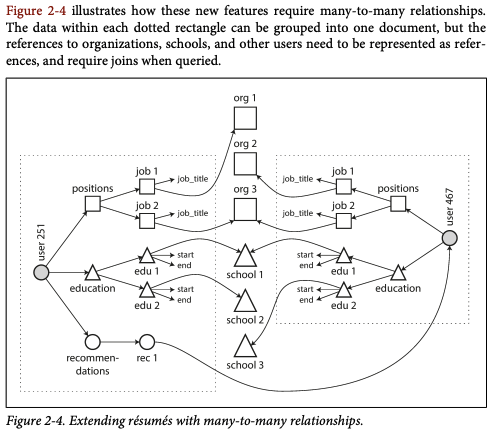

data model은 소프트웨어가 어떻게 구성될 것인가 뿐 아니라 해결하려는 문제에 대해 생각하는 방향에 대한 지대한 영향을 끼친다.  
대부분의 app은 한 data model layer 위에 또 다른 data model layer를 얹으며 구성된다. 따라서 각 layer마다 다음 아랫 layer에서는 data model이 어떻게 표현될까?에 대한 질문이 매우 중요하다.  
예를 들면,

- app 개발자는 실제 현실에 있는 것들을 객체 또는 data structure들로 모델링하고 API를 통해 이들을 어떻게 조작할지 생각한다. 때에 따라서 이러한 model은 구체적인 app만을 대상으로 모델링되기도 한다.
- app에서 구상한 data structure들을 저장하고 싶으면 general-purpose한 data model(ex. JSON, XML, Table, Graph 등)로 어떻게 표현해야할지 고려해야 한다.
- DB를 개발한 엔지니어들은 이러한 JSON,XML,Table들을 메모리에 byte들로 만들어야 한다. 그리고 이렇게 표현된 것들은 query, search, manipulate 등이 가능해야 한다.
- 더 낮은 layer의 경우 hardware 엔지니어들이 이러한 상위 layer들의 data를 전기적 또는 아날로그적 신호로 나타낼지 고려한다.

결론은 항상 각 layer마다 그 아래 layer의 복잡성을 숨기고 깔끔한 data model을 제공한다는 점이다.  
이러한 추상화를 통해 여러 layer의 종사자들이 함께 일하는 것이 가능케 한다.

각 data model마다 특징을 가지며, 이에 따라 작업을 수행하는 방식도 달라지게 된다.  
대표적인 data model인 relational, document, graph model들과 이들만의 query 방식에 대해서 알아보자.

## Relational Model vs Document Model

초기 대부분의 usecase들은 transaction processing(계좌 이체, 비행기 예약, 재산관리 등)과 batch processing(급여, 레포트 처리 등)에 기반하여 사용되었지만 이에 국한되지 않고 다른 문제들까지 generalize를 잘 하였기에 가장 많이 사용된다.

### The Birth of NoSQL

NoSQL은 Not Only SQL의 약자로 통용되며, RDB를 대체하려는 시도에 의해 탄생하게 되었다.  
NoSQL DB를 사용하고자 하는 가장 큰 이유들은 아래와 같다.

- 많은 데이터들을 처리해야할 경우 RDB보다 더 좋은 scalability와 write throughput를 가졌기에
- relation model에서 지원하지 않은 특정 query 작업들을 수행하기 위해
- relational schema의 제약을 피하고 더욱 변화하기 쉬운 data model을 표현하기 위해

### The Object-Relational Mismatch

대부분의 개발 언어는 OOP를 사용하며 여기에 SQL data model을 사용할 때 항상 따라오는 serialization 비판이 있다.  
OOP에서 사용하는 객체 data model과 relation의 table, row, column의 data model에는 서로 갭이 존재하기에 이를 맞춰주는 코드가 따로 많이 필요하며 이를 위한 라이브러리가 따로 존재한다.

예로 LinkedIn Profile과 같이 현실에 이력서와 같이 일대다 관계를 relational data model로 표현하는 여러 방법을 알아보자.

- 직무, 학력 그리고 연락처 정보들을 data 정규화를 통해 표현하기 위해 각각의 table과 외래키를 구성해 저장 가능하다.
- 최신 SQL에서는 JSON/XML과 같은 data 종류와 이와 관련된 indexing과 query를 지원하기에 하나의 row에서 multi-valued data를 저장 가능하다.
- 정보들을 JSON/XML document로 encode하여 test 타입으로 table에 저장한다. 그리고 app에서 이러한 text를 따로 변환하여 정보를 가져온다. 이 경우, 보통 DB에서 query를 통해 값을 사용할 수 없다.


JSON model의 경우 locality를 table보다 더 가지는 이점이 있다. table의 경우 이력서를 정보를 가져오기 위해 여러 query들을 수행하여야 한다. 하지만 JSON의 경우 document에 관련 정보를 모두 가지기에 하나의 query만으로도 충분하다.  
일대다 관계에서 relational의 경우 tree 구조를 내재적(implict)으로 나타나며, JSON의 경우 직접적(explicit)으로 나타낸다.

### Many-to-One and Many-to-Many Relationships

Figure 2-1에서 region_id와 industry_id가 text 형식이 아닌 표준화된 id 형태로 주어지는 이유는 다음과 같다.

- 모든 프로필에서 일관적인 스타일과 철자 사용
- 같은 도시를 다르게 표현하는 등의 모호함 없음
- id에 대한 정보를 바꾸더라도 하나의 저장소에서 관리되기에 변경된 내용을 프로필들에 일일히 반영하지 않아도 됨
- 지역이나 산업 등을 다른 언어로 번역하여 나타내는 등의 지역화 작업이 쉬워짐
- id를 통해 search 작업을 더 효율적으로 수행 가능

결국 id와 text 중 하나를 선택하는 기준은 중복성에 대한 질문에 달려있다.  
만약 text를 통해 정보를 저장한다면 사람이 이해할 수 있는 정보가 여러 곳에 중복되어 저장될 수 있으며, id의 경우 하나의 정보에 대한 reference를 의미하기 때문에 정보의 중복이 발생되지 않는다.
또한 id 자체는 사람에게 어떠한 정보도 가지지 않기에 수정될 필요가 없어 그냥 유지하면 된다.

사람에게 의미를 가지는 정보는 어떠한 이유에서든 미래에 수정될 여지가 있다. 그리고 이러한 정보가 만약 여러 곳에 중복되어 저장되는 형태라면 수정 작업마다 많은 overhead를 야기할 것이다. 결과적으로 이는 **정보의 비일관성**을 야기한다.  
DB에서 이러한 중복성을 없애는 것을 정규화(normalization)이라 한다.

이러한 정규화 작업은 일대다 관계를 필요로 한다. 그리고 다대일 관계는 tree 구조로 표현될 수 있으며, 이는 RDB에서는 자연스럽게 JOIN을 통해 가능하지만 document DB의 경우 관련 정보를 하나의 document들에 저장하기에 작업을 진행하기 어색하다.  
또한 초기에는 document model로 표현하는 것이 아주 잘 들어 맞았어도 나중에 기능이 추가되거나 요구사항이 바뀌면서 data들은 서로 연결되는 경향이 있기에 결국에는 어떠한 JOIN을 DB 또는 app 상에서 구현해야하는 경우가 많다.

예를 들어, 만약 학력과 직무에 대한 정보가 학교와 조직에 대한 정보를 reference 하도록 기능을 수정하는 경우 여러 프로필들에서 여러 학교와 조직들이 연결되어 다대다 관계가 발생하게 된다.



### Are Document Databases Repeating History?

DB에서 관계를 표현하는 가장 최고의 방법은 무엇인가에 대한 논쟁은 초기부터 이어져 왔다.  
초기 IBM에서 개발한 IMS는 hierarchical model을 통해 data를 표현하였으며, document DB에서 사용하는 JSON과 매우 유사하다. 따라서 일대다 관계를 표현하는데 좋았고 JOIN이 없기에 다대다 관계를 표현하는데 문제를 겪었다. 따라 개발자들은 비정규화를 통해 data를 중복하여 저장할지 아니면 직접 여러 정보의 reference를 해결할지 정해야 했다.

이러한 IMS의 한계를 극복하기 위해 relational model이나 network model 등이 제안되었고 관계를 표현하는 최고의 방법을 찾는 문제에 대한 논의는 현재까지 이어지고 있다.

#### The network model

CODASYL model로 불리기도 하는 이 network model은 기존 hierarhical model의 일반화이다. 즉, tree 구조에서는 record가 하나의 부모만을 가졌지만, network model에서는 graph처럼 여러 부모를 가지고 있다.  
따라서 이를 통해 다대다 관계를 좀더 잘 표현할 수 있게 된 것이다.

record의 연결은 외래키와 같은 방식이 아닌 c언어의 포인터와 같은 방식으로 작동한다.  
따라서 원하는 record를 찾기 위해서는 처음 root record에서 시작해 연결된 path를 따라가며 찾게된다. 그리고 이렇게 원하는 record를 찾는 path를 access path라고 부른다.

아주 간단한 경우에는 access path는 linked list와 같으며 원하는 data를 찾는데 O(n)의 시간이 걸린다.  
하지만 다대다 관계에서는 여러 path가 하나의 record를 향할 수 있고 개발자들은 이러한 여러 path들에 대한 정보를 계속해서 추적해야 한다. 이러한 모든 경우를 고려해야한다는 것은 n차원의 data 공간을 탐색하는 것과 같이 매우 복잡하다.

이러한 path를 따라가는 query의 작동 방식은 약간의 변화에도 취약하여 유연하지 못하다. 왜냐하면 query를 위해 작성한 code가 현재 구성된 access path들을 가정한 상태로 동작하고 있기 때문이다.

#### The relational model

반면 relational model의 경우에는 복잡하게 중첩된 구조 대신 data들을 그저 table(행과 열)로 표현하여 access path를 따라가지 않고도 원하는 data를 찾을 수 있다. 특정 열의 값을 key로 원하는 row에 저장된 record에 접근할 수 있으며, 다른 table과의 외래키 관계를 고려하지 않고 단순히 새로운 data를 table에 추가 가능하다.

relational model에서는 query optimizer가 자동적으로 query의 작동 순서와 어떤 index를 활용할지 정한다. 즉 어떤 access path를 선택할지 자동적으로 선택해줘 개발자가 사용하기 쉽다.  
따라서 기존 model들 보다 DB를 수정하기 쉽다.

relational model에서 작동하는 query optimizer는 처음 개발할 땐 매우 복잡한 연구가 필요했지만, 한번 생성한 후에는 추후 어떠한 변화에도 활용할 수 있는 general-purpose solution이기에 장기적으로 봤을 때 매우 효율적이다.

#### Comparison to document databases

Document model의 경우 중첩된 record들을 그들의 부모에게 저장하는 방식이기에 어찌보면 이전 hierarchical model로 다시 회기한 것이다.

하지만 다대일 그리고 다대다 관계를 표현하는 방식을 보면, relational model과 그리 다르지 않다. 둘다 고유한 식별자를 통해 관련된 record를 찾으며, 이 과정에서 JOIN 또는 후속 query들을 활용한다.

### Relational Versus Document Databases Today

Document model의 경우 schema가 유연하고, locality를 활용한 더 좋은 성능 그리고 app에서 사용하는 data 구조와 유사하다.  
Relational model의 경우 JOIN을 통한 다대일 그리고 다대다 관계를 더 잘 표현할 수 있다.

#### Which data model leads to simpler application code?

만약 일대다 관계(tree 구조)의 data를 다룰 경우 document model이 더 알맞다.  
relational의 경우 document와 유사한 구조의 data들을 여러 table들로 나누기에 schema와 app의 코드를 복잡하게 만든다.

하지만 만약 다대다 관계가 필요하거나 document 내 특정 값을 바로 접근하고 싶다면 relational model을 활용하는 것이 맞다. 이를 통해 중복성을 없애고 JOIN을 통해 관계를 쉽게 표현할 수 있기 때문이다.

모든 data들에 적합한 model을 딱 말하는 것은 불가능하기에 여러 주어진 조건에 알맞은 model을 고려하여 선택할 줄 알아야 한다. 예를 들어 만약 data가 서로 얽혀있는 경우 graph model이 최고이고, relational model은 사용할만 하지만 document의 경우 부적절하다.

#### Schema flexibility in the document model

schema가 없다는 뜻은 임의의 key와 value가 document에 추가될 수 있으며, document에 어떤 field가 포함될지 보장할 수 없다는 의미이다.  
정확히 말하면 document model은 schema가 내재적으로 존재하며 이는 강제되지 않지만 read 과정(schema-on-read)에서 특정 형태의 schema를 가정하여 진행된다는 뜻이다. 반면에 relational model의 경우 schema가 write 과정(schema-on-write)에서 가정되어 db에서 특정 schema 형태를 data에 강제한다.

schema-on-read는 dynamic(runtime) type checking이고 schema-on-write은 static(compile-time) type checking이라고 이해하면 편하다.

schema-on-read 방식은 만약 저장되는 data의 형태가 항상 같은 구조가 아닐 때 큰 장점을 가진다.  
data가 외부 시스템에 의해 정해지거나 다양한 type의 객체가 존재하지만 각각의 type으로 설정하는 것이 알맞지 않은 경우가 이에 해당한다.

하지만 만약에 data가 모두 같은 구조로 존재해야한다면 schema-on-write이 유용하다.

#### Data locality for queries

document의 경우 binary나 JSON 등으로 encode되며 하나의 연속된 string으로 저장된다.  
따라서 data들이 모두 한곳에 뭉쳐있기에 locality(지역성)의 장점을 활용하여 빠르게 data를 가져올 수 있다.  
이러한 locality는 많은 양의 data들을 한번에 가져와할 때만 적용되며, document가 수정될 경우 encode된 크기가 바뀌는 경우 전부 새로 작성되어야 하기에 document를 되도록 작고 크기를 늘리지 않는 수정만 하는 것이 좋다.

몇몇 RDB에서도 이러한 locality를 적용한 경우가 존재하며, 대표적으로 google의 spanner db의 경우 table schema가 부모 table의 row내에 중첩될 수 있게 허용하여 이를 적용하였다.

#### Convergence of document and relational databases

RDB에서는 JSON/XML 형태를 지원하며 반대로 document DB에서는 JOIN과 같은 query를 수행할 수 있게 하였다.  
결과적으로 양쪽 DB가 자신의 단점을 보완하는 과정에서 유사해지고 있으며 이 둘의 hybrid 형태가 미래의 DB가 되지 않을까 예상한다.

## Query Languages for Data

SQL declarative query language이며, document model의 경우 imperative query language이다.  
imperative의 경우 자신의 원하는 결과를 얻기 위해 필요한 작업을 명령하는 방식이고, declarative의 경우 자신의 원하는 결과를 직접적으로 명시하는 방식이다.

DB에서는 declarative의 형태가 더욱 매력적인데 이는 DB 엔진의 자세한 구현 내용을 숨길 수 있기 때문이다. declarative의 query는 원하는 결과만을 나타내기에 이를 변경하지 않고도 엔진에 대한 성능 향상 작업을 할 수 있다. 하지만 imperative의 경우 query에서 명시된 작업의 순서를 마음대로 변경할 수 없기 때문에 엔진이 메모리 등의 자원을 수정할 경우 query에 작성한 포인터의 위치 등 또한 수정해야 된다.

마지막으로, declarative의 경우 병렬 수행이 가능하지만 imparative의 경우 특정 명령들이 순서에 맞게 수행되어야 하기에 병렬 수행을 구현하기 어렵다. 병렬적으로 여러 엔진이 작업을 수행할 경우 대기상태와 같은 이유로 순서가 꼬일 수 있기 때문이다.

document DB인 MongoDB에서는 이러한 declarative query를 위해 aggregate pipeline 기능을 추가하여 원하는 데이터 형태를 명시하면 그 밑에 엔진이 알아서 이를 수행한다.

web의 경우 javascript를 통해 style을 바꾸는 것보다 CSS를 통해 이를 수정하는 것이 더 효율적인 이유도 이와 같은 이유이다.

### MapReduce Querying

MapReduce란 많은 양의 data에 대한 특정 처리 과정(pipeline과 같이)을 분산된 장치 전역에서 수행하는 programming model이며 document db에서 이를 지원한다. imperative와 declarative를 결합한 형태를 가진다.

원하는 data 형태를 나타내는 부분과 적업을 수행하기 위한 함수인 map과 reduce로 이뤄져 있으며, 이 두 함수 모두 pure function이여야 한다. 즉, 함수에 arg으로 들어온 data만 다룰 수 있고 side effect를 가지면 안되고 이외 추가적인 query를 수행할 수 없다.  
이러한 제약조건을 통해 DB에서 함수를 어떤 조건이나 순서에 상관없이 언제든 수행 또는 재수행할 수 있다. 그리고 제약조건이 존재하지만 여전히 라이브러리 함수를 호출하거나 연산 등을 수행할 수 있기에 강력한 도구이다.

MongoDB에서 mapReduce

```javascript
db.observations.mapReduce(
  function map() {
    let year = this.observationTimestamp.getFullYear();
    let month = this.observationTimestamp.getMonth() + 1;
    emit(`${year}-${month}`, this.numAnimals);
  },
  function reduce(key, values) {
    return Array.sum(values);
  },
  {
    query: { family: "Sharks" },
    out: "monthlySharkReport",
  }
);
```

MapReduce는 SQL에서도 구현될 수 있지만 많은 SQL에서 지원하고 있진 않다.

## Graph-Like Data Models

일대다 관계 또는 관계가 존재하지 않는 data라면 document model이 적절하다.  
하지만 만약 다대다 관계가 많고 매우 복잡한 data라면 graph model이 가장 적절할 것이다.

Graph model은 단순히 homogeneous한 data 뿐 아니라 여러 type의 객체들로 이뤄진 data에서도 활용될 수 있다. 이때 각 vertices와 edge들은 각각 다른 관계 또는 객체를 의미하게 된다.  
예를 들어 facebook에서는 graph를 통해 사람,장소,이벤트, 댓글 등 여러 객체들과 이들의 관계를 표현하였다.

아래 Fig 2-5 또한 graph model를 나타낸다.


graph model 중 property graph와 triple-store graph 그리고 이와 관련된 delcarative/imperative query에 대해 알아보자.

### Property Graphs

property graph에서 vertex는 아래와 같이 구성된다.

- 고유 식별자
- 나가는 방향의 edge들
- 들어오는 방향의 edge들
- property들(key-value 형태)

edge는 아래와 같이 구성된다.

- 고유 식별자
- edge가 시작하는 vertex(tail vertex)
- edge가 도착하는 vertex(head vertex)
- vertex간 관계를 나타내는 label
- property들(key-value 형태)

relational으로 생각하면 vertex들과 edge들이 들어가는 table 두 개를 생각해 볼 수 있다.  
PostgreSQL 기준 schema를 표현하면 아래와 같다.

Example 2-2

```sql
CREATE TABLE vertices (
 vertex_id integer PRIMARY KEY,
 properties json
);
CREATE TABLE edges (
 edge_id integer PRIMARY KEY,
 tail_vertex integer REFERENCES vertices (vertex_id),
 head_vertex integer REFERENCES vertices (vertex_id),
 label text,
 properties json
);
CREATE INDEX edges_tails ON edges (tail_vertex);
CREATE INDEX edges_heads ON edges (head_vertex);
```

이 model의 중요한 점들은 아래와 같다.

- 어떤 vertex라도 다른 vertex와 관계를 가질 수 있기에 항상 edge를 가질 수 있다.
- edge에는 head와 tail vertex에 대한 정보가 있기에 어디에서든 path를 따라 graph를 탐색할 수 있다.
- 여러 다른 관계들을 나타내는 label들이 존재하기에 하나의 graph 내에서 다양한 정보들을 정보할 수 있다.

이 model은 매우 유연한 특징을 가진다.  
Fig 2-5에서 이를 잘 나타내는 대표적인 점은 각 국가마다 고유한 지역 체계를 잘 반영하여 표현할 수 있다는 점이다. 프랑스와 미국의 지역 체계에 맞춰 régions와 states로 다르게 표현한 것을 확인 가능하다.

graph는 evolvability가 매우 좋아 추후 어떤 새로운 기능이 추가되어도 graph에서 이에 맞는 새로운 vertex와 기존 vertex와의 관계를 표현하는 edge를 추가하는 방식을 통해 쉽게 data를 반영할 수 있다.

### The Cypher Query Language

Cypher는 declarative한 language로 property graph에서 사용된다.
Example 2-3에서는 Fig 2-5를 만들기 위한 Cypher query를 나타내며, vertex에는 USA나 Idaho와 같은 label이 붙어있고 edge는 ->를 통해 labeling하여 생성한다.

Example 2-3.

```
CREATE
 (NAmerica:Location {name:'North America', type:'continent'}),
 (USA:Location {name:'United States', type:'country' }),
 (Idaho:Location {name:'Idaho', type:'state' }),
 (Lucy:Person {name:'Lucy' }),
 (Idaho) -[:WITHIN]-> (USA) -[:WITHIN]-> (NAmerica),
 (Lucy) -[:BORN_IN]-> (Idaho)
```

Example 2-4에서는 이렇게 생성된 graph에 대한 query를 나타내며, MATCH 문을 통해 주어진 조건에 맞는 pattern을 찾아낸다.

```
MATCH
 (person) -[:BORN_IN]-> () -[:WITHIN*0..]-> (us:Location {name:'United States'}),
 (person) -[:LIVES_IN]-> () -[:WITHIN*0..]-> (eu:Location {name:'Europe'})
RETURN person.name
```

위 query는 다음과 같이 해석된다.

1. person을 tail vertex로 BORN_IN label을 가진 edge와 연결된 어떤 head vertex 중 WITHIN edge를 통해 location이 United States인 vertex와 연결된 pattern을 찾는다.
2. 같은 person tail vertex에서 LIVES_IN edge를 가진 head vertex 중 location이 Europe인 vertex와 연결된 pattern을 찾는다.

declarative한 query이기에 이를 수행하는 방법은 여러가지가 있을 수 있다.  
먼저 person vertex들을 전부 찾아 조건에 맞는 것들만 가져오거나 반대로 location에서 조건에 맞는 vertex를 찾아 거꾸로 person을 찾는 path를 따를 수도 있다.  
즉, declarative하기에 query optimizer가 가장 최적의 방법으로 알아서 query를 수행할 수 있고 사용자는 이에 대해 자세히 알지 못해도 사용할 수 있게 되는 것이다.

### Graph Queries in SQL

Example 2-2와 같이 graph model을 relational model에서도 표현 가능하다.  
즉, SQL을 통해 graph data에 대한 query 또한 사용할 수 있다는 뜻이다.  
단, 어려운 점은 query를 수행하는데에 있어 JOIN 작업을 얼마나 수행해야 하는지 사전에 알지 못한다는 것이다.

Fig 2-5에서 원하는 person과 location vertex pattern을 찾기 위해 중간에 얼마나 많은 edge를 거쳐야 하는지 모르기에 Cypher에서는 \\[:WITHIN*0..]을 통해 이를 나타내었다.  
SQL에서는 이러한 variable-length traversal path를 query로 표현하기 위해 recursive common table expressions(WITH RECURSIVE syntax)를 활용할 수 있다.

Example 2-5.

```sql
WITH RECURSIVE
 -- in_usa is the set of vertex IDs of all locations within the United States
 in_usa(vertex_id) AS (
 SELECT vertex_id FROM vertices WHERE properties->>'name' = 'United States'
 UNION
 SELECT edges.tail_vertex FROM edges
 JOIN in_usa ON edges.head_vertex = in_usa.vertex_id
 WHERE edges.label = 'within'
 ),

 -- in_europe is the set of vertex IDs of all locations within Europe
 in_europe(vertex_id) AS (
 SELECT vertex_id FROM vertices WHERE properties->>'name' = 'Europe'
 UNION
 SELECT edges.tail_vertex FROM edges
 JOIN in_europe ON edges.head_vertex = in_europe.vertex_id
 WHERE edges.label = 'within'
 ),

 -- born_in_usa is the set of vertex IDs of all people born in the US
 born_in_usa(vertex_id) AS (
 SELECT edges.tail_vertex FROM edges
 JOIN in_usa ON edges.head_vertex = in_usa.vertex_id
 WHERE edges.label = 'born_in'
 ),

 -- lives_in_europe is the set of vertex IDs of all people living in Europe
 lives_in_europe(vertex_id) AS (
 SELECT edges.tail_vertex FROM edges
 JOIN in_europe ON edges.head_vertex = in_europe.vertex_id
 WHERE edges.label = 'lives_in'
 )

SELECT vertices.properties->>'name'
FROM vertices
-- join to find those people who were both born in the US *and* live in Europe
JOIN born_in_usa ON vertices.vertex_id = born_in_usa.vertex_id
JOIN lives_in_europe ON vertices.vertex_id = lives_in_europe.vertex_id;
```

위 SQL을 해석하면 아래와 같다.

1. name 값이 United States들을 찾아 vertex집하에서 가장 첫번째 element로 만들고 이 vertex로 향하는 모든 within edge들이 찾아질 때까지 반복한다.
2. name 값이 Europe인 vertex에 대해서도 1번 과정을 반복한다.
3. 1번에서 찾은 vertex집합들을 향하는 born_in edge들을 전부 따라가 미국에서 **태어난** 사람들을 찾는다.
4. 2번에서 찾은 vertex집합도 같은 방법을 통해 유럽에서 **사는** 사람들을 찾는다.
5. 마지막으로 각 두 집합에서 찾은 vertex들 간 join을 수행하여 미국에서 태어나고 유럽에서 사는 사람들의 이름을 가져온다.

graph query를 통해서는 4줄이지만 sql에서는 엄청 복잡하게 나타내어진다.
따라서 이를 통해 다른 data model들은 각각 다른 use case들을 만족하기 위해 설계되었음을 직접 확인할 수 있다.

### Triple-Stores and SPARQL

Property graph model과 유사하지만 Triple-Store와 관련된 다양한 기술과 도구들이 app을 개발할 때 유용할 수 있기에 알아본다.

모든 정보가 (Subject 주어,Predicate 서술어,Object 목적어)인 간단한 three-part statement로 저장된다.

- Subject는 graph에서 vertex와 동일하다.
- Object는 primitive datatype 또는 vertex가 될 수 있다.
  primitive datatype의 경우 string 또는 숫자를 예로 생각해 볼 수 있고, 이 경우 subject와 key-value 관계를 가지게 된다. 따라서 (lucy, age, 33)인 경우 vertex lucy를 key 그리고 age:33을 value로 볼 수 있다.
  vertex인 경우, predicate는 graph의 edge가 되며, subject는 tail vertex 그리고 object는 head vertex이다. predicate을 통해 두 vertex간 관계를 설명하게 된다. 따라서 (lucy, marriedTo, alain)의 경우 vertex lucy,alain 사이에 marriedTo라는 edge로 관계를 나타내게 된다.

Example 2-7.

```
@prefix: <urn:example:>.
_:lucy a :Person; :name "Lucy"; :bornIn _:idaho.
_:idaho a :Location; :name "idaho"; :type "state"; :within _:usa.
_:usa a :Location; :name "United States"; :type: "country"; :withIn _:namerica.
_:namerica a :Location; :name "North America"; :type "continent".
```

세미콜론(;)을 통해 같은 vertex에 대해서 여러 값들을 할당할 수 있다.  
만약 predicate이 edge이면 object는 vertex이고 :bornIn _:idaho, :within _:usa와 같이 표현된다.  
만약 property라면 object는 string이며, :name "United States"와 같이 표현된다.

### The semantic web

triple-store에 대해서 공부하다보면, semantic web과 관련된 정보들을 자주 볼 수 있을 것이며, triple-store와 semantic web은 서로 독립적이지만 많은 사람들이 이 둘이 밀접히 연관되어 있다고 생각하기 때문에 간략히 언급한다.

semantic web은 website에서 사람이 읽을 수 있는 정보 뿐아니라 일관성있는 format으로 기계가 이해할 수 있는 format의 data(Resource Description Framework) 또한 게시하여 "인터넷에 있는 web들을 db화 하자"에 대한 아이디어이다.  
하지만 현재는 실제로 활용되고 있지는 않다.

### The RDF data model

Example 2-7에서 사용한 언어는 human-readable RDF data이다. 때로는 RDF는 XML 형태로 작성될 수 있으며, 이 경우 같은 정보이지만 좀더 verbose하다.

Example 2-8. The data of Example 2-7, expressed using RDF/XML syntax

```xml
<rdf:RDF xmlns="urn:example:"
xmlns:rdf="http://www.w3.org/1999/02/22-rdf-syntax-ns#">
<Location rdf:nodeID="idaho"> <name>Idaho</name> <type>state</type>
<within>
<Location rdf:nodeID="usa"> <name>United States</name> <type>country</type> <within>
<Location rdf:nodeID="namerica"> <name>North America</name> <type>continent</type>
          </Location>
        </within>
      </Location>
    </within>
</Location>
<Person rdf:nodeID="lucy"> <name>Lucy</name>
<bornIn rdf:nodeID="idaho"/>
  </Person>
</rdf:RDF>
```

semantic web을 위해 디자인되었기에 subject,predicate,object가 URI가 될 수 있다.  
이는 나의 data와 다른 web에 있는 data를 결합 할 수 있게 하기 위함이며, URI를 통해 서로 다른 web에서 같은 predicate을 사용하더라도 충돌을 피할 수 있다.(namespace와 같이)

### The SPARQL query Language

SPARQL은 RDF data model을 사용하는 tripe-store을 위한 declarative query 언어이며, Cypher와 유사하다.

Example 2-9. The same qeury as Example 2-4, expressed in SPARQL

```
PREFIX : <urn:example>

SELECT ?personName WHERE {
  ?person :name ?personName.
  ?person :bornIn / :within* / :name "United States".
  ?person: livesIn / :within* / :name "Europe".
}
```

아래에 있는 expression은 두 결과가 동일한 query문이다.

(person) - [:BORN_IN]-> () -[:WITHIN*0..]-> (location) # Cypher
?person :bornIn / :within\* ?location. # SPARQL

RDF에서는 predicate에서 vertex와 property를 구별하지 않기에 property matching을 위해 같은 syntax를 사용할 수 있다.  
따라서 property name을 찾고 싶으면 아래와 같이 작성한다.

(usa {name:'United Staes'}) #cypher
?usa :name "United States". #SPARQL

semantic web은 사용되지 않지만 SPARQL은 app을 개발할 때 내부적으로 사용할 수 있는 강력한 도구가 될 수 있다.

### The Foundaation: Datalog

Datalog는 오래된 언어이지만 많은 query 언어들이 기반으로 삼았기에 중요하다.  
Cascalog와 같이 Hadoop에서 많은 dataset들을 query할 때 사용하는 query 언어가 Datalog를 기반으로 구현되었다.

Datalog의 data model은 triple-store model과 유사하지만 좀더 일반화 되었다. triple-store처럼 (subject,predicate,object)로 작성하는 대신 predicate(subject,object)로 작성된다.

Example 2-10. Figure 2-5의 data를 Datalog로 표현

```
name(namerica, 'North America').
type(namerica, continent).

name(usa, 'United States').
type(usa, country).
within(usa, namerica).

name(idaho, 'Idaho').
type(idaho, state).
within(idaho, usa).

name(lucy, 'Lucy').
born_in(lucy, idaho).
```

data를 정의하였으니, 전과 동일한 결과를 가지는 query문을 작성해보자.

Example 2-11. Example 2-4와 동일한 query를 Datalog로 표현.

```
within_recursive(Location, Name) :- name(Location, Name). /* Rule 1 */

within_recursive(Location, Name) :- within(Location, Via), /* Rule 2 */
                                    within_recursive(Via, Name).

migrated(Name, BornIn, LivingIn) :- name(Person, Name), /* Rule 3 */
                                    born_in(Person, BornLoc),
                                    within_recursive(BornLoc, BornIn),
                                    lives_in(Person, LivingLoc),
                                    within_recursive(LivingLoc, LivingIn).
?- migrated(Who, 'United States', 'Europe').
/* Who = 'Lucy'. */
```

Cypher와 SPARQL에서는 바로 SELECT문으로 넘어가지만 Datalog에서는 작은 단계를 차례로 거쳐 query를 진행한다.  
Datalog에서는 Rule을 정의하고 매 단계 Rule의 결과를 차례로 이어나가 원하는 결과를 찾을 수 있는 것이다.

Rule에서는 대문자는 변수를 predicate은 Cypher와 SPARQL와 동일하게 match된다. 예를 들면, name(Location, Name)은 Location namerica와 Name 'North America'를 찾아낸다.  
Rule은 :- operator의 오른쪽에 위치한 모든 predicate에 적용되며, 적용될 때 :-의 왼쪽의 변수가 실제 value로 대체되어 db에 추가된 것과 같이 결과가 나온다.

Example 2-11의 결과를 Rule을 통해서 알아보자.

1. name(namerica, 'North America')는 db에 존재하기에 Rule 1이 적용되고 within_recurisve(namerica, 'North America')를 생성한다.
2. within(usa, namerica)가 db에 존재하고 이전 단계에서 within_recurisve(namerica, 'North America')를 생성하였기에 Rule 2가 적용된다. 그리고 within_recursive(usa, 'North America')를 생성한다.
3. within(idaho, usa)가 db에 존재하고 이전 단계에서 within_recursive(usa, 'North America')를 생성하였기에 Rule 2가 적용된다. 그리고 within_recursive(idaho, 'North America')가 생성된다.

Rule 1,2 반복을 통해 within_recursive predicate은 db에 있는 North America의 모든 location들을 알려준다.


마지막으로 Rule 3을 통해 어떤 location에서 BornIn 그리고 어떤 location에서 LivingIn한 사람들을 찾을 수 있다.  
BornIn = 'United States', LivingIn = 'Europe' 그리고 사람은 Who 변수로 설정하면 Datalog에서 Who 변수의 값을 알려준다.

## Summary

이번 장에서는 다양한 model들에 대해서 알아 봤으며, 모든 것을 자세히 보지는 못했지만 overview를 통해 app의 요구사항에 따라 어떠한 best fit model을 찾을 지 알기에는 충분할 것이다.

역사적으로, data는 큰 hierarchical model을 나타내는 하나의 Tree로 표현되었지만, 다대다 관계를 표현하기에는 적절치 못하였고 따라서 relational model이 이를 해결하기 위해 개발되었다.  
최근에는 개발자들이 relation model에 적합하지 않은 경우를 해결하기 위해 NoSQL을 datastore로 사용하고 있고 이러한 행보는 2가지로 큰 방향으로 구분해 볼 수 있다.

1. Document db는 data가 self-contained document들과 하나의 document가 다른 document와의 관계가 거의 없을 경우를 목적으로 한다.
2. Graph db는 반대로 data가 잠재적으로 모든 것들과 관계를 가질 수 있을 경우를 목적으로 한다.

document,realtional,graph이 세 가지 model들은 각자만의 도메인을 가진다. 하나의 model이 다른 model을 흉내낼 수 있지만 결과적으로 부족하다. 따라서 우리는 다른 목적들을 위한 다른 시스템을 가지는 것이며, 하나의 것이 모든 문제를 해결해주는 만능 열쇠가 될 수 없다.

document와 graph model이 가지는 공통점은 둘 다 저장되는 data에 대한 schema를 강제하지 않기에 요구사항을 바꿔도 app이 쉽게 적응할 수 있다는 점이다. 하지만 app 대부분은 data에 대한 명확한 structure을 예상하고 있기에 schema를 implict(read 시점에서 사용)하게 할지 explicit(write 시점에서 강제)할지에 대한 질문이 되게 될 것이다.

각 data model은 저마다 query 언어와 framework가 존재하며, 지금까지 SQL, MapRedcue, MongoDB's aggregation pipeline, Cypher, SPARQL 그리고 Datalog에 대해 알아봤다.  
다음 장에서는 설명되었던 data model을 구현할 때 발생하는 trade-off들에 대해 알아보자.
