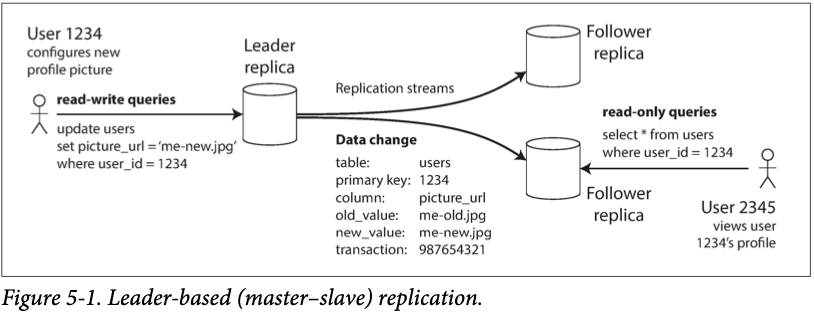

*Replication:* 같은 data의 copy들을 network를 통해 연결된 여러 독립적인 machine들에 저장하는 것  
Replication을 수행하는 이유는 다음과 같다.

- user들의 latency를 낮추기 위해 지정학적으로 가까운 곳에 data를 보관하기 위해(reduced latency)
- system 요소들 중 몇몇이 crash 하여도 계속해서 작업을 수행할 수 있게 하기 위해(availability)
- read query에 대한 throughput을 높히기 위해(scale out)

이번 장에서는 dataset의 크기가 하나의 machine 내 전부 저장되는 크기라 가정한다.
그리고 Chp6에서 dataset의 크기가 너무 큰 경우 사용되는 *partitioning* (*sharding*)에 대해 알아본다.

distributed system에서 replication을 수행할 때 발생하는 모든 문제들은 data를 *change*할 때 발생한다.
만약 절대 수정되지 않는 data를 다룰 경우 단순히 복사하여 저장하고 이를 read하기만 하면 된다.
*change*를 수행하는 방법은 3가지(*single-leader*, *multi-leader*, and *leaderless*)가 존재하며, 각각 장단점이 존재한다.

replication을 수행할 때 선택해야하는 config의 trade-off들로는 synchronous vs async 그리고 failover 처리 방법이 존재한다.

# Leaders and Followers

data에 대한 copy를 저장하는 DB를 *replica*라 한다.
그러면 저장되는 모든 data들이 모든 replica에 반영되게 하려면 어떻게 해야할까?

가장 간단한 방법은 하나의 leader node를 두어 모두 write을 처리하게 하고 follower는 이에 대한 *log* 또는 *change stream*을 받아 이를 반영하는 방식인 *leader-based replication*이다.

1. replica 중 하나를 leader로 선택하여 client가 db에 write을 할 때 leader에게만 request를 보내게 한다.
그러면 leader에서는 가장 먼저 자신의 local storage에 새로운 data를 write한다.
2. leader가 write을 수행할 때마다, *replication log* 또는 *change stream*을 통해 follower에게 data change에 대한 정보를 보낸다. 각 follower들은 이를 받아 leader에서 수행된 write의 순서 그대로 db를 업데이트한다.
3. client에서 read를 수행할 경우, query는 leader 또는 어떠한 follower에게라도 갈 수 있다.
오직 write만 leader에서 독점적으로 진행한다.

*Figure 5-1. Leader-based (master–slave) replication.*

Leader-based replication model은 PostgreSQL, MySQL, MongoDB 등 많은 DB에서 built-in으로 제공한다.

## Synchronous Versus Asynchronous Replication

leader의 write이 결국에는 어느 시점에 follower에게 반영될 것이고 leader는 다시 client에 update에 대한 정보를 보낼 것이다.
이렇게 follower에게 반영되는 시점과 client에게 update 정보를 보내는 시점을 어떻게 구현했냐에 따라 synchronous와 asynchronous가 나뉜다.

*Figure 5-2. Leader-based replication with one synchronous and one asynchronous follower.*

**Sync**

Follower 1의 replication은 synchronous: leader가 follower로부터 update가 성공했다는 응답을 받은 후 client에게 응답한다.

follower에게 즉각적으로 update가 반영되기에 항상 최신 상태이며, 따라서 leader가 crash하여도 data durability가 보장된다. 하지만 하나의 node라도 응답하지 않는 경우 system 전체에서 client의 write 작업이 중단되게 된다.

**Async**
Follower 2의 replication은 asynchronous: leader가 write을 처리 후 client한테 바로 응답한다. 그리고 나중에 follower에게 전달한다.

follower에게 update 전달할 때 delay가 존재하며, 보통 1초 이내로 이뤄지지만 때에 따라 훨씬 늦어지는 경우도 존재한다. 따라서 leader가 crash 할 경우 follower에게 전달되지 못한 update는 사라질 수 있어 durability를 보장하지 못한다. 하지만 몇몇 node가 crash나 network fault와 같은 이유로 작동하지 않거나 update가 뒤쳐져있어도 client는 정상적으로 write을 수행할 수 있어 availability가 증대된다.

sync 방식의 경우 system 전체가 멈출 수 있기에 현실에서는 보통 async 방식이 선호된다.
때에 따라서는 두 방식을 혼합하여 몇몇 node에는 sync하게 update를 반영 후 나머지 node들은 async하게 이를 반영하여 두 마리 토끼를 모두 잡는 *semi-synchronous*를 사용한다.

### Research on Replication

async replication system의 경우 data loss가 발생할 수 있기에 chain replication과 같이 좋은 성능 및 가용성을 가질 수 있는 기법들이 연구되었으며, Microsoft Azure storage에서 이를 활용한다.

replication consistency와 consensus(여러 node가 저장되는 value에 대한 합의)는 밀접한 관계를 가지며, 이에 대해 chp9에서 자세히 다룬다.

## Setting Up New Followers

follower replica를 추가하거나 failed node를 대체할 경우 이들에게 최신 상태의 leader data 전달하여 consistency를 유지해야한다.

data는 지속적으로 변화하고 있기에 특정 시점의 leader file을 복사하여 가져오는 방식은 그 사이에 변화한 data를 반영하기 힘들고 이를 위해 leader를 아예 lock하는 방식은 availability를 저해한다.

availability를 유지하며 최신 상태의 data를 replica에 반영하는 방식은 아래와 같다.

1. 특정 시점의 leader의 DB에 대한 snapshot을 최대한 locking 없이 지속적으로 생성한다.
어차피 backup 용도로 많이 수행되기에 일반적으로 수행되는 작업이다.
2. 새로운 follower replica에 snapshot을 복사한다.
3. follower는 leader에 연결되어 snapshot 이후 update들을 반영한다.
이를 위해서는 snapshot이 leader의 replication log에서의 정확한 자신의 위치를 파악하고 있어야 한다.
PostgreSQL에서는 이러한 위치 정보를 *log sequence number* 그리고 MySQL은 *binlog coordinates*라 한다.
4. follower들이 *caught up*(최신 상태를 가짐) 하였으면, 계속해서 leader에서 발생하는 update를 따라가며 반영한다.

## Handling Node Outages

Node들은 보안 업데이트, fault 등 여러 이유로 down 될 수 있지만, System 전체적으로 봤을 때는 downtime이 없어야 한다. 따라서 node outage의 영향을 최소화하여 system 전체적으로 어떻게 계속 작업을 수행할 수 있게하는지 알아보자.

### Follower failure: Catch-up recovery

follower replica(node)에서 downtime이 발생하여도 각자 data changes에 대한 log를 가지고 있기에 leader와 자신의 log 위치를 비교하여 특정 시점 이후의 update들을 leader에서 log로 가져와 이를 반영하여 caught up 할 수 있다.

### Leader failure: Failover

Leader의 경우 상황이 훨씬 복잡해진다.
먼저 follower 중 하나를 leader로 승격시키고, client의 req들을 모두 그 쪽으로 보내게 reconfigured 되어야 한다. 그리고 나머지 follower들은 새로운 leader로부터 data change들을 받아 반영한다.
위의 과정을 *failover*라 한다.

Failover는 administrator가 직접 수행하거나 자동적으로 이뤄질 수 있다.
자동적인 경우 과정이 아래와 같다.

1. *Determining that the leader has failed.*
여러 이유에서 leader가 fail 할 수 있기에 이를 정확히 탐지하는 것보다 간단히 timeout을 확인해 fail 상태를 확인한다: health check를 통해 정해진 time 내 leader의 응답이 없으면 fail로 간주하여 failover를 수행한다.
2. Choosing a new leader
election process(남아있는 replica들 중 과반수에 의해 선정) 또는 이전 *controller node*에서 지정한 node를 leader로 선정한다. 가장 이상적인 leader 후보는 가장 최신 상태의 data change를 가지고 있어 data loss를 최소화 할 수 있는 node이다. 모든 node에서 새로운 leader에 대한 consensus 과정이 이뤄지는데 이는 chp9에서 다룬다.
3. *Reconfiguring the system to use the new leader*
client에서는 새로운 leader에게 request를 보낸다. 만약 이전 leader가 복구되었을 경우, 새로운 leader가 존재하는 것을 모르고 계속 leader 역할을 할 수 있기에 system에서 이전 leader는 새로운 leader를 인지하고 follower가 되도록 해줘야 한다.

Failover 과정에서 발생하는 문제점들은 다양하다:

- async에서는 새로운 leader가 이전 leader의 모든 data change를 반영하지 못할 수 있다.
이 상황에서 이전 leader가 다시 작동한다면 data conflict가 발생할 것이며, 보통 이러한 경우 이전 leader에서 복사되지 못한 data change들은 모두 날린다.(client 입장에서는 durability를 무시하는 꽤나 과격한 처리 방법이다.)
- write를 버리는 작업은 만약 db와 연동된 외부 db가 존재할 경우 매우 큰 문제로 이어질 수 있다.
Github를 예로 들면, MySQL에서 follower가 새로운 leader가 되면서 이전 leader에서 반영하지 않은 data change는 모두 날렸다. 이때 schema에서는 primary key로 autoincrementing counter를 활용하고 있었기에 새로운 leader는 이전 leader에서 이미 사용한 value를 primary key로 활용해 새로운 data를 작성한다.
이 때 이러한 primary key들은 Redis에서도 연동되어 있었기에 primary key의 재사용은 MySQL과 Redis 사이에 data inconsistency를 야기하여 특정 data가 잘못된 user에게 보내지게 되었다.
- 특정 상황에서는 두 node가 동시에 leader 역할을 할 수 있다. 이러한 상황을 *split brain*이라 한다.
만약 두 leader에서 모두 write를 수행하고 conflict 해결에 대한 처리 과정이 없을 경우, data는 오염되거나 잃게 된다. 안전망으로 몇몇 system에서는 leader가 두 개 발견되면 하나를 shutdown하는 메커니즘을 가지지만, 두 node 모두 shutdown 하는 결과를 초래할 수도 있다.
- 적당한 timeout을 설정하기 모호하다.
longer timeout ⇒ longer time to recovery but can be certain
shorter timeout ⇒ could be unnecessary failovers but fast recovery

이러한 문제들 때문에 차라리 직접 failover를 수행하는 것을 선호하기도 한다.
지금까지 언급된 node failures; unreliable networks; trade-offs around replica consistency, durability, availability, latency 들은 모두 distributed system의 근본적인 문제들이며, 이후 chp에서 깊이 논의한다.

## Implementation of Replication Logs

실제 Leader-based replication의 여러 replication 방법에 대해 간략히 소개한다.

### Statement-based replication

leader에서 수행한 모든 write request(*statement*)에 대한 log follower에게 전달한다.
RDB의 경우 Insert, Update, Delete와 같은 statement가 follower에게 전달되는 것이다.
각 follower에서는 log를 parse하여 leader에서 수행한 statement을 그대로 수행한다.

간단해 보이지만 자세히 보면 여러 문제들이 존재한다.

- nondeterministic function 예로 NOW()와 같은 시간이나 날짜 함수나 RAND()와 같이 랜덤 숫자를 리턴하는 함수의 경우 leader의 수행 결과와 follower의 수행 결과가 같을 수 없다.
- 기존에 존재하는 data에 대한 statement 또는 autoincrementing column 등에 대한 statement의 경우 수행되는 순서에 따라 결과가 달라지게 된다. 따라서 무조건 같은 순서로 statement를 수행해야 하기에, 동시에 여러 transaction을 수행할 때 제약이 발생한다.
- side effects(triggers, stored procedures, user-defined functions)를 가지는 statement의 경우 replica마다 다른 결과를 가질 수 있다. 이를 방지하기 위해서는 side effect가 모두 deterministic해야 한다.

leader에서 statement에 존재하는 nondeterministic function call을 모두 정해진 value로 바꾸는 방식을 통해 이를 해결할 수 있지만, edge case가 많이 존재하여 쉽지 않다.

대부분 다른 log방법을 활용하는 추세이다.

### Write-ahead log(WAL) shipping

chp3에서 storage에 disk에 data를 어떤 형태로 저장하는지 다루면서 언급했었다.

- log-structured storage engine(SSTable, LSM-Tree)에서 main storage로 활용한다. append-only log segment들은 compacted 그리고 background에서 garbage-collected 된다.
- B-Tree에서는 기존 data를 overwrite하기 이전에 WAL을 작성하여 update 중 crash하여도 이를 복구할 수 있게 한다.

위 두 경우 모두 log는 db의 write에 대한 모든 정보를 가진 append-only sequence of bytes이다.
그리고 이를 그대로 활용해 replica를 생성할 수 있다.

follower에서는 leader의 log에 나온 내용 그대로 data structure를 구성하고 복사한다.
이러한 WAL의 log에는 어느 disk block의 어느 byte가 변경되었는지 등 매우 low level detail들이 포함되어 있기에 storage engine에 대한 의존성이 강하다. 따라서 만약 db의 새로운 version이 새로운 storage format으로 변경된다면 이전 version의 db와 연동되지 않을 것이다.

만약 replication이 follower가 새로운 software version을 사용할 수 있게 한다면, downtime 없이 먼저 follower를 업데이트한 후 leader를 업데이트하면서 failover하면 된다.
하지만 WAL의 경우 version mismatch를 허용하지 않기에 upgrade 시 모두 한번에 해줘야 해서 downtime이 발생한다.

### Logical(row-based) log replication

storage engine의 (*physical*) data representation에서 분리되어 나타낸 replication log를 *logical log*라 한다.

logical log는 보통 table에 어떤 record에 저장되었는지 자세한 row level에서 작성된다.

- Inserted row, log는 모든 column들에 대한 새로운 value를 가진다.
- deleted row, log는 식별자에 대한 정보(주로 primary key)를 가지며, 이게 없을 경우 삭제되는 row의 모든 col값을 기록한다.
- updated row, 식별자에 대한 정보 그리고 모든 col에 대해 업데이트하는 값을 가진다.(또는 변경하는 col에 대해서만)

storage engine이 내부적으로 어떻게 data structure를 구성하고 저장하는지는 상관없이 log의 설명 그대로 결과가 반영되도록 하면 되기에 node간 서로 다른 version이나 storage engine을 활용할 수 있다.
또한 외부 app에서 parse하여 사용하기도 훨씬 쉽다.

### Trigger-based replication

replication을 db layer가 아닌 application layer에서 접근하는 방법이다. 이는 flexibility가 요구될 때 사용되기 좋다. 예를 들어, 특정 data의 부분집합만 가져오거나, 다른 종류의 db의 data를 또 다른 종류의 db로 복사하는 등이다.

trigger는 custom application code를 등록하여 db에 data change가 있을 때마다 호출되어 수행하게 해주는 기능이다. trigger에서 data change를 별도의 table에 기록하면 외부 프로세스에서 이를 read 할 수 있게 한다. 그리고 외부 프로세스에서는 custom code를 수행하여 작업을 진행하는 방식이다.

대표적으로 Bucardo for Postgres, Databus for Oracle이 존재한다.

다른 replication 방식보다 overhead가 훨씬 많고 오류 가능성도 많지만 가장 flexible 하다.

# Problems with Replication Lag

leader-based replication는 read-scaling architecture로 적은 write은 leader로 많은 read는 모든 node에서 분산 처리하여 scaling 할 수 있다.
이러한 경우 follower가 많기에 현실적으로 sync한 update는 매우 불안정하여 async 방식을 사용한다.

async로 update를 처리할 경우 follower가 항상 leader의 최신 상태를 반영하고 있지 않기에 client가 read request를 보낼 때마다 서로 다른 결과가 응답되는 data inconsistency가 발생한다.
하지만 inconsistency는 임시적으로 발생하지 결과적으로 시간이 지나면 모든 follower가 caught up 하여 leader와 consistency를 이룬다. 그리고 이러한 consistency를 *eventual consistency*라 한다.

“eventually”라는 모호한 단어를 통해 consistency를 설명하는 것은 의도된 것이다.
follower에서 발생하는 *replication lag*는 상황마다 그 시간이 달라지지만 언젠가는 replicated 되는 점을 나타내기 위함이다.

replication lag가 큰 경우 발생하는 inconsistency의 여러 문제와 이에 대한 해결법에 대해 알아보자.

## Reading Your Own Writes

user가 data를 write한 후 leader에서 이를 반영하고 follower에서는 async하게 진행하는 상황을 가정해보자.
이때 user는 자신이 작성한 data가 성공적으로 반영된 것을 확인 후 refresh 했을 때 read query가 follower에게 전달되어 아까 성공적으로 write 했던 data가 보이지 않을 것이다.

*Figure 5-3. A user makes a write, followed by a read from a stale replica. To prevent
this anomaly, we need read-after-write consistency.*

이때 필요한 consistency를 *read-after-write consistency*, also known as *read-your-writes
consistency*라 한다.
자신이 작성한 data가 다른 user에게 언제 update 될지 모르지만 적어도 자신 스스로 확실히 update 되었다는 것을 확인할 수 있게 data consistency를 보장하는 것이다.

leader-based replication에서 read-after-write consistency를 구현하는 기법들을 아래와 같다.

- user가 수정했을 수 있는 data들을 read할 때는 leader에게 보내고 나머지는 follower에게 보낸다.
대표적으로 user profile data의 경우 각자 자신의 정보만을 수정할 수 있기에 자신의 profile read는 leader로 나머지 profile은 follower로 traffic을 보내는 규칙을 세울 수 있다.
- user가 수정 가능한 것들이 너무 많은 경우 다른 판단 기준을 생각해 볼 수 있다.
마지막 수정 시간을 기억하고 여기서 1분 동안은 read가 모두 leader에게 가게 한다. 그리고 replication lag를 모니터링하면서 follower들 중 1분 이상 data 상태가 뒤쳐진 것들을 제외하고 read를 분산하는 것이다.
- client에서 가장 최근 write에 대한 timestamp를 기억하고 있으면 system에서는 해당 user에게 read 결과를 보낼 때 적어도 timestamp 이후의 update가 반영되었는지 확인할 수 있다.
따라서 replica 중 timestamp로부터 update가 되지 않은 것들은 피하고 만족하는 다른 replica에게 read를 보내거나 replica가 update 되는 것을 기다린 후 read를 수행할 수 있다.
timestamp로는 log sequence number과 같은 logical timestamp 또는 실제 system clock(이 경우 time synchronization이 매우 중요해진다)을 사용할 수 있다.

다른 상황으로는 *cross-device* read-after-write consistency로 user가 하나의 device에서 data를 update하고 다른 device에서 이를 read할 때 금방 write한 data를 볼 수 있어야 한다.
이를 위해서는

- timestamp을 활용한 기법에서 device간 서로 다른 device에서의 update 발생 정보를 알 수 없기에 timestamp에 대한 metadata를 중앙화하여 알 수 있게 할 수 있다.
- 만약 여러 다른 datacenter들에 분산되어 있는 replica들을 가지고 있을 경우 device들이 모두 같은 datacenter로 연결된다는 보장이 없다. 따라서 같은 user들의 device들을 모두 같은 datacenter로 request를 보내도록 구현해야 한다.

## Monotonic Reads

user가 read를 수행하는 도중 정보가 *moving backward in time* 하는 경우가 발생할 수 있다.

이런 경우는 user가 여러번 read query를 보낼 때 서로 다른 replica에서 처리하는 과정에서 발생한다.
하나의 replica는 lag이 적어 update 상태를 응답했는데 다음 read는 lag이 큰 replica에서 처리되어 응답에서 update 내용이 사라지는 것이다. 이러한 경우 user는 보이던 것이 안 보이기에 큰 혼란이 올 수 있다.

*Figure 5-4. A user first reads from a fresh replica, then from a stale replica. Time
appears to go backward. To prevent this anomaly, we need monotonic reads.*

이러한 이상현상 방지를 보장하는 것이 바로 *Monotonic reads*이다. 한번 read한 data보다 오래된 data는 read하지 않고 새로운 data만 read하는 것이다.
strong consistency보단 약하지만 eventual consistency보단 강한 consistency를 보장한다.

이를 구현하는 방법 중 하나로는 user마다 지정된 replica에만 read를 보내게 하는 것이다. 이는 userId를 hash값으로 하여 특정 replica를 할당하는 방식으로 진행된다. 만약 지정된 replica가 fail하면, 다른 replica로 reroute하게하면 된다.

## Consistent Prefix Reads

replication lag로 인해 정보의 인과관계가 깨지게 되는 현상을 말한다.

*Figure 5-5. If some partitions are replicated slower than others, an observer may see the
answer before they see the question.*

Mr.Poons과 Mrs.Cake 간 대화는 인과관계에 맞게 이뤄졌지만 제 3자가 이를 read할 때 lag로 인해 update되는 data의 순서가 바뀌게 되어 인과관계가 깨지는 것을 확인할 수 있다.

이를 해결하기 위한 consistency를 *consistent prefix reads*라 한다.
write이 수행된 순서에 맞춰 read를 하도록 보장한다.

partitioned(sharded) db에서 발생하는 특정 문제로 서로 인과관계가 있는 write들은 같은 partition에 저장하는 것을 통해 해결할 수 있다. 이러한 것이 불가능한 경우 data간 인과관계를 추척하는 알고리즘을 활용할 수도 있다.

## Solutions for Replication Lag

replication이 아래에서는 async하게 작동하지만 user에게는 sync하게 보이도록 하는 것이 해결 방법이다.

위에서 언급했던 해결방안들은 확실한 보장을 제공하지만 app layer의 code를 복잡하게 만들 수 있다.
db에서 만약 알아서 이를 수행해준다면 개발자 입장에서는 참 편할 것이고 이 때문에 결국 *transactions*이 존재하는 것이다. transaction을 통해 db layer에서 강한 consistency 보장을 제공하고 app의 code를 간단하게 유지할 수 있게 한다.

분산 system에서 transaction는 성능과 availability를 저해하기에 eventual consistency는 필연적이라는 주장하면서 실제로 많은 분산 system에서 이를 사용하지 않는다. 이러한 주장은 일정 부분 사실이지만 너무 단순화한 생각이며 chp7,9에서 분산 system에서의 transaction을 다룬다.

# Multi-Leader Replication

leader-based replication model에서 leader를 여러개로 설정하여 write을 진행할 수 있게 하는 방식이다.
Replication 자체는 leader-based와 동일하게 write을 수행한 leader는 나머지 node들에게 data change를 forwarding한다. 각 leader들은 다른 leader에 대해 서로 양방향으로 data change를 주고 받는 leader 및 follower로서 동작한다.

## **Use Cases for Multi-Leader Replication**

multi-leader는 매우 현대에 usecase에 적합해 보이지만 concurrency issue 및 이를 위한 conflict resolution 등 많은 문제들이 도사리고 있기에 보통 되도록 피하려고 한다.

### Multi-datacenter operation

만약 여러 지역의 datacenter에 node들이 distributed된 system이 있다고 가정해보자.
leader-based의 경우에는 이 datacenter 중 하나의 datacenter 내 leader가 존재하고 나머지 node들은 전부 follower일 것이다. 따라서 write에 대한 request들은 전부 하나의 datacenter로 route되어야 하기에 latency 및 성능의 저하가 오게 된다.

multi-leader configuration는 차라리 user들의 write req를 가까운 datacenter들로 보내고 각 datacenter들은 leader-based model 구조로 write을 처리하는 것이다. 그 후 퍼져있는 datacenter별 leader들간 data change들을 forwarding하는 것이 latency 및 성능을 올리면서 기존 distributed system의 장점까지 유지할 수 있는 방법이라는 아이디어이다.

*Figure 5-6. Multi-leader replication across multiple datacenters*

single-leader와 multi-leader를 비교하면 아래와 같다.

Performance
single의 경우 user의 위치와 상관없이 모든 write req가 leader로 route되기에 latency가 발생할 수 있다.
반면 multi의 경우 user가 가장 가까운 leader로 route되기에 훨씬 빠르며 추후 다른 datacenter로 data change가 async하게 반영된다.

Tolerance of datacenter outages
single의 경우 leader가 fail하면 failover를 통해 다른 datacenter의 node가 leader로 승격한다.
multi의 경우 다른 datacenter들로 request를 reroute만 하고 fail한 datacenter가 복구되면 data change를 반영하면 된다.

*Tolerance of network problems*
datacenter간 연결은 보통 public internet을 통하기에 private보다 좀더 불안정하다.
single의 경우 inter-datacenter 연결을 sync방식으로 하여 replication을 진행하기에 좀더 취약한 모습을 보인다. multi의 경우 async로 연결하여 일시적으로 datacenter간 network가 멈춰도 write는 계속 수행 가능하다.

### **Clients with offline operation**

calendar app과 같이 각 device마다 오프라인 환경에서도 날짜에 event를 기록하거나 삭제하는 등의 local write 작업이 수행이 가능하며, 온라인이 되는 경우 이를 다른 device에서 앱을 켰을 때도 볼 수 있게 replication을 수행하는 방식은 multi-based replication 방식과 동일하다.

각 device는 datacenter로 보고 이들 사이의 불안정한 network는 async방식을 통한 replication으로 극복한다. replication lag의 크기가 상관없고 어쨌든 각 device마다 write은 가능하고 eventual consistency를 가지면 되는 경우이다.

### **Collaborative editing**

Google Docs와 같이 여러 사람들이 문서를 수정할 수 있게 하는 app들이다.

data replication에서 발생하는 문제들과 꽤나 비슷한 문제들을 다루는 경우로 문서에 대한 write은 먼저 각자 local에서 처리되고 이후 다른 user들에게 async하게 replication되는 방식으로 진행된다.

하나의 문서를 여러 명이 동시에 수정할 경우 conflict가 발생할 수 있으며, 만약 먼저 수정하고 있는 user가 있을 경우 다른 user는 이를 대기해야 하는 방식으로 이를 처리할 경우 transaction을 사용하는 single-leader형태로 볼 수 있다.
반면 conflict 위험에 불구하고 협동을 더 빠르게 하기위해서 data change의 단위를 작게 가져가고 locking을 사용하지 않을 수 있다.

## **Handling Write Conflicts**

multi-leader replication의 가장 큰 문제이다. 이를 위해 conflict resolution이 필요하다.

예로 두 user가 하나의 wiki page에 대해 동시에 write할 경우 각자의 leader에는 성공적으로 반영되지만 이후 leader간 sync가 async하게 이뤄지는 과정에서 conflict가 발생한다.

*Figure 5-7. A write conflict caused by two leaders concurrently updating the same
record*

### **Synchronous versus asynchronous conflict detection**

write이 sync할 경우 다른 user가 해당 data에 대해 작업을 수행하고 있는지 바로 알 수 있기에 conflict가 일어나기전 해결이 가능하다.
하지만 async의 경우 conflict가 발생한 후에 알 수 있으며, 이땐 이미 user는 자신의 write이 성공한 줄 알고 있기에 conflict 해결을 요청할 수도 없다.

만약 multi-leader에서 write하는 작업을 sync하게 처리해 모든 leader들에게 성공 응답을 받은 후 user에게 응답을 보내는 방식으로 처리하여 conflict를 해결할 수 있지만, 이때 multi-leader를 활용하는 큰 이유인 **여러 leader에서 write을 독립적으로 처리 가능함**을 잃기에 이럴꺼면 그냥 single-leader를 쓰는게 낫다.

### **Conflict avoidance**

multi-leader에서는 conflict를 해결하는 마땅히 좋은 방법이 없기에 회피하는 것이 최선이다.

만약 user가 자신만의 data만 수정할 수 있고 이러한 user들을 특정 datacenter마다 할당하여 지정된 leader에서만 write을 처리한다면 다른 leader와의 sync과정에서 conflict가 발생하지 않을 것이다.
왜냐면 각 record마다 이를 처리하는 leader가 지정되어 있기에 concurrency가 발생할 수 없기 때문이다.

하지만 만약 datacenter가 fail하여 reroute되야하거나 user가 한 지역에서 다른 지역으로 이동하여 다른 datacenter가 더 가까워진 경우 등은 다른 leader를 통해 write을 진행하게 되면서 conflict가 발생할 수 있다.

### **Converging toward a consistent state**

single-leader의 경우 write을 순차적인 순서로 진행하기에 같은 data에 여러 write이 수행되어도 최종적으로 마지막 write이 최종 data 값을 결정하게 된다.

multi-leader의 경우 이러한 write의 순서를 명확히 정할 수 없기에 어떤 write이 최종 data 값을 결정해야 할지 알 수 없다. replica들마다 들어오는 write 순서대로 처리할 경우 Fig 5-7과 같이 data inconsistency가 발생한다.
모든 replication schema는 모든 replica에서 data에 대한 consistency를 보장해야하기에 *convergent(모든 replica에서 data change를 복사할 때 최종적으로 같은 value의 data들을 가지는 것)*한 방법으로 conflict를 해결해야 한다.

convergent conflict resolution은 아래와 같은 방식으로 달성할 수 있다.

- 각 write request마다 고유한 식별자 ID를 부여한다.(timestamp, random number, UUID, hash of the key and value 등) 그리고 highest ID를 winner로 선정하고 나머지 request들은 전부 버린다.
만약 timestamp가 사용될 경우 이를 LWW(*last write wins*)라 부른다.
가장 많이 사용되는 방법이지만 data 손실에 대한 위험성이 크다.
- 위 방법과 똑같이 고유한 ID를 부여하고 이에 따라 high to low 순서대로 write을 정렬한다.
그 후 순서대로 write을 수행한다.
- conflict이 발생하는 write들의 값들을 merge한다.(두 write의 값들을 알파벳 순서로 정렬 후 concat하여 하나의 값으로 만드는 등으로 “B/C”와 같이 결과를 저장한다.)

### **Custom conflict resolution logic**

multi-leader에서는 가장 flexible한 application code에서 conflict resolution을 처리할 수 있도록 tool들을 제공한다.

On write
db에서 conflict를 발견하면 conflict handler 함수를 호출 후 background에서 실행된다.

On read
conflict가 발생하면 이와 관련된 모든 write을 저장한다. 그리고 다음 read에서 이러한 모든 version들의 data가 client에게 보내진다.
client에게 prompt으로 직접 conflict를 해결하게 하거나 client 상에서 자동적으로 이를 처리할 수도 있다.

보통 단일 row 또는 document 수준에서 conflict를 해결하며, transaction 전체에서 이를 해결하지 않는다. 따라서 만약 transaction이 atomic write들로 구성되었다면 각 write마다 conflict를 resolve해야 한다.

최근 연구에서 찾은 자동적으로 conflict를 해결하는 방법들은 아래와 같다.

- *Conflict-free replicated datatypes* (CRDTs): set, map, ordered list, counter 등과 같은 data structure로 동시에 여러 user들이 수정할 경우 conflict를 자동적으로 해결할 수 있다.(2-way merge)
- *Mergeable persistent data structures*: Git version control과 같이 history를 직접 추적하고 3-way merge를 수행한다.
- *Operational transformation*: conflict 해결 알고리즘으로 ordered list의 item에 대해 concurrent editing을 수행할 수 있도록 설계되었다.

## **Multi-Leader Replication Topologies**

*replication topology*: node간 write request가 어떤 경로로 전파되는지에 대한 묘사

Fig 5-7과 같이 node가 2개만 존재하면 양방향으로 간단히 표현할 수 있지만 3개 이상일 때부터 다양한 topology를 구성할 수 있게 된다.

*Figure 5-8. Three example topologies in which multi-leader replication can be set up*

circular와 star topology에서는 write이 특정 node들을 거쳐야 모든 replica에 도달할 수 있다.
따라서 이러한 특정 node들은 수신한 data change들을 다음 node로 전달하는 forwarding을 수행해야 한다.
이 과정에서 무한루프가 발생할 수 있기에 보통 node마다 식별자를 두고 replication log에서 write마다 이들의 식별자를 기록하여, 나중에 node가 자신의 식별자가 들어있는 write을 수신했다면 이를 무시한다.

all-to-all에 비해 circular와 star topology는 중간에 node가 fail 한다면 write가 전파되지 못하게 된다.
따라서 node 사이가 좀더 밀접하게 연결된 topology일 수록 fault tolerance가 더 높다고 볼 수 있다.

반면 all-to-all의 경우에는 전파가 특정 순서대로 진행되는 것이 아니기에 Fig 5-9와 같이 request의 인과관계가 지켜지지 못하는 문제가 발생할 수 있다.

*Figure 5-9. With multi-leader replication, writes may arrive in the wrong order at some replicas*

Leader3에서 Client A에서 수행한 Insert가 수행되기 전 이에 대한 의존성을 가지는 update가 먼저 도착하여 인과관계가 깨지게 되었다.
이렇게 의존성을 가지는 statement가 순서에 맞게 수행되게 보장하기 위해서는 timestamp를 이용할 수 있겠지만 여러 node간 time sync가 정확히 이뤄져야 한다는 문제가 존재한다.

*version vector*를 사용해 이를 해결할 수 있으며, 많은 multi-leader replication system에서는 conflict detection 기법 구현이 잘 되어있지 못하기에 multi-leader 사용에 신중함을 요한다.

# **Leaderless Replication**

leader 개념을 버리고 모든 replica에서 직접 write을 수행할 수 있게 허용하는 system이다.
Amazon *Dynamo* system(Dynamo DB와 다름)에서 사용을 시작으로 다른 여러 DB에서 이를 도입하였으며, 이들을 *Dynamo-style*이라 부른다.

몇몇 leaderless 구현 방식에서는 client가 coordinator node를 통해 write을 한번에 여러 replica에 보낸다.
하지만 coordinator에서는 write의 순서를 강제하지 않기에 인과관계가 깨질 가능성이 있다.

## **Writing to the Database When a Node Is Down**

leader기반 system의 경우 leader가 down된 상태라면 failover를 수행히지만 leaderless에서는 failover가 존재하지 않는다.

*Figure 5-10. A quorum write, quorum read, and read repair after a node outage*

*quorum write*
user가 write을 parallel하게 여러 replica에 보낸 다음 quorum 이상의 node에서 이를 성공적으로 수행했다면 몇몇 replica에서 발생한 miss는 무시한다.

*quorum read*
read 또한 parallel 하게 여러 replica에 보내기에 이전에 miss 했던 replica와 write을 수행했던 replica 사이에 다른 응답을 받게 된다. 이 때 client는 version number의 비교를 통해 더 최신 version의 결과를 활용한다.

write 작업이 quorum을 만족하는 수의 node에서 성공적으로 수행이 되었기에 quorum read를 하였을 때 read가 도달하는 node들 중 최소 하나는 updated data를 가지고 있을 것이라는 보장을 받을 수 있다.

### Read repair and anti-entropy

Replication scheme에서는 결국 모든 replica에서 모든 data를 복사하여 저장하고 있어야 한다.
따라서 down 되었던 node가 복구된 후 그 동안 miss 했던 write을 수행해야 한다.

이를 위해 Dynamo-style datastores에서는 두 가지 mechanisms을 사용한다:

*Read repair*
quorum read를 수행하면 client는 up-to-date value와 stale(outdated) value 두 가지를 모두 응답 받으면서 어떤 replica가 stale 상태인지 알 수 있다. 그러면 이 때 client가 up-to-date value로 해당 replica에 write을 보내는 방식이다.
value에 대한 read 작업이 많은 경우에 잘 사용된다.

*Anti-entropy process*
background 프로세스에서 지속적으로 replica간 data 차이가 있는지 찾으며 stale value를 최신으로 복사해준다. leader-based의 replication log와 다르게 anti-entropy process에서는 특정 write 순서 없이 replicate하며 replicate 과정에서 큰 delay가 발생할 수 있다.

위 둘을 모두 구현하지 않는 system도 있고 구현한 system도 있다.
다만 참고할 점은 read가 잘 일어나지 않는 data의 경우 anti-entropy process를 통해 update 반영이 가능하며 아예 replica에 값이 없는 경우도 이를 찾아 반영하기에 durability를 올려준다.

### Quorums for reading and writing

Quorum을 만족할 경우 write을 수행한 node와 read를 수행하는 node 사이에 중첩되는 node가 무조건 존재하기에 최소 1개의 replica에서는 최신 data를 응답한다는 보장이 가능하다.

이러한 write과 read가 항상 성공하기 위해 필요한 수들을 일반화해 식을 만들 수 있다.

$$
w + r > n
$$

n은 quorum에 들어가는 replica의 총 수, 이는 system에 존재하는 모든 replica 수를 의미하지 않다.(partition이 존재할 수 있기에)
r과 w는 *quorum* read와 write라 부르며, read 또는 write가 유효하기 위해 필요한 최소 replica 수이다.

Fig 5-10의 경우 n = 3, w = 2, r = 2로 2+2>3 이기에 항상 최신 value가 read에서 얻어진다는 보장을 할 수 있다.

보통 n은 홀수(주로 3 또는 5) 그리고 w = r = (n+1) / 2 (반올림)한 값을 선택한다.

quorum 조건인 w + r > n는 아래와 같이 fault tolerance를 가능하게 한다:

- w < n, node가 unavailable하여도 write을 계속 처리할 수 있다.
- r < n, node가 unavailable하여도 read를 계속 처리할 수 있다.
- n = 3, w = 2, r = 2 이면 1개의 unavailable node를 감수할 수 있다.
- n = 5, w = 3, r = 3 이면 2개의 unavailable node를 감수할 수 있다.(Fig 5-11)

*Figure 5-11. If w + r > n, at least one of the r replicas you read from must have seen the
most recent successful write*

보통 read와 write는 n개의 모든 node로 전달되며 r과w의 수에 따라 작업 성공이 판단된다. 만약 실패할 경우 error를 리턴한다.

## Limitations of Quorum Consistency

때로는 w + r의 합을 n/2보다 많이 가져가 절반 이상으로 설정하거나 심지어 n보다 같거나 작게 가져가 quorum이 만족하지 않지만 성능과 availability를 더 높게 가져갈 수도 있다.

몇몇 가능한 시나리오에서는 w + r > n을 만족하지만 여전히 stale value만 read되는 edge case가 존재한다:

- quorum n에 포함되지 않는 replica에 write이 수행될 수 있는 sloppy quroum을 사용하는 경우 w와 r을 만족했지만 중첩되지 않아 stale value가 읽힐 수 있다.
- 두 write이 concurrent하게 수행될 경우 어떤 것이 먼저 수행되어야 하는지 알 수 없다.
이럴 경우 가장 안전한 방법은 concat을 통해 merge이며, timestamp와 같은 것을 이용해 하나의 write만 선정할 경우 data loss가 발생할 수 있다.
- write과 read가 concurrent할 경우 read의 값이 어떻게 나올지 장담할 수 없다.
- 만약 write이 w의 크기를 만족하지 못할 경우 실패로 간주하지만 성공적으로 이를 수행한 replica에서 rollback이 이뤄지지 않는다. 따라서 read를 수행할 때 write을 수행한 data가 나올 수도 아닐 수도 있다.
- 만약 새로운 data를 가진 node가 fail 후 이전 data로 복귀될 경우, 의도치 않게 w의 수를 만족하지 못하게 된다. 즉 quorum을 만족했다가 fail 이후 불만족하게 되는 것이다.

quorum을 봤을 때 항상 최신으로 written된 value를 read할 수 있게 보장할 것 같지만 현실은 이처럼 간단하지 않다. Dynamo-style db들은 보통 eventual consistency를 감당할 수 있는 usecase에 대해 최적화가 이뤄진다. w과 r은 stale value가 read되는 확률을 조절할 수 있게 해주지만 절대적인 보장을 해주지 못한다고 생각해야 한다.

### Monitoring staleness

up-to-date data를 기준으로 replica들이 얼마나 뒤쳐져있는지 확인하는 것을 말한다.
이는 stale read가 발생해도 괜찮은 app에서도 replication health 상태를 확인하기 위해 수행한다.

leader-based replication의 경우 leader를 기준으로 follower의 replication log의 위치가 어딘지 파악 후 leader의 위치 - follower의 위치 = follower가 뒤쳐진 정도라 볼 수 있다.

반면 leaderless의 경우에는 write에 대한 정해진 순서가 존재하지 않기에 log의 위치를 가지고 판별할 수 없다.
n,w,r의 크기를 가지고 예상되는 stale read를 예측하는 방법이 연구되고 있지만 아직까지 현실에서는 사용되지 않는다.
Eventual consistency에서 “Eventual”을 어떻게 수치화 할 수 있을지가 가장 중요한 척도이기에 leaderless에서도 이를 수행할 방법을 고안하고 있다.

## Sloppy Quorums and Hinted Handoff

만약 client에서 network 상 issue 또는 다른 문제로 특정 node cluster에 접근하지 못해 quorum을 만족하지 못하지만 quorum을 구성하는 n이 아닌 replica에는 문제없이 접근할 수 있는 경우가 있다.
이때 designer는 trade-off를 직면하게 된다.

- quorum을 만족하지 못하니 그냥 모든 request를 error로 응답한다.
- 일단 quorum을 구성하지 못하는 replica에라도 임시적으로 write을 수행한다.

만약 후자를 선택할 경우 이를 *sloppy quorum*이라 부른다.
quorum에서의 w와 r은 만족하지만 이는 n에 포함되는 node 뿐만 아니라 이외 node들도 포함하게 되는 것이다.

network가 복구되면 임시적으로 사용하였던 node에서 n에 포함되는 node로 write가 옮겨가게 된다.
이는 *hinted handoff*라 부른다.

sloppy quorum의 경우 write availability를 크게 증가시키지만 n에 포함되지 않는 node를 사용하기에 quorum을 만족하지 못하기에 read에 있어 up-to-date data를 가져온다는 보장을 하지 못한다.

### Multi-datacenter operation

leaderleass에서도 conflict, concurrency, network interruption 등을 tolerate할 수 있게 설계되었기에 multi-leader와 같이 multi-datacenter 작업에 사용될 수 있다.

Cassandra 같은 경우 전체 datacenter들에 있는 node 중 n개를 설정하고 각 datacenter마다 n개 중 몇개의 node를 포함할 것인지 설정 가능하다.
client에서는 write 수행 시 전역에 걸쳐있는 node에 write을 보내고 자신이 해당하는 local datacenter의 quorum만을 만족하는지 판단을 기다린다. 이를 통해 cross-datacenter link에서 발생하는 delay에 영향을 받지 않는다.

## Detecting Concurrent Writes

multi-leader와 비슷하게 leaderless에서도 concurrent write에 의한 conflict가 발생할 수 있다.

문제는 write이 서로 다른 node마다 다른 순서로 도달하여 수행된다는 점이다.

*Figure 5-12. Concurrent writes in a Dynamo-style datastore: there is no well-defined ordering*

- node 1: A를 받고 B의 write은 받지 못해 결과 A
- node 2: A를 받고 B를 받아 결과 B
- node 3: B를 받고 A를 받아 결과 A

만약 node들이 이렇게 write이 들어온 순서대로 수행한다면 system 전체에서 영구적인 inconsistency가 발생할 것이다.
eventual consistency 달성하기 위해서는 모든 replica에서 결과가 하나로 수렴해야 한다.
그리고 이를 위해서는 개발자는 db의 내부적 conflict handling 방법에 대해 알아야 한다.

### Last write wins(discarding concurrent writes)

concurrent write들 중 어느 것이 더 “recent”한지 명확한 판별 기준이 존재한다면, 들어온 write들 중 recent한 것만 남기고 나머지는 무시하는 방법을 통해 모든 replica에서 하나의 data로 수렴할 수 있다.

문제는 concurrency의 경우 write들에 순서가 존재하지 않기에 어느 것이 recent한지 판단할 수 없다.
이에 대한 해결방법으로 임의적으로 순서를 부여하는 방식이 있으며, timestamp를 write마다 부여하고 LWW(last write wins) 알고리즘을 통해 conflict를 해결하는 방식이 이러한 것의 예이다.

LWW의 문제점은 conflict를 해결하는 대가로 durability를 잃는다는 점이다.
concurrent write을 수행하는 client 모두 처음에는 성공 응답을 받지만 나중에 확인하면 자신이 write한 data가 사라져 있는 것이다.
심지어 concurrent하지 않은 write까지 drop할 가능성도 있다.

만약 data loss가 절대 발생하면 안되는 app의 경우 LWW는 매우 안좋은 선택이며, 대신 UUID를 key로 하여 각 write마다 고유한 식별자를 부여해 conflict없이 모든 write을 저장하는 방법을 생각해 볼 수 있다.

### The “happens-before” relationship and concurrency

만약 작업 A가 *happens before* B라 하려면, B가 A에 대해 인지하고 있거나 A에 대한 의존성이 있는 작업을 진행해야 한다.
따라서 Fig 5-9와 같이 B는 A에 대해 알고있고 A의 결과로 생성된 value에 대해 update를 하는 작업이기에 이에 해당한다. 즉, B가 A에 대해 *casually dependent*(인과관계)를 가진다.

concurrency는 반면에 A와 B 모두 서로의 존재에 대해 모른 상태에서 작업을 진행하며, 따라서 인과관계 또는 순서가 존재하지 않는다. 따라서 작업들 중 어떤 작업이 더 먼저 수행되었느냐의 판단 유무가 작업들이 *concurrent* 한 것인지에 대한 중요한 척도이다.
Fig 5-12와 같이 서로 상대방이 뭘 하는지 모르는 상태에서 같은 key에 대해 작업을 진행하는 것이 이에 해당한다.

따라서 작업(operation)들 간 관계를 총 3가지로 정리할 수 있다.

- A가 B보다 먼저
- B가 A보다 먼저
- A와 B는 *concurrent*

참고로 시간적으로 동시에 발생했다고 해서 concurrent 하다고 할 수 없다.
concurrency의 정의에서 시간은 중요하지 않으며 단지 각 operation들이 서로에 대한 정보 없는 경우를 말한다.
따라서 정보를 물리적으로 전달하는 과정에서 operation간 영향을 주고 받거나 시간 차를 두고 operation이 발생하여도 이들은 서로에 대한 정보없이 수행되었기에 *concurrent* 하다 말할 수 있다.

### Capturing the happens-before relationship

Fig 5-13의 single replica에서 발생하는 concurrency를 통해 작업들의 관계를 판별 가능한 알고리즘에 대해 알아보자.

*Figure 5-13. Capturing causal dependencies between two clients concurrently editing a
shopping cart*

1. client 1은 장바구니에 우유를 추가합니다. 이것은 해당 key에 대한 첫 번째 write이므로 서버는 성공적으로 저장하고 data에 version 1을 할당합니다. 서버는 또한 값과 version 번호와 함께 해당 값을 client에게 반환합니다.
2. client 2는 계란을 카트에 추가합니다. client 2는 우유가 동시에 추가된 것을 모르고 있습니다(client 2는 계란이 카트에 유일한 항목이라고 생각한다.) 서버는 이 write에 version 2를 할당하고 계란과 우유를 두 개의 별도의 값으로 저장합니다. 그런 다음 값과 version 번호 2를 client에게 반환합니다.
3. client 1은 client 2의 write를 모르고 있으며 카트에 밀가루를 추가하려고 합니다. 따라서 현재 카트 내용이 [우유, 밀가루]여야 한다고 생각합니다. client는 이 값을 이전에 서버에서 받은 version 번호 1과 함께 서버에 보냅니다. 서버는 version 번호에서 [우유, 밀가루] 쓰기가 이전 값 [우유]을 덮어쓰지만 [계란]과 concurrent하다는 것을 알 수 있습니다. 따라서 서버는 [우유, 밀가루]를 version 3으로 할당하고 [계란] 값은 더 이상 남아 있지 않습니다. 서버는 두 개의 남아 있는 값 [우유, 밀가루] 및 [계란]을 client에게 반환합니다.
4. 한편, client 2는 밀가루가 방금 client 1에 의해 추가되었다는 사실을 모르고 햄을 추가하려고 합니다. client 2는 지난 응답에서 서버로부터 [우유] 및 [계란] 두 가지 값을 받았으므로 client2는 이러한 값을 merge하고 햄을 추가하여 새 값을 형성합니다. 이 값을 client는 이전 version 번호 2와 함께 서버에 보냅니다. 서버는 version 2가 [계란]을 덮어쓰지만 [우유, 밀가루]와 concurrent하다고 감지하므로 두 개의 남아 있는 값은 [우유, 밀가루] (verison 3) 및 [계란, 우유, 햄] (version 4)입니다.
5. 마지막으로, client 1은 베이컨을 추가하려고 합니다. client 1은 이전에 서버에서 version 3으로 [우유, 밀가루] 및 [계란]을 받았으므로 이러한 값을 merge하고 베이컨을 추가하여 최종 값을 서버에 보냅니다. 이 write은 이전 version 3를 [우유, 밀가루, 계란, 베이컨]로 덮어쓰지만 [계란, 우유, 햄]과 concurrent하다고 감지하므로 서버는 이 두 가지 값을 유지합니다.

알고리즘에서는 value 대신 version 값을 통해 concurrency를 판단 가능하다는 점을 기억하자.

Fig 5-14에서는 Fig 5-13에서 발생한 작업들 간 *happens before* 관계를 화살표로 나타낸다.
*Figure 5-14. Graph of causal dependencies in Figure 5-13*

client에서는 server에 저장된 data에 대해 최신 상태를 가지지는 않지만 version을 통해 이전 write들을 덮어쓰면서 concurrent한 write가 발생해도 각자 write한 data의 loss가 발생하지 않는다.

알고리즘을 아래와 같이 작동한다:

- 서버에서는 모든 key에 대한 version 숫자를 가지고 있으며, key에 대해 write이 이뤄질 때마다 version 숫자+1하고 새로운 version 숫자과 함께 written된 data를 저장한다.
- client에서 read를 수행하면 서버에서는 key에 대해 덮여쓰여지지 않은 version들의 data와 가장 최신 version 숫자를 모두 보낸다. client에서는 write을 수행하기 전에 무조건 read를 먼저 수행하여 key에 대한 version 숫자를 받아야 한다.
- client에서는 write을 수행하기 전에 먼저 read를 통해 받은 version 숫자를 가지고 있어야 하며, read를 통해 받은 data들을 merge한 상태로 가지고 있어야 한다. 그리고 write request에 받은 version 숫자를 포함한다.(write을 수행할 때 받는 응답은 read와 같이 현재 data value들을 받게 된다.)
- 서버에서는 client가 보낸 version 숫자를 통해 write가 이전 어떤 version에 대해 *happens before* 관계를 가지는지 파악한다.
해당 version 또는 그보다 작은 숫자의 data(*happens before*)에 대해 덮어쓰기를 수행하고 그보다 큰 숫자의 data들(concurrent한 value들)은 계속 유지한다.

write에 이전 read에서 받은 version 숫자를 포함하는 것은 어떤 previous state를 기반으로 write이 수행되었는지 알려준다. 만약 version 숫자 없이 write을 수행할 경우 나머지 모든 write에 대해 concurrent이기에 어떠한 data도 덮어쓰지 않고 새로운 data 값으로 저장된다. 그리고 덮여쓰여지지 않은 모든 data 값에 추가되어 응답으로 받는다.

### Merging concurrently written values

알고리즘에서는 concurrency가 발생하여도 어떤 data loss도 발생하지 않도록 한다.
하지만 client에서 *siblings*(concurrent한 value들)을 모두 받아 직접 merge 해야하는 추가적인 작업이 필요하다.

merge하는 과정은 conflict resolution으로 볼 수 있고 application code에서 구현된다. 그리고 여러 케이스를 고려하여 똑똑하게 처리할 필요가 있다.

예를들어 Fig 5-13에서 보면 마지막에 [계란, 우유]가 concurrent value에서 중복되어 서버에 존재하는데 이를 고려하여 merge할 때 중복되는 값이 없도록 처리할 수 있다.

만약 삭제의 경우, concurrent value 중 하나에서는 삭제하였지만 나머지에는 계속 존재하여 merge 되었을 때 삭제 했던 client 입장에서는 삭제했던 값이 다시 나타날 수 있다. 따라서 이를 방지하기 위해 단순히 db에서 item을 삭제하는 대신 보존하여 *tombstone* 이라는 marker를 통해 삭제했던 item을 표시하여 merge할 때 이를 확인하여 포함하지 않을 수 있다.

이렇게 직접 code를 통해 처리하는 것이 flexible 하지만 error에 취약하기에 자동적으로 처리하는 방법으로 이전에 언급했던 CRDTs(merge에 대해 자동적으로 수행해줌) 자료구조 등을 활용하는 방안도 고려해 볼 수 있다.

### Version vectors

leaderless의 경우에는 어떨까?

Fig 5-13에서는 작업들간 의존성을 위해 single version number를 사용하지만 leaderless의 경우 key에 대한 version 뿐만 아니라 replica에 대한 version number 또한 필요로 하다.
즉, 각 replica에서는 각자 write에 대한 고유한 version number 뿐만 아니라 다른 replica에 존재하는 version number 또한 파악해야한다는 것이다. 그리고 이러한 정보들을 활용해 어떤 data를 덮어쓰고 concurrent한 data는 siblings로 유지해야할지 판단할 수 있다.

version vector는 여기서 등장한다.
모든 replica에 대한 collection of version numbers를 가지고 있다.
Fig 5-13와 같이 read를 통해 version vector를 먼저 받고 write할 때 이를 포함하여 db에 보낸다.
그러면 db에서는 덮어써야하는 data와 siblings로 유지할 data를 구별한다.

따라서 version vector를 통해 leaderless 환경에서 하나의 replica에서 read를 수행하고 이어지는 write가 다른 replica에 전달되어도 conflict가 발생하지 않도록 보장하며, 여기서 발생되는 siblings들을 merge를 통해 data loss 없이 저장 가능하다.

# Summary

In this chapter we looked at the issue of replication. Replication can serve several purposes:

*High availability*

Keeping the system running, even when one machine (or several machines, or an entire datacenter) goes down

*Disconnected operation*

Allowing an application to continue working when there is a network interruption

*Latency*

Placing data geographically close to users, so that users can interact with it faster

*Scalability*

Being able to handle a higher volume of reads than a single machine could handle, by performing reads on replicas

Despite being a simple goal—keeping a copy of the same data on several machines—replication turns out to be a remarkably tricky problem. It requires carefully thinking about **concurrency** and about all the things that can go wrong, and dealing with the consequences of those faults. At a minimum, we need to deal with unavailable nodes and network interruptions (and that’s not even considering the more insidious kinds of fault, such as silent data corruption due to software bugs).

We discussed three main approaches to replication:

*Single-leader replication*

Clients send all writes to a single node (the leader), which sends a stream of data change events to the other replicas (followers). Reads can be performed on any replica, but reads from followers might be stale.

*Multi-leader replication*

Clients send each write to one of several leader nodes, any of which can accept writes. The leaders send streams of data change events to each other and to any follower nodes.

*Leaderless replication*

Clients send each write to several nodes, and read from several nodes in parallel in order to detect and correct nodes with stale data.

Each approach has advantages and disadvantages. Single-leader replication is popular because it is fairly easy to understand and there is no conflict resolution to worry about. Multi-leader and leaderless replication can be more robust in the presence of faulty nodes, network interruptions, and latency spikes—at the cost of being harder to reason about and providing only very weak consistency guarantees.

Replication can be synchronous or asynchronous, which has a profound effect on the system behavior when there is a fault. Although asynchronous replication can be fast when the system is running smoothly, it’s important to figure out what happens when replication lag increases and servers fail. If a leader fails and you promote an asynchronously updated follower to be the new leader, recently committed data may be lost.

We looked at some strange effects that can be caused by replication lag, and we discussed a few consistency models which are helpful for deciding how an application should behave under replication lag:

*Read-after-write consistency*

Users should always see data that they submitted themselves.

*Monotonic reads*

After users have seen the data at one point in time, they shouldn’t later see the data from some earlier point in time.

*Consistent prefix reads*

Users should see the data in a state that makes causal sense: for example, seeing a question and its reply in the correct order.

Finally, we discussed the concurrency issues that are inherent in multi-leader and leaderless replication approaches: because they allow multiple writes to happen concurrently, conflicts may occur. We examined an algorithm that a database might use to determine whether one operation happened before another, or whether they happened concurrently. We also touched on methods for resolving conflicts by merging together concurrent updates.

In the next chapter we will continue looking at data that is distributed across multiple machines, through the counterpart of replication: splitting a large dataset into *partitions*.