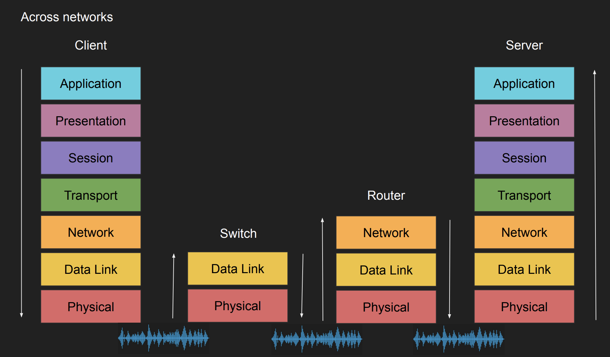
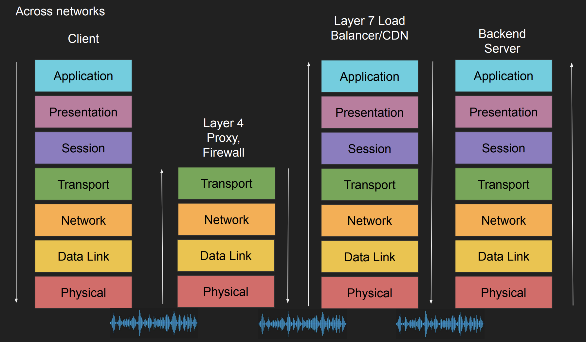

## Client - Server Architecture

Application을 Client와 Server 둘로 나눈다.  
이를 통해 Client에서는 많은 자원을 요구하는 작업을 수행할 필요없이 Server에 요청하면, Server에서 이를 대신 수행하여 결과를 보내준다.  
이와 같은 배경에 의해 RPC(Remote Procedure Call)이 개발되었다.

이를 통해 다음과 같은 장점들을 얻는다.

- Scaling하기 더 쉽다.
- Client에서는 App에 대한 dependency를 가지지 않고 이를 모두 Server가 가지게 된다. 따라서 Client에서는 오직 수행하기 가벼운 작업만 요구된다.

하지만 이러한 architecture을 위해 표준 communication model이 필요하게 된다.  
그리고 이러한 표준 model을 통해 network를 위해 사용하는 매개체와 상관없이 app에서 통신을 할 수 있으며, network 장비를 교체하는 과정 또한 더 쉬워진다.

## OSI Model

서로 다른 시스템 간 communication을 위한 개념적인 model로, networking이 어떻게 이뤄져야 하는지에 대한 표준을 세운다.  
이를 통해 network를 개념적인 layer로 나눠서 볼 수 있어 networking을 좀 더 이해하기 편하다.

### 7 Layers

OSI Model의 각 Layer는 특정 Network 컴포넌트를 나타낸다.

- Layer 7. Application - app에서 network 서비스를 사용할 수 있다. ex) HTTP, gRPC, FTP
- Layer 6. Presentation - data가 활용될 수 있는 format으로 만들며, encryption이 진행된다. ex) Encoding, Serialization
- Layer 5. Session - device간 network 연결과 port들을 관리한다. ex) Connection establishment, TLS
- Layer 4. Transport - data 전송 프로토콜 정보 ex) UDP/TCP, Port(network 서비스나 특정 프로세스 식별 논리 단위)
- Layer 3. Network - data가 어떤 network의 물리적인 path를 따라가야 할지(routing) 정하기 위한 정보들을 가진다. ex)IP
- Layer 2. Data link - ex) Frames, Mac address Ethernet
- Lyaer 1. Physical - data를 물리적인 매개체로 변환하여 보낸다. ex)Signals, Fiber, Wave

### Example

HTTPS를 통해 웹에서 POST 요청을 보내는 것을 예시로 OSI 모델을 살펴보자.

Sender

- Layer 7: JSON 데이터와 함께 HTTPS 서버에 POST 요청을 보낸다.
- Layer 6: JSON 데이터를 Serialize하여 byte string으로 flatten한다.
- Layer 5: JSON을 서버에 보내기 전에 먼저 TCP 연결을 위한 요청을 한다.
- Layer 4: HTTPS이기에 target port 443에 SYN 요청을 보낸다.
- Layer 3: IP packet에 SYN이 들어가고 src/dest IP에 대한 정보가 들어간다.
- Layer 2: 각 packet들이 하나의 frame에 들어가고 src/dest MAC 주소 정보가 들어간다.
- Layer 1: 각 frame들이 bit단위 문자열로써 signal로 변환되어 전달된다.

Receiver

- Layer 1: signal을 수신하게 된다.
- Layer 2: Layer 1에서의 bit들이 frame들로 구성된다.
- Layer 3: frame들을 통해 packet을 구성한다.
- Layer 4: IP packet들을 통해 TCP segment를 구성한다. TCP의 경우 해당 Layer에서 flow control을 통해 들어오는 packet들이 순서에 맞게 조립될 수 있도록 한다. 예시에서는 SYN 요청을 보내는 것이기에 이 이상의 Layer로 올라갈 필요없이 연결 요청에 대한 응답을 바로 보낸다.
- Layer 5: Client와의 연결이 성립되거나 식별된다.
- Layer 6: 이전에 연결 요청을 처리한 후 다시 Client에서 JSON을 보내게 되는데 이때 byte string으로 flatten되었던 JSON 데이터를 다시 복구시킨다.
- Layer 7: App에서 JSON과 POST 요청을 인지한 후 이와 관련된 event listener를 수행한다.

### Network devices

실제로는 Client와 Server간 network 과정 사이에 아래와 같은 여러 중간 단계들이 존재하게 된다.
{: w="500" h="500" }
{: w="500" h="500" }

- Switch: Layer2의 frame에서 mac주소를 보고 오직 해당하는 device에만 데이터들을 전달하는 역할을 한다.(이는 switch에 있는 port번호와 mac주소를 mapping한 테이블을 통해 이뤄진다.) 같은 subnet에 있는 device간 연결에 사용된다.
- Router: Layer3의 IP packet에서 ip 주소를 가져와 dest까지 가는 network path를 결정하고 routing을 한다. ip와 subnet mask를 통해 dest ip가 속하는 network와 그 host의 주소를 알 수 있으며, router에서는 이를 활용한다.
- Proxy: Client에서 들어오는 data의 목적지 ip주소와 port 정보 등을 읽고 Client를 대신하여 목적지에 보낸다.(대신 보내는데 목적이 있기에 app layer에 있는 정보들을 확인할 필요가 없다.)
- Firewall: 특정한 data나 packet이 network를 통해 들어오는 것을 방지하는 목적으로 사용된다. 이를 위해서 Layer3에 있는 ip packet과 layer4에 있는 port 정보를 사용한다.
- CDN/Load Balancer: url 등과 같은 path에 따라 network path를 다르게 보내거나 data caching을 위해 layer 7까지 다 본다.

Layer 1~4까지의 정보들(ip,port,mac 주소 등)은 encrypted되지 않아 누구든지 확인할 수 있다. 하지만 그 위 layer들이 가진 정보들은 보통 encryted 된다.

## Host to Host communication

주된 내용은 Layer2에 해당하며, Host간 연결이 어떻게 진행되는지 알아본다.

### IP가 필요한 이유

각 Host들은 저마다 network card와 고유한 MAC(Media Access Control)주소를 가지고 있다.  
따라서 단순히 원하는 Host의 MAC 주소를 알면 이를 명시하고 Network에 연결된 모든 Host들에게 이를 보내고 이에 해당하는 Host만 정보를 받아서 보는 방법을 생각할 수 있다.

하지만 만약 Network에 존재하는 Host들이 무수히 많아지면 단순히 이를 전부한테 보내는 과정은 매우 비효율적이게 된다. 그리고 이러한 과정을 더 효율적이게 해결하기 위해서 탄생한게 바로 IP주소이다.

IP주소는 두 가지 부분으로 이뤄져있다.

- 속한 Network 주소
- 그 속한 Network의 Host 주소

그리고 속한 Network 주소를 활용해 빠르게 원하는 Host가 있는 network로 데이터를 전송할 수 있게되어 효율적으로 통신이 이뤄질 수 있게 된다. 이를 Routing이라 한다.

### Port가 필요한 이유

IP 주소와 MAC 주소만을 이용해 원하는 Host에게 data를 전송할 수 있다.  
하지만 Host에는 많은 app들이 존재하기 때문에 수신되는 data가 어떻게 다뤄져야 하는지에 대한 정보가 없으면 매우 번거로워지게 된다.  
따라서 이를 들어오는 data를 처리하기 위한 프로세스를 할당하기 위해 protocol, src ip/port, dest ip/port 이렇게 고유한 5가지 정보 조합을 활용할 수 있다.
따라서 이를 통해 컴퓨터에서는 어떤 data를 어떻게 처리해야할 지 파악하는 것이다.

각 프로토콜 마다 할당된 port 번호가 존재하며, 해당 port로 data가 들어왔다면 이에 해당하는 프로토콜을 활용해 data를 활용하면 된다.  
대표적으로

- HTTP 80
- HTTPS 443
- SSH 22
- FTP 21
  존재한다.
