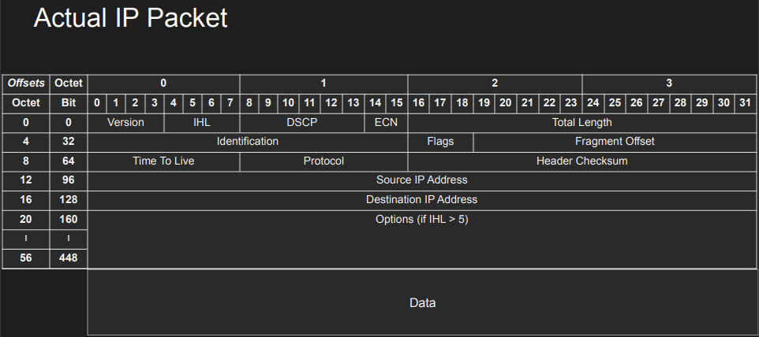
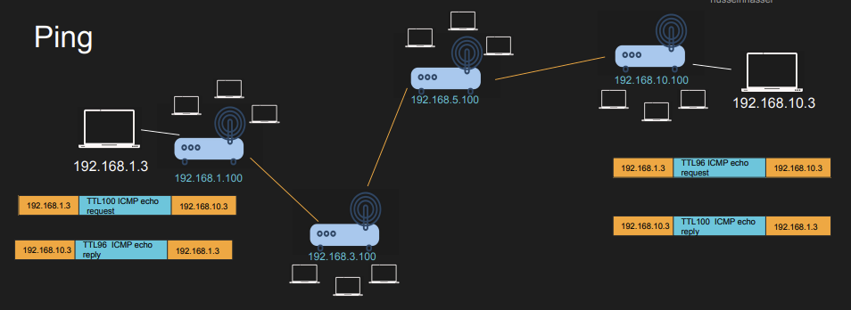
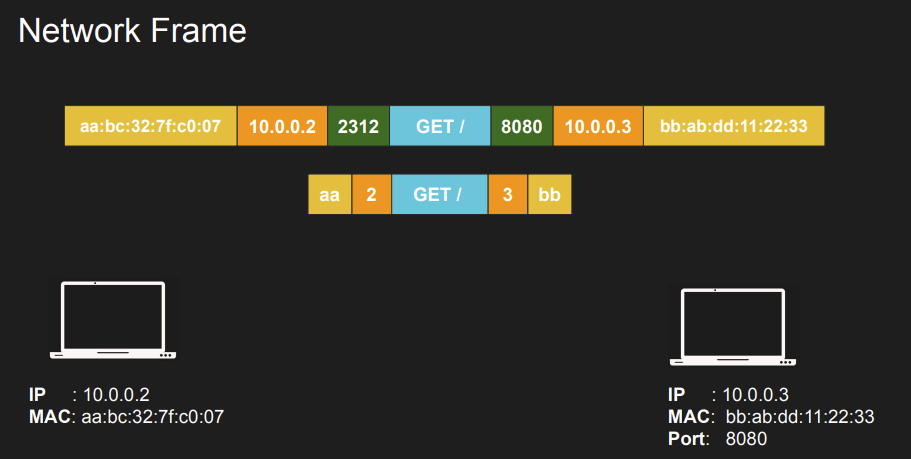
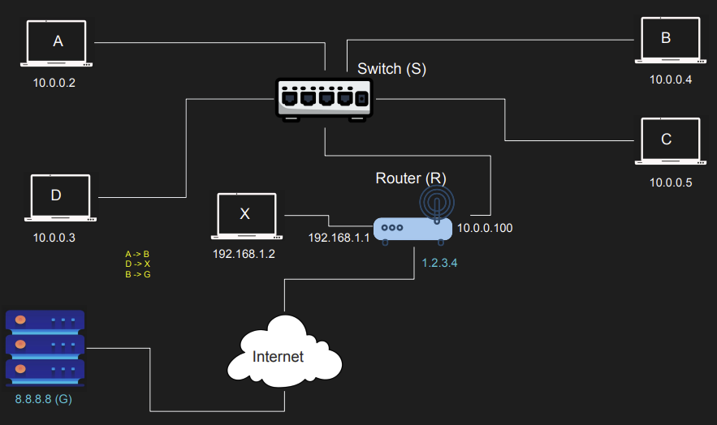

## IP Building Blocks

전반적인 IP에 대해 알아본다.

### Netwokr/Host

IP는 Network 부분과 Host 부분으로 나눠서 볼 수 있으며, 이는 subnet mask를 통해 구분 가능하다.

192.168.254.0/24 의 IP가 있다고 하면, 이진수로 보았을 때 앞 24자리는 Network를 나타내는 부분이며, 나머지 8자리는 해당 Network에 속하는 Host를 나타낸다.

만약 192.168.100.10/22와 192.168.102.10/22가 같은 Network에 속하는지 알고 싶다면 십진수로 표현된 IP를 이진수로 바꾼 후 22번째 자리를 잘라서 그 앞부분이 같은지 확인하면 된다. 예시의 경우 같은 Network에 속하는 IP들이다.

따라서 IP를 보고 통신을 할 때 src와 dest가 서로 같은 subnet에 존재하는지 여부를 알 수 있다.

## Private IP Addresses

- 10.0.0.0/8 (255.0.0.0)
- 172.16.0.0/12 (255.240.0.0)
- 192.168.0.0/16 (255.255.0.0)

위 3가지 IP 대역은 오직 Private IP를 위해서만 사용될 수 있으며, Public IP로 사용을 시도할 경우 바로 Drop된다.

Network는 프랙탈 구조와 같이 작은 Network들과 큰 Network가 유사하게 구성되어 있다.  
이러한 큰 Network들을 구성하는 것들은 Public IP를 통해 나타내며, 작은 Network들은 Private IP를 통해 나타내어진다.

대부분의 Wifi들은 연결되는 기기에 Private IP들을 부여하며, 때문에 다른 지역에서는 나와 같은 IP를 사용하는 User가 존재할 수 있다. 하지만 여전히 같은 IP를 가지는 User간 구분이 가능한데 이는 Private IP는 오직 Local에서만 사용되며, 만약 인터넷을 사용할 경우 ISP 통해 고유한 Public IP가 부여될 것이기 때문이다.

### AWS에서의 Private IP

AWS에서 Private Subnet에서 Internet에 접속하기 위해서 아래와 같은 것들이 왜 필요한지 이제 이해가 가능하다.

- Route Table: Private IP에서 인터넷 IP를 접근하고 싶을 경우 NAT Gateway로 Route될 수 있도록 세팅되어야 한다. 그리고 이를 통해 여러 Network에서 중복되어 사용하는 Private IP 대신 하나의 고유한 Public IP를 활용하여 Internet에 접근 가능하다.

- NAT Gateway: src에 있는 Private IP를 NAT Gateway의 Public IP로 바꾸고 Internet에 접근 후 응답을 대신 받아 이를 Private IP에게 넘겨준다. 이를 통해 Private Subnet에 있는 기기들은 Internet에 접근할 수 있지만, Internet에서는 Private IP를 접근하지 못하게 한다. 이는 NAT Gateway는 stateful하기 때문에 subnet에서 나가는 요청들을 기억해 그에 대한 응답들은 통과시켜 주기 때문이다.

- Router: NAT Gateway에서 IP Packet을 받아 Internet Gateway로 forwarding한다.

## IP Packet

IPv4를 기준으로 IP Packet을 구성하는 내용에 대해 알아본다.

{: w="700" h="700" }

- version: protocol version
- IHL(Internet Header Length): option의 길이를 정의, 기본적으로 5줄
- ECN(Explicit Congestion Notification): Router의 buffer가 가득 차면 이후에 들어오는 req들을 그냥 수행하지 않는다. 따라서 Client는 아무런 정보 없이 왜 Data가 안 들어오는지 모른다. 따라서 ECN을 통해 buffer가 가득 찰꺼 같으면 미리 Client/Server에게 Network에 congestion이 있음을 알린다.
- Total Length: Packet 전체의 길이
- Identification: 만약 Packet이 한 frame에 들어가기 너무 크면 fragmentation을 진행하며 이를 위한 identifier
- Flags: fragment의 여부를 표시
- Fragment Offset: fragment안 data의 시작 offset을 나타낸다.
- TTL(TIME To Live): 얼마나 많은 hop을 수행 가능한지 나타냄
- Protocol: data에 사용된 protocol
- Src/Dest IP

## ICMP, PING, TraceRoute

ICMP는 Internet Control Message Protocol의 약자로, Layer 3에서 메세지 전달 기능을 수행한다. 이 메세지는 device간 연결 없이 바로 보내질 수 있다.  
메서지로는 Host/Port unreachable, fragmentation needed 등의 정보들을 전달한다.  
ping과 traceroute에서는 ICMP를 사용해 정보를 가져오는 것이다.

### ttl

ttl의 경우 같은 subnet에 있는 경우 다른 router로 hop하지 않고 바로 Host간 연결이 진행되기에 아무런 영향을 가지지 못한다. 따라서 ttl은 다른 network에 연결을 수행하는 경우에만 의미를 가진다.
ttl을 통해 request가 network에서 무한 loop을 가지고 수행되는 것을 방지할 수 있다.

이외에 ttl은 cache된 내용이 업데이트가 필요하기까지 얼마나 저장되어야하는지 나타내는데 사용되기도 한다.

### ping

{: w="700" h="700" }

ping을 수행할 경우 dest로 route되는 과정에서 매번 router를 거칠 때마다 TTL을 감소시킨다. 만약 TTL이 0이 되기 전에 dest에 도착할 경우 dest에서는 src를 목표로 ICMP echo reply를 보낸다. 그러면 src의 terminal에서 ping을 입력할 경우 출력되는 결과(ttl결과 그리고 dest에 도달하는데 걸린 시간)가 나오게 되는 것이다.

만약 TTL이 중간에 0이되면 src에 ICMP로 unreachable이라는 정보가 전달된다.  
따라서 ICMP를 통해 src에서 dest에 통신을 수행할 경우 이에 대한 결과가 어디에서 발생했는지 알 수 있게 된다.

### traceroute

{: w="700" h="700" }

src에서 dest까지 가는데 거치는 전체 path에 대한 정보를 알 수 있다.  
이는 dest에 도달할 때까지 TTL을 하나씩 증가시키면서 거치는 router들에 대한 정보를 받아보는 방식으로 진행된다.

path가 매번 바뀔 수 있고 어느 경우 ICMP을 막을 수도 있기에 항상 작동되지는 않는다.

## ARP(Address Resolution Protocol)

DNS를 통해 dest의 IP를 알 수 있고 ARP를 통해 IP에 해당하는 device의 MAC 주소를 알 수 있다.
ARP Table에는 IP와 MAC 주소가 mapping되어 있으며, MAC이기에 Layer 2의 frame에서 이러한 정보를 다룬다.

{: w="700" h="700" }

### Example

- IP 10.0.0.2(2)는 IP 10.0.0.5(5)와 연결하고 싶다.
- Host 2에서는 Host 5가 같은 Subnet에 있는지 확인한다.
  - 있는 경우: ARP Request를 해당 Subent에 broadcast한 후, Host 5의 IP와 일치하는 device가 MAC 주소로 응답한다. 그러면 Host 2에서 이를 frame에 업데이트 한다. 그리고 src에서는 Host 5의 MAC을 caching 한다.
  - 없는 경우: dest 대신 Gateway의 MAC을 찾아 넣고 요청을 보내면 Gateway에서는 NAT을 통해 Internet에서 dest IP를 아는 router로 IP Packet을 forwarding 할 것이다.

## Routing

{: w="700" h="700" }

### A -> B

A와 B는 같은 Subnet에 존재하기에 ARP와 Switch를 통해 Host간 연결이 진행된다.  
Switch에서는 각 Port와 연결된 device의 MAC 주소를 mapping한 테이블을 가지고 있기에 Layer2에서 작동하는 것으로 IP Packet의 frame을 보고 해당하는 MAC의 Port와 연결된 device로 Packet을 바로 보내준다.

### D -> X

D와 X는 서로 다른 Subnet에 있기에 ARP를 통해 찾은 Router의 MAC 주소를 넣어 IP Packet을 Switch를 통해 Router에게 보낸다.  
그리고 Router에서는 ARP를 통해 X를 아는 Router의 MAC 주소를 가져오고 이를 통해 routing을 진행하여 연결을 진행한다.

### B -> G

B에서 Router에게 보내는 과정은 D->X와 동일하다.  
G는 Internet에 존재하기 때문에 Router에서는 NAT을 통해 B의 Private IP를 Public IP로 바꾼 후 Internet을 통해 G를 찾는다.  
그리고 G에서 오는 응답을 Router에 받아 Switch를 통해 B로 전달해 줄 것이다.

### Modem/Router/Gateway

- Modem: ISP의 central hub와 집을 연결하여 집에서 인터넷을 사용할 수 있도록 해준다. 이때 hub에서 오는 물리적 정보를 연결된 기기에서 처리할 수 있는 형태로 바꿔준다.

- Router: Modem이 집안에 인터넷을 제공해준다면, Router는 이러한 Internet이나 devices간 연결시킬 수 있는 신호들을 전파한다. Router에 의해 생기는 각 Network은 모두 private이며, 따라서 Host간 연결은 가능하지만 인터넷은 modem 없이 접근할 수 없다.

- Gateway: Modem과 Router의 기능을 동시에 수행하는 기기라고 볼 수 있다.
