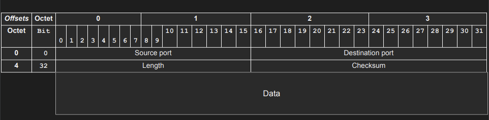

## What is UDP?

- Layer 4 Protocol
- port를 통해 특정 처리 과정을 Host에서 지정 가능하다.
- 간단한 Protocol로 data를 전송하거나 받을 수 있다.
- 통신을 위한 사전 연결이 요구되지 않는다. data를 바로 보내면 된다.
- Stateless
- 8 btye header Datagram

### Multiplexing and Demultiplexing

Host에서 다양한 app을 다양한 환경에서 실행 중일 때, Port를 통해 들어오는 data를 구분하여 이에 맞는 app에서 처리한다.  
UDP를 통해 data를 보낼 경우 하나의 IP와 여러 Port를 통해 Multiplexing한다.  
dest에서는 각 port에 맞게 data를 처리하는 Demultiplexing을 수행한다.

## User Datagram Structure

UDP Datagram은 8 byte header로 IP Packet에 data로써 들어가게 된다.  
Port는 16bit를 사용하여 표현할 수 있다.(0 ~ 65535, 몇몇은 reserved됨)

{: w="700" h="700" }

- src port: dest에서 오는 reply를 처리하기 위한 port이다.
- dest port: src에서 들어오는 data를 처리할 프로세스를 지정하기 위한 port이다.
- length: UDP Datagram의 전체 크기
- checksum: Datagram이 corrupted되었는지 확인하기 위해 사용된다.

## UDP Pros & Cons

Pros

- 간단한 Protocol
- Datagram 크기가 작다.
- 적은 Bandwidth를 사용한다.
- Statless이기에 적은 Memory를 사용한다.
- Low latency: handshake, order, no guaranteed delivery이기에 단순히 보내기만 하면 되어 빠르다.

Cons

- data를 보냈을 때 dest가 이를 수신했는지 알 수 없다.
- No guarantee delivery
- connectionless 하기에 누구나 data를 그냥 보낼 수 있다.(이를 통해 공격이 가능함)
- no flow/congestion control: router/dest에서 얼만큼의 data를 처리 가능한지 모르기에 data를 얼마나 보내야할지 모른다.
- no ordered packets
- can be easily spoofed

결론적으로 UDP를 사용하면,  
Simplicity, Performace > Consistency, Integrity  
이다.

## Usecase

UDP는 주로 time-sensitive 통신에서 사용되며, packet들이 종종 drop되는 것이 waiting되는 것보다 나은 경우에 사용된다. ex) voice와 video traffic은 UDP를 통해 전송된다.

DNS 서버에서도 UDP를 사용하여 hostname에 따른 ip를 reply 해준다.
