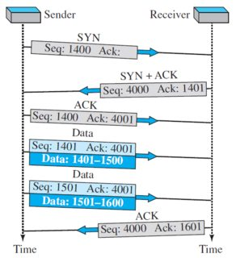
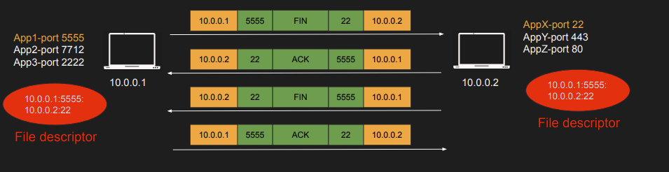
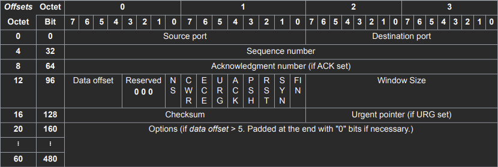
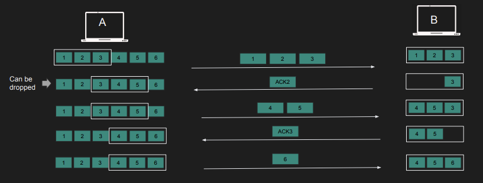
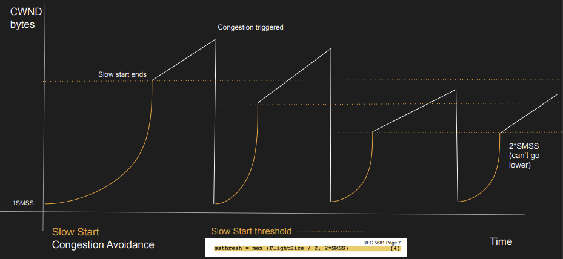

## What is TCP?

Transmission Control Protocol의 약자이다.

- Layer 4 Protocol
- port를 통해 data를 처리하는 process를 식별
- flow/congestion control
- 통신을 위해 사전 handshake를 통한 connection 구성
- 20 byte 크기의 tcp header(최대 60byte)
- Stateful(file descriptor)
- bidirectional communication

### TCP Connection

Connection은 Layer 5 Session에 해당한다.  
Connection이 이뤄져야 data를 보낼 수 있다. 그렇지 않을 경우 data를 drop한다.  
Connection은 src IP/port- dest IP/port 이렇게 4가지로 식별되며, OS에서는 이들을 Hash하여 그 값을 file descriptor로 mapping한다.  
file descriptor에서는 sesstion에 대한 state를 가지고 있다. 그리고 이를 통해 connection 유무를 판단할 수 있게 된다.

### Opening Connection

TCP에서는 이러한 connection을 시작하기 위해 3-way handshake를 수행한다.

- Sender에서 먼저 임의의 Sequence number를 Receiver에게 보낸다.
- Receiver는 Ack에 적힌 번호를 통해 이전의 Sequence number들을 정상적으로 받았다는 것을 알리는 동시에 Sender에서 다음으로 보낼 번호를 나타낸다. 그리고 자신이 사용할 Seq번호를 보낸다.
- Sender에서는 Receiver에서 보낸 Seq+1을 한 번호를 Ack으로 보내어 Receiver의 응답을 정삭적으로 받았다는 것을 알린다.
- 3-way handshake가 끝나며, connection을 이루면서 이에 대한 정보(src IP/port- dest IP/port)를 각자 file descriptor로 저장하고 있다.

### Closing Connection

4-way handshake를 수행한다.

- Sender가 Fin이 담긴 Segment를 Receiver에게 보낸다.
- Receiver는 이에 대한 Ack과 Fin을 각각 보낸다. 그리고 connection에 대한 file descriptor를 제거한다.
- Sender는 Receiver가 보낸 Fin에 대한 Ack을 보낸다. 하지만 바로 connection을 제거하기 않고 time-wait state로 들어간다.(re-transmitted되는 data가 이후에 들어올 수도 있기 때문이다.)

Connection close를 처음 요청하는 쪽에서 time-wait state로 들어가기 때문에 만약 server에서 client에 connection 종료를 요청하면 server에서 time-wait으로 인해 종료된 session들이 누적되어 많은 메모리를 잡아 먹을 수 있다.  
만약 front/backend를 모두 개발할 경우 front에서 back에 close 요청을 보내도록 하여 이를 해결할 수 있다.

### Sending Data

TCP에서 data를 보낼 때마다 이에 대한 Ack을 수신할 때까지 기다린 후 다음 data를 보내지 않는다. 그러면 너무 느리기 때문이다.  
이 대신 Sender에서는 data를 window 크기에 맞게 보내며, Receiver와 Router에 따라 window 크기가 정해지게 된다.  
Receiver에서 수신되는 data를 관리하는 것을 Flow Control  
Router에서 수신되는 data를 관리하는 것을 Congestion Control이라 한다.

### Ack

Ack에 적힌 번호는 이전 번호 Segment들에 대해 정상적 수신을 의미하기에 각 Segment에 대해 Ack을 매번 보낼 수 있는 대신 가장 마지막 Segment Seq번호 + 1을 Ack으로 하여 하나만 보낼 수도 있다. 이를 delayed Ack이라 하며, delay는 최대 0.5초까지 가능하다.

## TCP Segment

기본적으로 20 byte 이며, 최대 60 byte까지 가능하다.  
TCP Segment는 IP Packet에 'data'로써 들어가게 된다.

- Sequence Number: Sender/Receiver간 data 동기화를 위해 사용되며 Segment를 보낼 때 마다 증가하게 된다.
- Ack number: 수신된 이전 Sequence Number에 대한 수신 완료를 나타낸다.
- window size: 수신되는 data의 처리 가능한 크기를 나타낸다.
- SYN: connection을 처음 구성할 때 사용
- FIN: connection을 종료할 때 사용
- RST: connection을 reset할 때 사용
- PSH: data를 수신하는 쪽에서 이를 buffer에 넣는 대신 바로 처리해야 함을 나타냄
- ACK: 수신된 Segment의 sequence number에 대한 수신 완료를 나타냄
- URG: 가장 높은 우선순위로 처리되야 하는 data를 의미
- ECE: ECN-Echo로 congestion 메세지를 나타낸다.
- CWR: Congestion Window Reduced의 약자로 congestion이 발생하고 있으니 Sender가 보내는 data 크기(window 크기)를 줄이도록 하는 메세지이다.

TCP Segment는 순서가 존재한다.  
IP Packet은 Segment 순서에 맞게 도착한다는 보장이 없으며, 도착한다는 보장 또한 없다. 따라서 TCP에서는 각 Segment에 순서를 저장하여, 특정 번호의 Segment가 없으면 Sender에서는 이를 re-transmit queue에서 가져와 다시 send하게 된다.  
만약 Segment가 정상적으로 수신된 경우 dest에서 ACK을 보내며, 이에 해당하는 IP Packet은 queue에서 제거된다.

Dest에서는 Segment order에 맞게 data를 조립하며, 수신된 packet에 대한 ACK를 src에 보내게 된다.

### Segment Size

network의 MTU(Maximum Tranmission Unit)에 따라 다르다.  
보통 512 byte이며 network에 따라 jumbo frame을 통해 9000byte 까지 가능하다.

## Flow Control

Flow Control을 통해 Sender가 Receiver가 처리할 수 있는 data를 넘게 보내지 않도록 조절한다. 만약 Receiver가 감당할 수 있는 buffer 크기보다 더 많이 보낸다면 Segment는 drop될 것이다.

Receiver에서 처리할 수 있는 data의 크기는 RWND(Receiver Window)를 통해서(Receiver가 보내는 Segment의 window 값) Sender가 알 수 있으며, 이는 계속해서 변한다.

### Sliding Window

Sender에서는 일일이 Segment를 보내고 Ack을 기다리고를 반복하면 너무 느리다.  
따라서 window 크기만큼 data를 보내고 Ack을 받은 만큼 window를 slide하여 다음에 보낼 packet을 정하고 window에 있는 data를 보내게 된다.

1. Sender와 Receiver의 window 크기가 동일함을 가정한다.
2. Sender에서 window 크기 만큼 Segment를 보낸다.
3. Sender에서 Seq num 2를 Ack하였기에 3을 남길 만큼 window slide를 한다. 그리고 data를 다시 보낸다.
4. Seq num 3에 대해서 Ack을 받았으니 window를 slide하여 3을 없앤다.

이러한 window의 크기는 처음 3-way handshake를 진행하는 과정에서만 Sender에 전달되는 window scaling 만큼 증가될 수 있다.

## Congestion Control

Flow Control은 Reciever가 data를 얼마나 처리할 수 있는지에 대한 것이였다면, Congestion Control은 Network에서 data를 얼마나 처리할 수 있는지에 관한 것이다.
이와 관련된 window는 CWND(Congestion Window)이다.
결과적으로 Sender에서는 CWND 또는 RWND에 의해 보내는 data의 크기가 정해지게 된다.

### Congestion Detection

Sender에서 packet drop이나 time-out을 겪을 경우 Sender에서는 보낼 수 있는 data 크기의 threshold를 한번에 최대 CWND / 2 만큼 낮출 수 있다.  
이후 CWND는 1로 reset되어 window scaling을 다시 수행하게 되며, 이를 위해 threshold를 기점으로 이전(Slow Start)과 이후(Congestion Avoidance)에 서로 다른 알고리즘을 사용한다.

### Slow Start vs Congestion Avoidance

- Slow Start: Ack을 수신할 때마다 Sender에서 window크기를 증가시킨다.
- Congestion Avoidance: Slow Start에서 threshold에 도달하면 사용되며, 보냈던 data에 대한 모든 Ack을 수신한 이후(round trip) window 크기를 증가시킨다.

만약 window크기가 2로 시작한다 가정하면,  
Slow Start에서는 먼저 2개의 Segment를 보내고 이에 대한 Ack를 수신할 때마다 +1하여 보낸 Segment 수의 제곱만큼 window 크기가 설정된다. 따라서 2개를 보냈으니 이에 대한 Ack들을 수신하면 window 크기는 4가 된다. 이후 4 -> 8 -> 16

Congestion Avoidance에서는 먼저 2개의 Segment를 보내고 이에 대한 Ack을 전부 수신한 이후에 window를 +1 한다. 따라서 한 round trip 마다 2 -> 3 -> 4

### Congestion Notification

- Router에서 congestion을 겪고 있으면 ECN flag(IP Header에 위치)를 true로 만들어 Receiver에게 보낸다.
- 그러면 Receiver에서는 이를 복사하여 Sender에게 보낸다.

## TCP Pros and Cons

Pros

- data가 전달될 것이 보장된다.
- 오직 session을 유지하고 있는 쪽에서만 data를 보낼 수 있다.
- flow/congestion control
- packet이 순서에 맞게 처리될 수 있게 해준다.

Cons

- UDP에 비해 Header 크기가 크다. 따라서 더 많은 bandwidth 사용
- Stateful하기에 메모리를 많이 사용할 수 있다.
- Slow Start/Congestion 등으로 인해 통신이 지연될 수 있다.
- TCP Meltdown으로 인해 VPN에서 사용하기 부적합하다.(TCP 위에 TCP를 수행하면 두 TCP에서 congestion을 겪는다고 계속 오해하여 보내는 data를 점점 작게 만들어 결과적으로 느려진다.)

## Usecase

IP와 UDP는 기본적으로 data가 dest에 도착할 것이라는 보장을 하지 않는다.  
TCP는 항상 data가 dest에 도착하도록 보장한다.

- DB Connection
- Web Communication(HTTP)
- Remote shell
