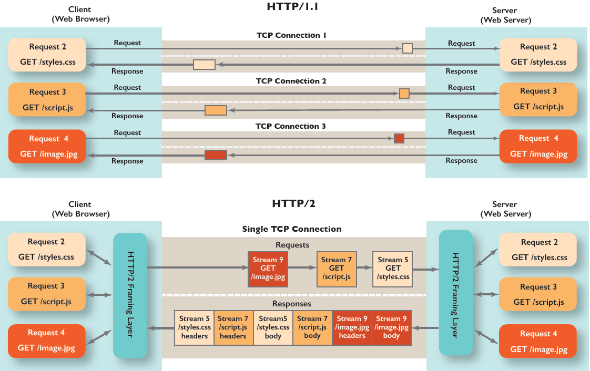

HyperText Transfer Protocol의 약자로, client와 server에서 구현된다.  
HTTP는 client와 server간 통신에 이용되는 메세지의 구조를 정의하여 Web client에 server로부터 어떻게 요청을 보내는지와 server에서 web page를 client로 어떻게 보낼지 정하였다.

기본적으로 HTTP는 OSI에서 application layer에 해당하며, transport layer인 TCP를 기반으로 한다. 따라서 한번 connection이 client와 server간 수립되면 각자 socket을 통해 신뢰할 수 있는(데이터 전달이 보장되는) 통신이 이뤄지게 된다.

HTTP에서는 client에 대한 어떠한 정보도 state으로 가지고 있지 않은 stateless protocol로, client가 같은 data에 대한 request를 보내도 server는 매번 이를 반복해 수행하여 data를 전달해준다.

## Non-Persistent and Persistent Connections

만약 매번 req/res를 수행할 때마다 새로운 TCP connection을 수행한다면 이는 Non-Persistent라 부르며, 한번 이뤄진 connection을 통해 req/res를 계속 수행한다면 이는 Persistent Connection이라 부른다.

Non-Persistent connection의 경우 매번 Web object를 client에서 요청할 때마다 server와 3-way handshake를 수행하기에 두번의 RTT(Round-Trip Time)가 소요되게 된다.(SYN->ACK/SYN->ACK/req->ACK/res) 추가적으로 이러한 connection들은 TCP의 state를 저장하기에 memory를 잡아먹게 된다.

Persistent의 경우 처음 수립한 connection을 계속해서 사용하여 통신이 이뤄지기에 현재와 같이 Web에 많은 object가 요구되는 경우 network에 사용되는 시간과 자원을 좀더 효율적으로 활용할 수 있다.

chrome에서는 이러한 TCP connection을 client당 최대 6개를 동시에 수립할 수 있다.

## HTTP Message Format

request 메세지는 다음과 같이 구성된다.

- Request line: HTTP method와 URL 그리고 Version이 들어간다.
- Header lines: 특정 Host(같은 ip라도 host에 따라 다른 site를 가질 수 있다), Connection, User-agent 등의 여러 option들에 대한 정보가 들어간다.
- Blank line
- Entity body: Post method에서 user가 form field에 작성한 content가 들어간다. 때로는 이 대신 URL에 path param이나 query param을 사용한다.

```javascript
GET /somdir/page.html HTTP/1.1 // method,url,version
Host: www.someschool.edu // hostname
Connection: close // Non-persistent 방식을 사용함
User-agent: Mozilla/5.0 // Client에 대한 정보로 Mozilla는 브라우저를 의미
Accept-language: fr // 만약 content가 프랑스어를 지원하면 이를 받음

//이 아래는 Entity body가 들어가는 곳
```

response 메세지는 다음과 같다.

- Status line: http version, status code 그리고 status code에 대한 설명이 들어간다.
- Header line: request와 같이 여러 정보들이 들어간다.
- Entity line: req에서 요청한 data가 들어간다.

```javascript
//status line
HTTP/1.1 200 OK
//header
Connection: close// res이후 server에서 TCP connection을 종료한다
Date: Tue, 18 Aug 2015 15:44:04 GMT//server에서 res를 보낸 시간
Server: Apache/2.2.3  (CentOS)//server에 대한 정보
Last-Modified: Tue, 18 Aug 2015 15:11:03 GMT//보내는 data가 마지막으로 수정된 날짜로 caching에서 중요한 정보이다.
Content-length: 6821//data의 크기를 나타낸다.
Content-Type: text/html//data의 종류를 나타낸다.
// Entity line
(data data data data data data....)
```

## HTTP/1.1

- Persisted TCP Connection 지원
- streaming with chunked transfer: data들이 중복되지 않는 연속된 "chunks"로 나눠진다. 그리고 Receiver쪽에서는 이러한 "chunks"는 개별적으로 수신되게 된다.
- pipelining: 하나의 connection에서 보냈던 HTTP req를 기다리지 않고 다음 req를 계속해서 보낼 수 있다. 다만, res는 req 보낸 순서에 맞게 돌아와야 되기에 앞에서 보낸 req가 오래걸리면 그 뒤에 보낸 req에 대한 res는 이를 기다려야 되어 비효율적이다.(Head of line blocking) HTTP/2에서 비슷하지만 더 나은 multiplexing을 지원하기에 사용되지 않는다.

## HTTP/2

- Push: web의 기본적인 html에는 필수적으로 css/js 파일이 따라오기에 이를 각각 req하는 대신 html하나만 req하면 server에서 한번에 다 보내준다. 현재 아무도 사용 안 한다.
- Multiplexing: 하나의 connection 내에서 한번에 여러 req를 보낼 수 있다. 그리고 server에서는 각각에 대해 res를 보내며, 이는 stream id에 따라 번호가 매겨져 따로 관리 될 수 있기에 무질서하게 올 수 있다.
  하지만 여전히 TCP Layer에서는 segment들이 모두 순서에 맞게 정렬될 때까지 buffer에서 대기해야 하기에 HOL blocking이 존재한다.
- Header compression: HTTP message를 좀더 효율적으로 압축하여 불필요한 정보를 제거한다.



## HTTP/3

TCP 대신 QUIC(UDP)을 기반으로 한다. 따라서 이를 통해 TCP로 인한 문제들을 우회한다.

- Head of line Blocking: UDP를 기반으로 하기에 한번에 여러 req를 보내도 segment들이 독립적이게 된다. 따라서 특정 segment가 re-transmitted 되어도 이후 segment들은 stream id에 맞게 모두 왔다면 먼저 처리될 수 있다.
- Connection setup과 TLS를 한번의 handshake로 처리한다. 이는 UDP를 기반으로 하기에 더 자유롭게 확장 가능하여 가능하다.
- Connection migration(connectionID): UDP는 stateless하기에 매번 data를 보낼 때마다 connectionID를 포함해서 보내야 한다. 이를 활용하여 만약 ip가 바뀌더라도 connectionID를 가지고 있다면 server에서 받아드린다.
