## E/R Modeling

DB 디자인 단계

1. Conceptual data modeling  
   E-R Modeling으로 현실 객체를 추상화  
   E-R diagram 작성
2. Logical db design  
   Relation db design 등 E-R modeling을 db Table 형태로 구체화  
   Table schema
3. Physical db design  
   data indexing과 보관을 얼마나 효율적으로 하는지 판단  
   Storage scheme 과 table indexes

우리가 이번 장에서 보는 단계는 1 단계 Conceptual data modeling

### E-R Model

개념적 기획을 만들기 위해 사용하는 추상적 개념들의 집합과 기호들을 말한다.

- Concepts : Entity, Relationship, Attribute
- Graphical symbols : E/R diagram

종류 : Original E-R model, Crow's foot notation

Original E-R Model
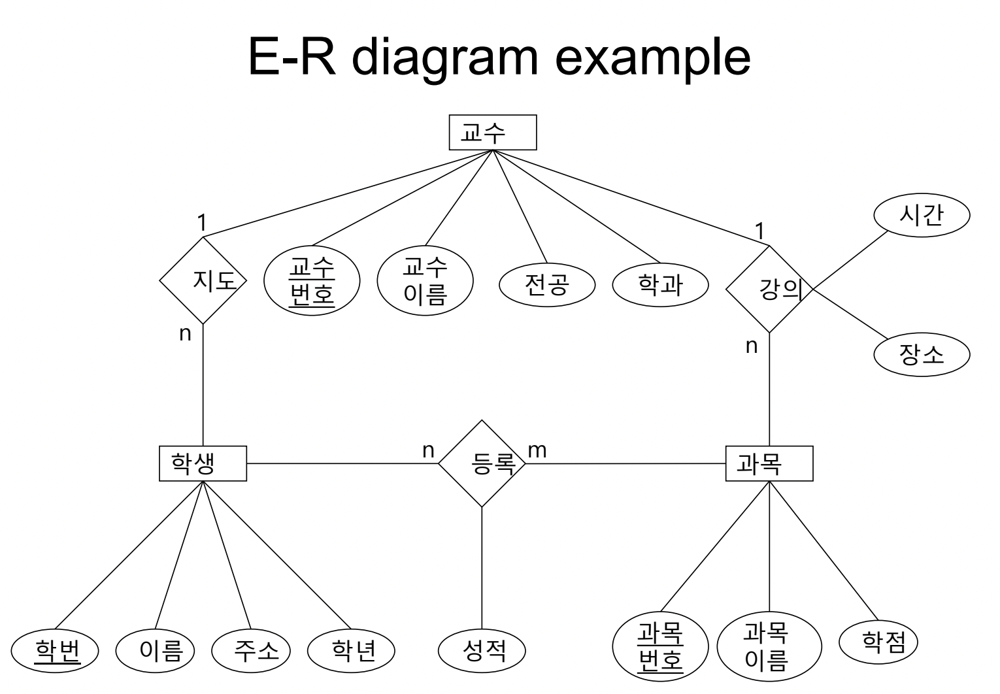

Crow's foot notation
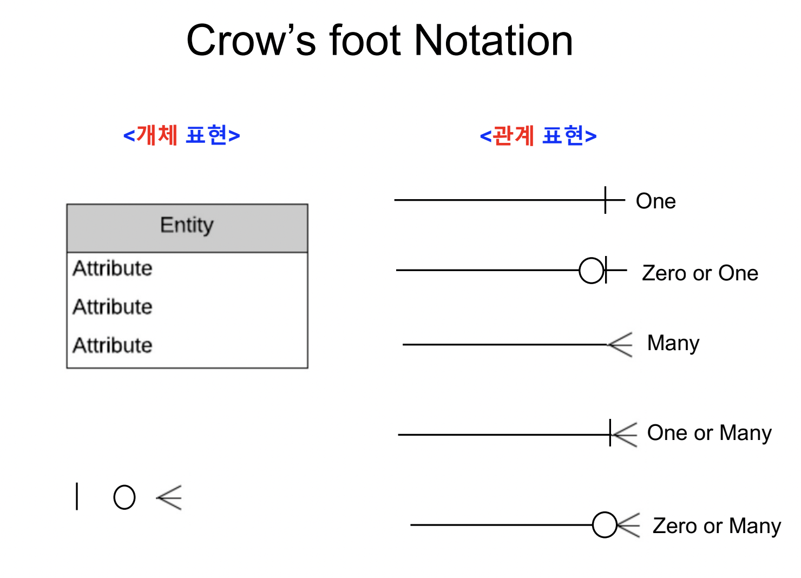

객체 칸 안에 Attribute들을 표시한다.  
관계를 따로 칸으로 나타내기 보단 단순한 Link으로 이어준다.  
Link된 선에 끝 부분 종류에 따라 두 객체 사이의 Cardinality 관계를 알 수 있다.

### Entity

- 식별자로 식별가능
- Entity class : a collection of entities of a given type
- Entity instance : 특정 Entity class의 한 예

Identifiers(식별자)

- 한 객체를 유일하게 식별할 수 있는 name or Attribute들을 말한다.
- DB design을 통해 Identifier는 Table의 Key 역할을 한다.

Relationship

- 모든 객체는 다른 객체와 어떠한 관계를 이룬다.
- Original E-R model에서는 관계도 Attribute를 가지고 있지만 요즘은 잘 안쓰임
- A Relationship class는 2개 이상의 entity들을 연관한다.
- Degree of Relationship으로 해당 관계를 이루는 Entity 수를 나타낼 수 있다.
- Degree = 2 : Binary Relationship
- Degree = 3 : Ternary Relationship

### Entity vs Table

- Entity는 Key가 없이도 관계를 나타낼 수 있지만 Table에서는 무조건 foreign Key가 있어야 관계를 나타낼 수 있다.
- 이러한 Entity 특성 상 Table 보단 편하게 초기 단계 Design에서 사용할 수 있다.

### Cardinality in Relationship

- Entity 간의 관계에서 Tuple들의 대응되는 'count'를 나타낸다.
- 대응 관계 종류 : 1:1 , 1 : n , n:1 , n:m
- Maximum Cardinality : 관계에 참여하는 Entity instances들의 최대 수를 의미
  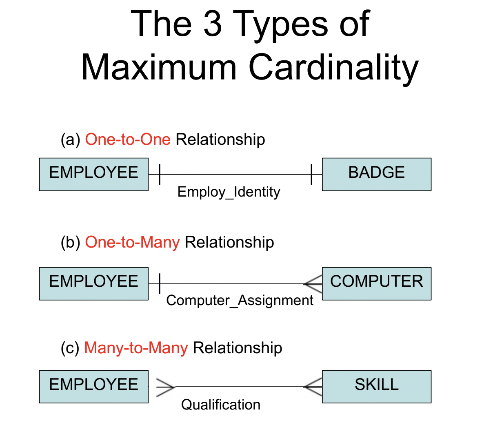

1 : n 또는 n : 1 관계에서 Entity는 Parent-Child 관계로 볼 수 있다.
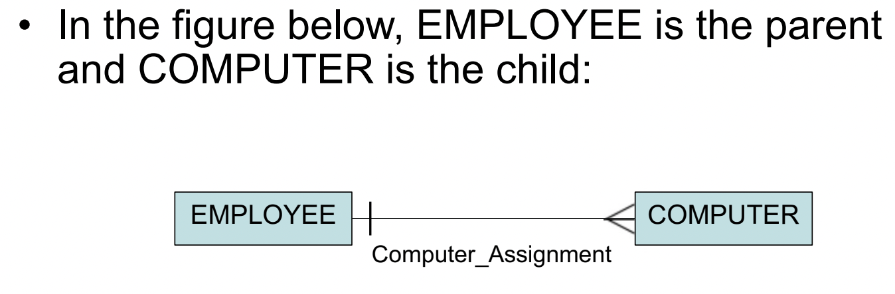

Parent Entity : Employee  
Child Entity : Computer

- Minimum Cardinality : 관계에 필수로 참여해야 되는 Entity instances들의 최소 수를 의미  
  zero[0] - > optional , one [1] -> 필수적으로 관계를 이루는 instance 수 최소 1개
  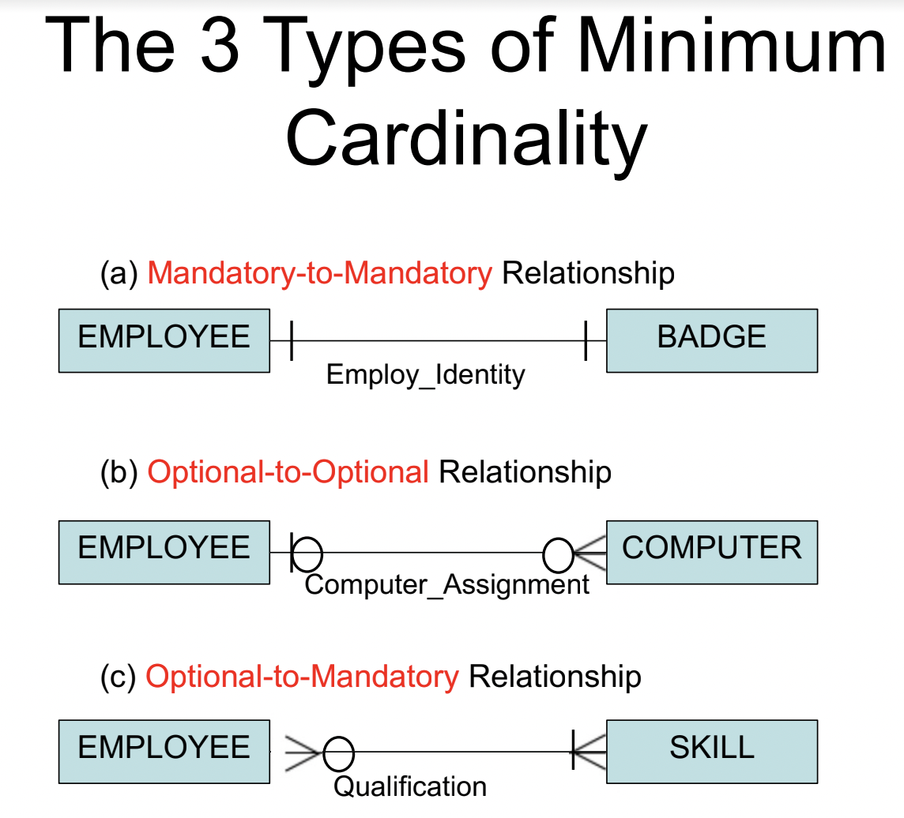

### ID- Dependent Entities

항상 Parent Entity를 가지는 ID-Dependent (child)Entity로 Parent Entity의 Identifier를 상속하는 Child Entity로 볼 수 있다.  
관계 표시
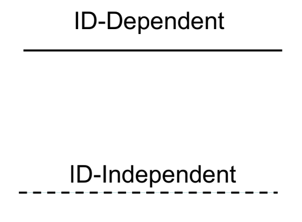

Weak Entity

- 다른 Entity에 의존해서 존재하는 Entity를 일컫는다.
- 모든 ID- Dependent Entity들은 Weak Entity라 본다.
- 모든 Weak Entity가 ID-Dependent Entity는 아니다.

Strong Entity

- Entity 존재가 다른 Entity에 의존하지 않는 독립적인 Entity를 말한다.
- 항상 Entity 자신의 Primary key(기본키)를 가지고 있다.

### Associaition Pattern

두 Entity간의 관계에서 추가적으로 필요한 Attribute를 나타내기 위해 사용한다.  
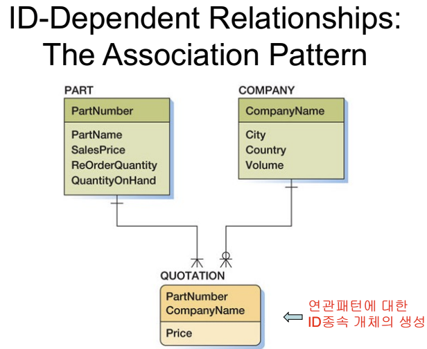

Attribute가 여러 값을 가지는 경우
Attribute를 따로 ID-dependent Entity로 빼서 나타낸다.
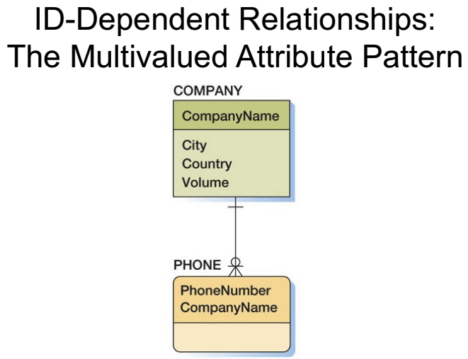

### Multivalued Attribute Pattern

Attribute가 여러 값을 가질 수 있는 경우 따로 ID-dependent Entity로 빼서 나타낸다.

### Archtype/Instance Pattern

Logical Pattern Parent -> ID-dependent child 관계를 가진다.
Parent의 instance인 child Entity들과 Parent가 구별된다.

ID-dependent Child의 경우
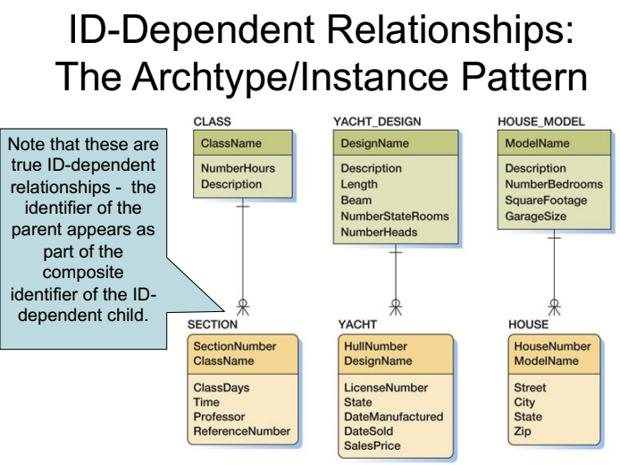

ID-Independent인 경우
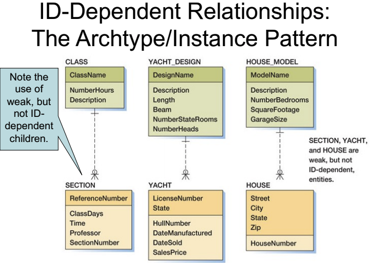

### Recursive Pattern

Entity 자신과의 관계를 나타낸다.
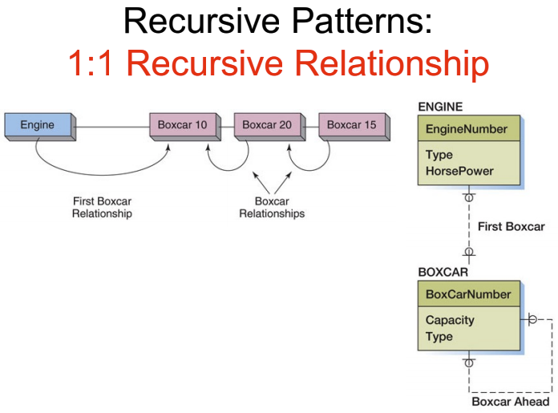

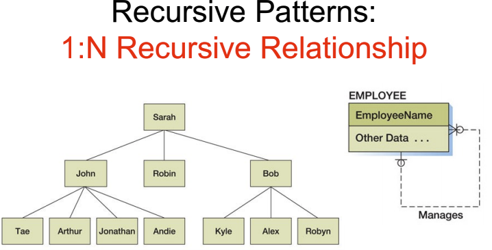

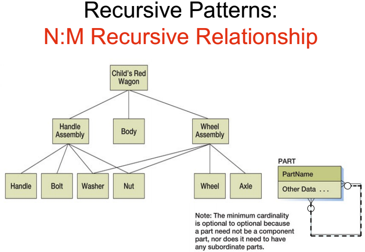
