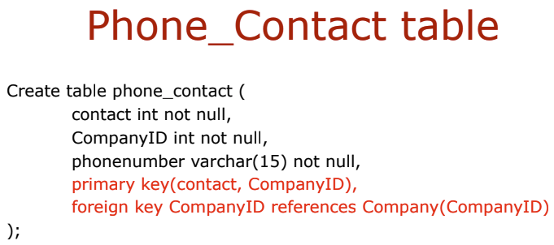

## E/R Model을 Relational DB로 변환

### Entity를 Table로 변환 (예외 없이)

- 식별자 -> 기본키
- 이상적인 기본키 -> Short, Numeric and Fixed
- 만약 마땅한 기본키가 없을 경우 Surrogate Key(대체키)를 임의적으로 이상적 조건 아래 만들어 사용할 수 있다.(테이블 안에서 의미x)
- Candidate Key(후보키) == Alternate Key(대리키), 후보키는 행들을 Unique하게 구별하게 해주는 Set of Attributes이다. 각 후보키는 테이블의 Attribute에 Unique 속성 부여한다.
    
  EMPLOYEE 테이블에서 후보키는 Email로 AK1.1은 후보키 1이라는 의미  
  CustomerNumber 테이블에서 후보키1은 Name과 City가 결합한 형태이며 1.1은 Name 1.2는 City이다.  
  후보키2는 Email이다.

- 애트리뷰트의 타입에서 보통 길이가 고정되어 있지 않은 속성들은 VARCHAR를 사용하는 것이 더 좋고, 공간 효율성도 좋음

- 유일성, NOT NULL 속성 정의, Null status를 통해 value가 Null이 될 수 있는지 없는지 나타낸다.

### Relationship 고려

- 1:1 개체 관계의 경우 어느 한쪽의 기본키를 다른 한쪽에 외래키로 추가

### No Parent, No Child 관계에서는

- 1 : N 개체 관계의 경우 1에 해당하는 테이블의 기본키를 N에 해당하는 테이블에 외래키로 추가한다. 1에 해당하는 테이블은 Parent N에 해당하는 테이블은 Child로 본다.
- N : M 관계의 경우 한쪽에 기본키를 다른 한쪽에 외래키로 추가하기에는 양쪽다 적절치 않다. 따라서 Intersection 테이블을 만들어 각 테이블의 기본키만을 추가한다. Intersection에는 양 테이블의 기본키가 같이 이뤄진 **복합 기본키**가 존재한다.(Composite Primary Key)
  
  Intersection Table 특징 : 두 Strong 개체 간의 관계를 나타낸다, 오직 두 개체의 기본키로만 구성된다.  
  CompanyName은 COMPANY 테이블의 기본키, COMPANY_PART_INT 테이블의 외래키(복합적 기본키)  
  PartNumber는 PART 테이블의 기본키, COMPANY_PART_INT 테이블의 외래키(복합적 기본키)

### ID-Dependent 개체들을 사용해 나타는 관계들 4가지

- Strong N : M 관계: Intersection Table
- Association 관계
  Intersection Table의 특징을 모두 가진다. + 두 개체의 관계를 나타내기 위한 추가적인 Attributes가 존재한다.  
    
  Price 속성이 추가됨을 볼 수 있다.
- Multivalued Attributes
  
  
- Archtype/Instance 관계
  
  

### Recursive Relationship

Non-identifying relationship(Child Entity가 Parent Entity에 not dependent하며, Parent 없이도 존재할 수 있는 관계)을 가지며, Parent Entity 와 Child Entity가 동일한 관계  

N : M 관계를 가지는 경우 그 관계를 나타내기 위해 따로 Intersection Table을 생성한다.  
다만, Recursive 관계를 나타낸다는 점을 유의!
