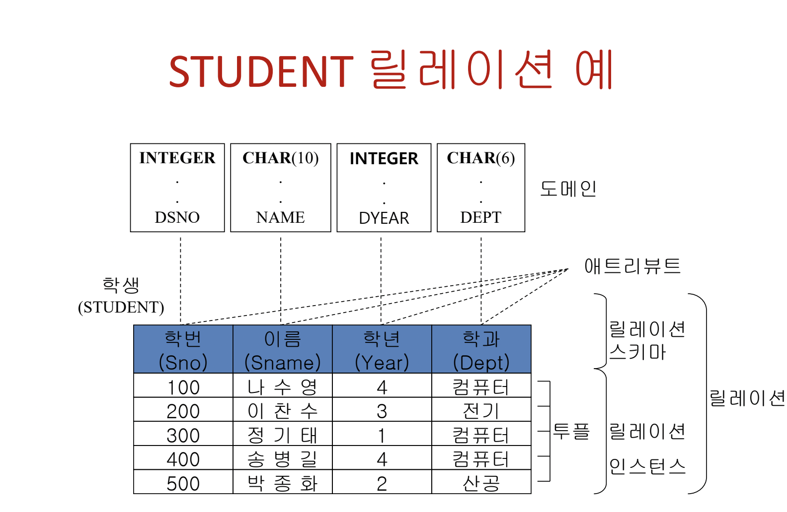
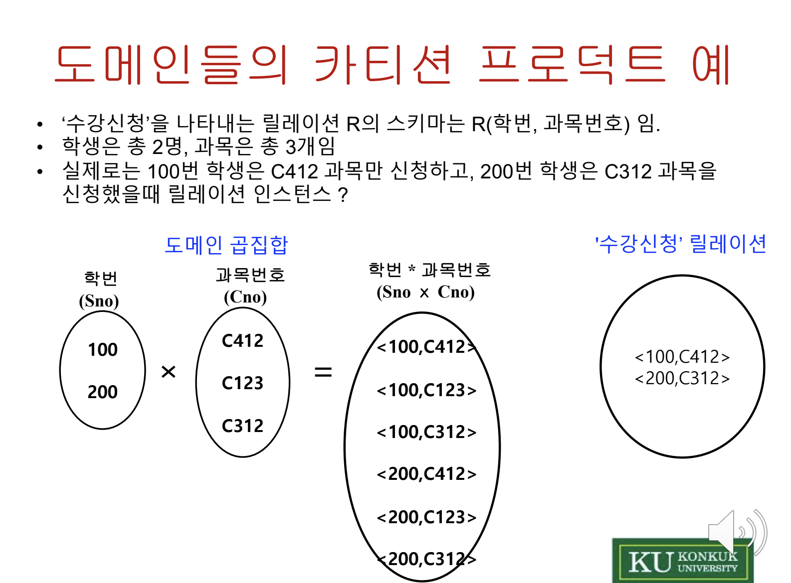
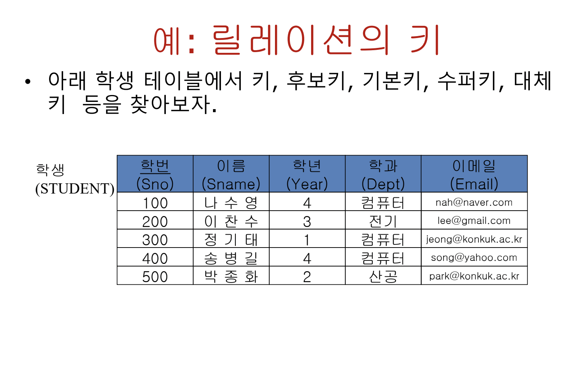

## Relational DB

### 관계 데이터 모델이란?

테이블들의 집합  
수학에서의 집합(set)과 릴레이션(relation)이론에 기초  
즉, 테이블 형태로 데이터를 저장한다. 테이블 = 릴레이션  
학생 테이블 예시

| 학번 | 이름   |
| ---- | ------ |
| 100  | 나수영 |

테이블의 Column 은 Attribue(Field)라 불린다.  
테이블의 Row 는 Tuple(Record)이라 불린다.

### Attribute and Domain

Domain은 Attribute가 취할 수 있는 값들의 집합이다.  
Attribute는 domain의 역할(role) 이름  
한 테이블 내에서 Attribute들은 모두 달라야 한다.  
Ex ) 학번이라는 Attribute의 domain은 3자리 숫자(type)라 할 때, 100~999까지의 값들이다.  
Domain의 종류  
단순 domain(simple domain) : attribute가 원자 값 (즉, 단 하나의 값)  
복합 domain(composite domain) : attribute가 여러 개의 값 (즉, 날짜라고 할 때, 연,월,일로 구성됨)

### Relation 정의 2가지 방법

1. Domain의 type 먼저 정의 한 후, Attribute를 정의 하는 방법
2. Domain의 정의를 건너뛰고, 곧 바로 Attribute의 type을 정의하는 방법

Ex) Student Relation  
첫 번째 방법 사용 시, 먼저 domain을 생성한 후, 그 type과 이름을 지정해 준다  
Attribute를 정의해 Relation Schema를 구축 한다. -> Attribute들에 맞게 데이터를 입력해 Tuple를 생성해 준다.

### Relation Schema

Attribute의 구조를 말한다. 즉, Relation Schema = a set of Attributes  
정적인 성질, 시간에 무관함을 지닌다.  
R(A1 ,A2, ..., An) Ai <=> Di 수학적 관계를 가진다.

### Relation instance

어느 한 시점에 Relation이 포함하고 있는 a set of Tuples 이다.  
{< V, V, ... , V > l V ∈ D} 수학적 관계를 가진다.  
동적인 성질, 삽입, 삭제, 갱신으로 시간에 따라 변화한다.

Relation = Relation Schema + Relation instance  
즉, Relation은 Domain들의 Cartesian product(곱집합)의 부분 집합이다.  
수학적 표현 : R ⊆ D1 x D2 x D3 x ... x Dn

### 차수(degree)와 Cardinality

릴레이션 차수는 릴레이션의 attribute 갯수  
릴레이션의 카디날리티는 투플의 갯수  
if 두 릴레이션을 곱집합할 때 차수는 두 차수의 합, 카디날리티는 두 카디날리티의 곱이다.

### Relation의 특성 vs Table 차이점

- 투플의 유일성 : 릴레이션은 투플의 집합이며, 이 투플들은 서로 다르다.(중복X)
- 투플의 무순서성 : 릴레이션 안 투플들은 순서 X(추상적, 주머니로 작성됨), 테이블은 구체적인 개념 (표로 작성됨)
- 애트리뷰트의 무순서성 : 릴레이션 스키마는 attribute들의 집합으로 순서성 X
- 애트리뷰트의 원자성(atomicity) : Attribute는 단일값만 존재(복수 값 X), NULL 값도 원자값(단일값)이다.

만약 학생 한명이 여러 전화 번호를 가지면 어떻게 릴레이션을 구성해야 할까?

1. 전화번호 Attribute 안에 전화번호를 ,(comma)로 분리해 2개를 넣는다. <--삽입 삭제 시, string operation이기에 비효율적
2. Attribute를 하나 더 추가해서 전화번호를 추가한다. <-- 만약 전화번호를 또 추가해야되면 attribute를 추가 & 검색 시 필드 2개
3. 전화번호 Table을 따로 만들어 관리한다.(학생 table을 정규화 릴레이션)
   이 중 3번 방법이 최적의 방법이다.

### 개념 정리.

관계 DB는 테이블의 집합, 시간에 따라 내용이 변할 수 있음  
관계 DB의 스키마 = 릴레이션 스키마 + 무결성 제약조건(개체 무결성 : 기본 키의 값은 유일 Null x, 참조 무결성 : 외래 키 값은 피참조 릴 레이션의 기본 키 값 or Null , 도메인 무결성 : attribute 값이 해당 도메인에 속한 값이어야 한다.)  
관계 DB는 집합 이론에 기초

- database : a set of tables
- Relation instance : a set of tuples
- Relation Schema : a set of Attributes

이러한 테이블 간의 관계를 이용해 다른 테이블을 만들 수 있다.  
마치 두 객체를 합쳐 또 다른 객체를 만드는 것과 비슷 하지만 객체 대신 Table임.  
ex) 학생 Table 과 강의 Table의 관계를 이용해 등록 Table 작성 가능.  
등록 Table이 학생 Table 과 강의 Table 간의 관계를 나타냄. 이는 외래 키, 기본 키가 연결고리

### Relation key

- Key
  릴레이션 안에서 각 투플을 유일하게 식별할 수 있는 Attribute의 집합
- 종류
  - 후보 키
    릴레이션의 Attribute 값이 유일성을 가지고, 투플을 구분하는데 필요한 최소한의 Attribute가 해당
  - 슈퍼 키
    유일성만 만족하는 키들의 집합
  - 기본 키
    후보 키들 중 지정된 하나의 키, 각 투플에 대한 기본 키는 항상 유효한 값이어야 한다.(NULL 값 X)
  - 대체 키
    후보 키들중 기본 키를 제외한 나머지 후보 키들

후보 키: 학번, 이메일  
슈퍼 키: 학번 & 이름,학년,학과,이메일 등  
기본 키: 학번 or 이메일 (후보 키들 중 하나 선택)  
대체 키: 후보 키 - 기본 키

외래 키(Foreign Key)  
R 릴레이션의 Attribute A가 S 릴레이션의 기본 키에 해당하면, A는 외래 키이다.  
R은 참조 릴레이션, S는 피참조 릴레이션  
ex) 등록 Table의 SNO는 학생 Table의 외래키  
외래 키의 값은 기본키에 존재하는 값이거나 NULL  
관계형 데이터 베이스에서는 기본 키와 외래 키에 의해서 개체(Entity)간의 관계를 유지한다.
