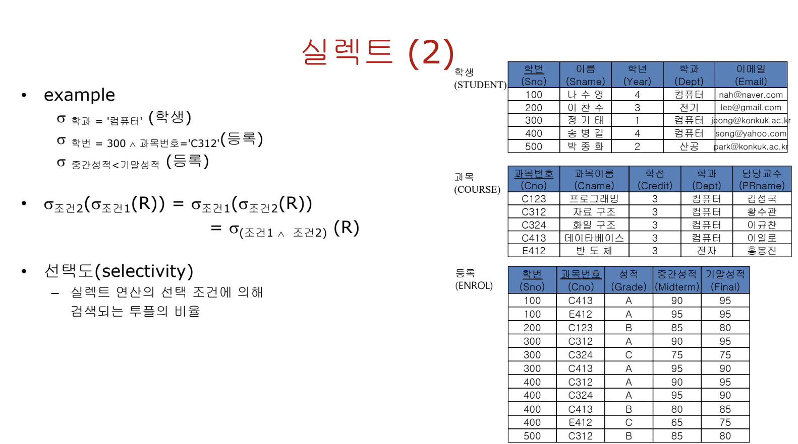
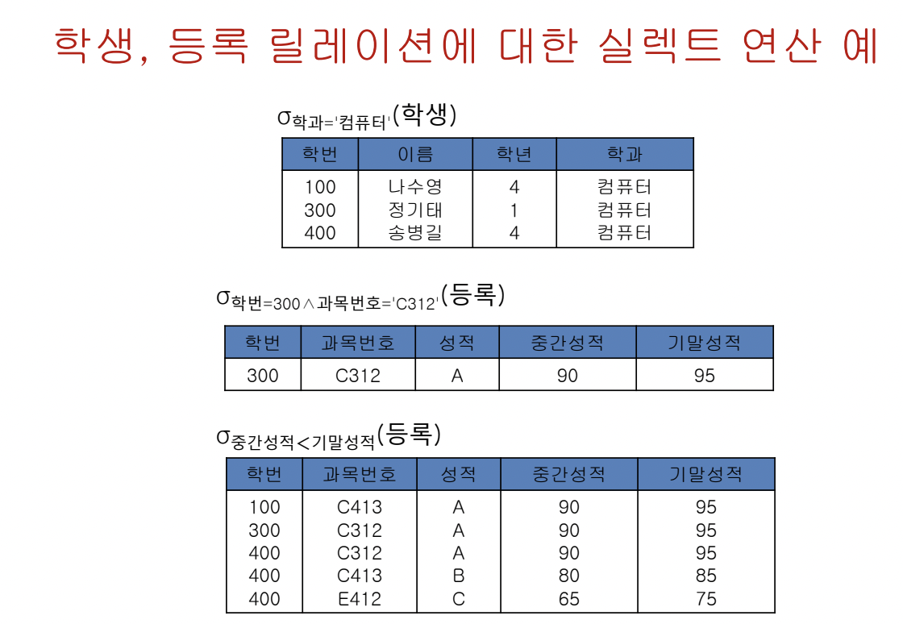
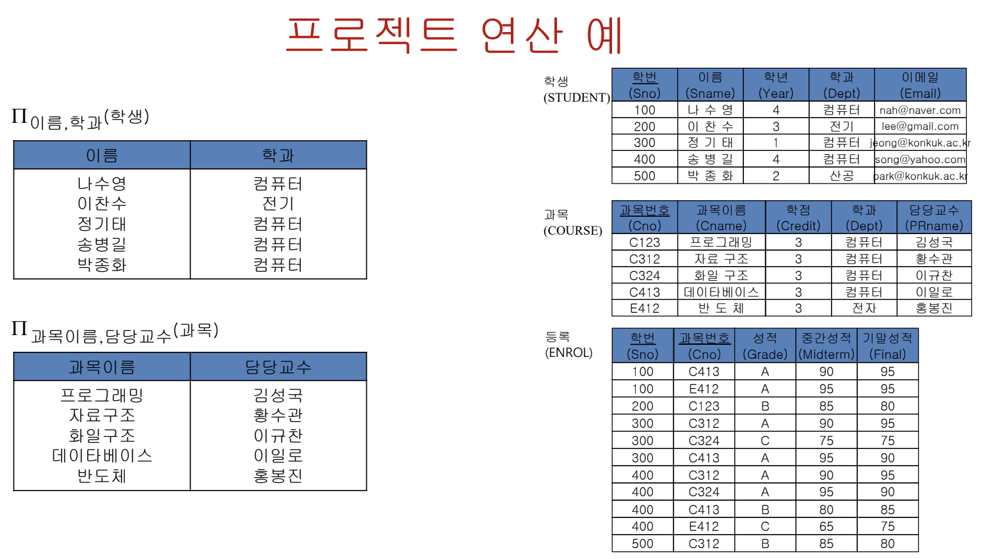
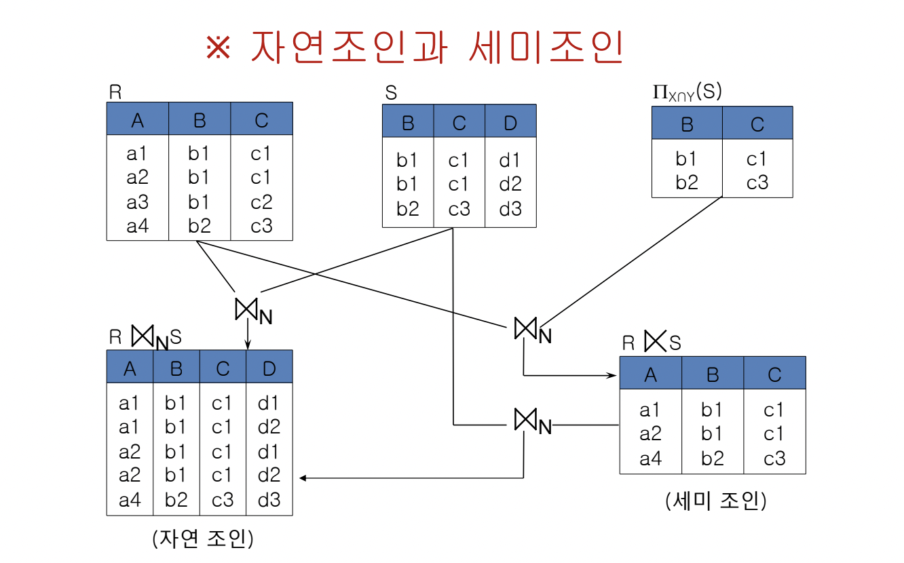
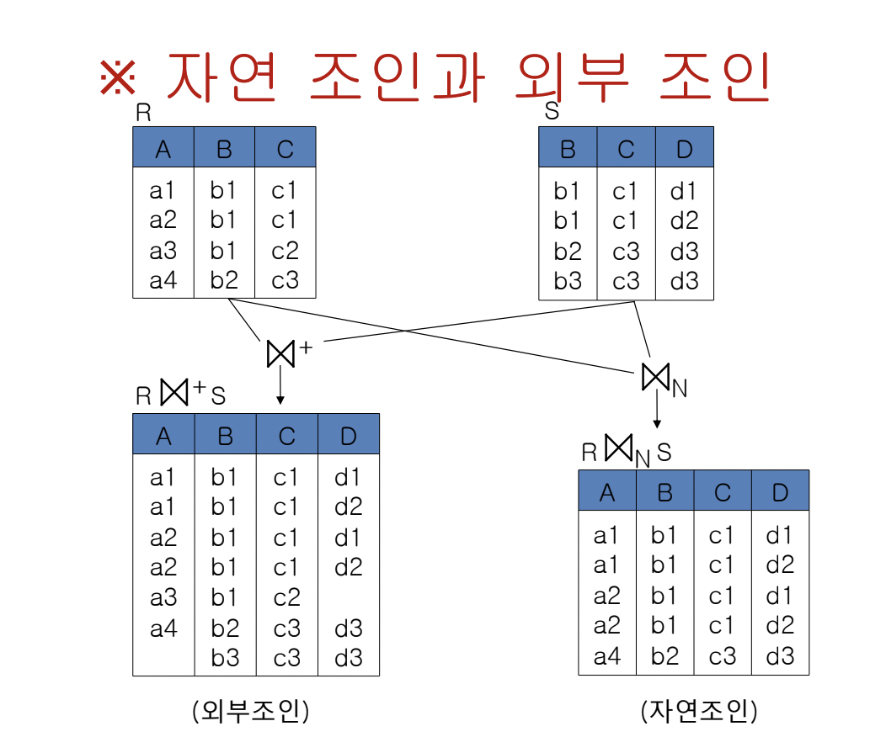
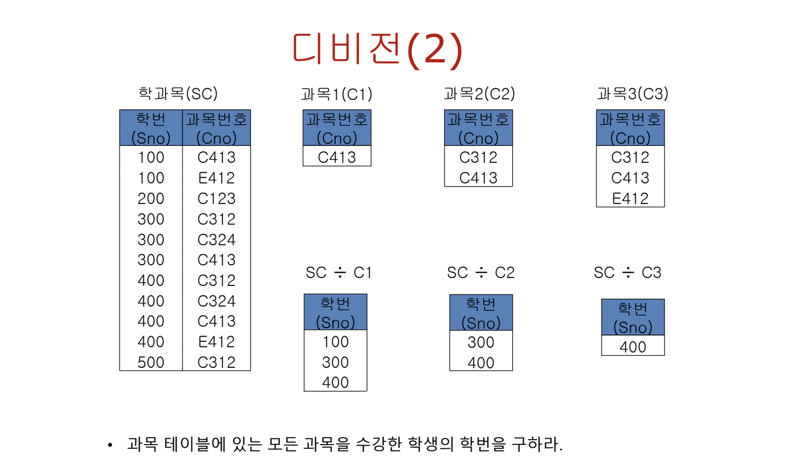
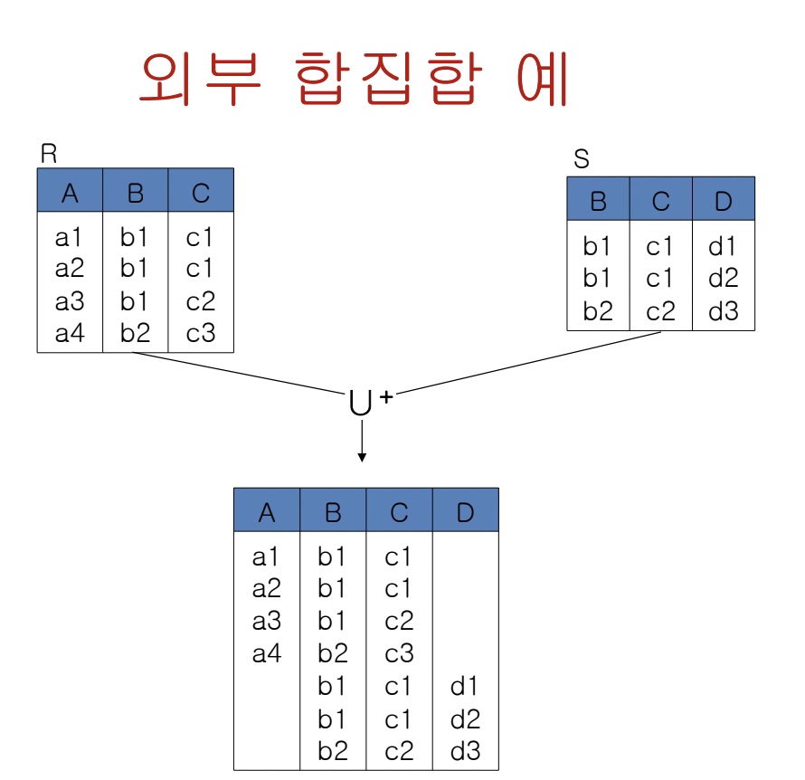

## 관계대수

관계형 데이터 베이스는 3단계로 구성된다.

1. 관계형 데이터 모델 (relation data model)
   릴레이션 개념(스키마,도메인,attribute,테이블,집합 등)
2. 관계 대수 (relational algebra)
   릴레이션으로 표현된 데이터에 대한 대수적인 연산  
   릴레이션에 대한 연산자로 구성됨.  
   데이터를 어떻게 조작할 수 있는지
3. 데이터 언어 (Data language)
   사용자가 데이터 베이스를 조작할 때 사용하는 언어 (Query Language)를 말한다.  
   정의(DDL), 제어(DML), 조작(DCL)로 구성되있다.  
   스키마 정의, 검색/삽입/수정/삭제, 백업/복원/접근 권한 제어 등  
   대표적으로 MySQL이 있다.

여기서 살펴볼 내용은 2번 관계 대수

### 관계 대수 연산자

- 집합 연산자
  - 합집합, 교집합, 차집합, 카티션 프로덕트
- 순수 관계 연산자 - SELECT, PROJECT, JOIN, DIVISION

폐쇄 성질을 가진다. 즉, 피연산자와 결과 모두 릴레이션 형태를 가지며, 중첩된 수식의 표현이 가능하다.

### 집합 연산자

∣ ∣ 는 a number of tuples 즉, cardinality이다.
합집합 (union, ∪) : ∣R ∪ S∣ ≤ ∣R∣+∣S∣, 같은 경우는 R과 S 사이에 교집합이 없는 경우
교집합 (intersect, ∩) : ∣R ∩ S∣ ≤ min{∣R∣, ∣S∣}, 같은 경우는 R과 S가 둘 중 하나가 다른 하나를 포함하는 경우
차집합 (difference, -) : ∣R - S∣ ≤ ∣R∣, 같은 경우는 교집합이 없는 경우
카티션 프로덕트 (cartesian product, ×) : ∣R x S∣ = ∣R∣ x ∣S∣ , 차수(attribute 개수) = R의 차수 + S의 차수

집합 연산자를 사용하기 위해 Union-compatible를 따져봐야 한다.  
합집합, 교집합, 차집합의 피연산자들은 서로

1. 차수(attr의 수)가 같아야 한다.
2. 대응 애트리뷰트 쌍 별로 도메인(data type)이 같아야 한다.

합집합, 교집합, 카티션 프로덕트는 결합 법칙, 교환 법칙 성립한다.

### 순수 관계 연산자

각 기호 문자 표현 의미

- 릴레이션 (스키마) : R(X) = R(A1, A2, A3 ... Ai), X는 Schema 즉 a set of attributes(A1, A2, A3 ... Ai)
- 투플 r : <a1, a2, a3 ... ai>
  릴레이션 R = { r l r = <a1, a2, a3 ... ai>} 즉, 릴레이션 instance R은 투플들의 집합
  ai : 투플 r에 대한 attribute Ai의 값  
  ai = r.Ai = r[Ai] 으로도 표현 한다.

#### SELECT ( 𝝈 )

릴레이션 R에 A,B attributes가 있을 때  
𝝈Aθⅴ(R) : A attribute에서 v 값을 갖는 튜플 선택  
𝝈AθB(R) : A와 B attributes를 갖는 튜플 선택  
여기서 θ는 비교연산자 { < > = ≤ ≥}를 포괄적으로 의미한다.  
SELECT 연산자는 input & output이 1개인 unary operator이다.  
따라서 연산 결과는 릴레이션의 수평적 부분집합이다.

Selectivity는 선택된 tuple의 수/ 전체 tuple의 수 이다. 여기서 등록 관련 선택도는 5/11

#### PROJECT ( ∏ )

unary operator, 결과로 수직적 부분집합을 가져 온다.  
테이블에서 원하는 attributes만 가져온다. 만약 원하는 attribute만 가져온 결과 테이블에 중복 값 존재하면 제거  
∏Y(∏X(R)) = ∏Y ( Y ⊆ X 일 때)

만약 ∏학과(학생) 일 경우 결과 릴레이션

| 학과   |
| ------ |
| 컴퓨터 |
| 전기   |
| 산공   |

중복된 값은 제거 됨을 확인 할 수 있다.

#### Join ( ⨝ )

연결된 데이터를 두 테이블로 분리하여 데이터의 중복성을 피하고, 필요할 때만 연결(Join)하여 사용 (관계형 데이터베이스 핵심 원리)  
R 테이블의 기본키 = S 테이블의 외래키이면 R과 S는 관계를 형성하고 있다고 볼 수 있다.  
Join은 이러한 관계가 있는 두 테이블을 서로 엮어 새로운 테이블을 만들어 낸다. binary operator (input 2 output 1)  
종류

- 세타조인
  R ⨝ AθBS = { r ∙ s | r ∊ R ∧ s ∊ S ∧ (r.A θ s.B) }  
  A,B : join attribute  
  θ : 비교연산자  
  결과 차수 = R 차수 + S 차수  
  R 릴레이션의 A attribute θ S 릴레이션의 B attribute를 조건으로 tuple들을 묶어 새로운 릴레이션 도출  
  Ex) 학생⨝ 학번=학번 등록 : 학생 릴레이션 학번 attribute = 등록 릴레이션 학번 attribute 조건으로 새로운 릴레이션 도출  
  두 릴레이션의 곱집합에서 θ 조건을 만족하는 tuple들만 모은 수평적 부분집합 의미.(연산 방법은 다를 수 있다.)

- 동일조인
  세타조인의 θ가 '='을 의미하는 경우에 해당한다.

- 자연조인 ( Natural join, inner join, ⨝ N )  
  동일 조인의 결과에서 중복되는 attribute를 제거 (기본키와 외래키가 같다는 조건으로 하기에 join시 중복되는 attribute 발생)  
  R ⨝ NS = ∏ X U Y (R ⨝ Z=ZS)

- 세미조인 ( ⋉ )  
  자연조인 결과 테이블에서 하나의 릴레이션의 attribute들로만 표현된 테이블이다.  
  R ⋉ S = ( ∏A(R ⨝ NS))
  R ⨝N S = ( R ⋉ S ) ⨝ N S = ( S ⋉ R ) ⨝ N R
  

- 외부조인 ( outer join, ⋈+ )  
  자연조인 결과에서 대응되지 않은 투플들 까지 null값을 포함하여 나타내어 주는 테이블을 가진다.  
  조인하는 두 릴레이션의 조인에 포함되지 않은 모든 tuple들을 나타낸 테이블은 full outer join  
  조인하는 두 릴레이션에서 왼쪽의 릴레이션의 조인에 포함되지 않은 tuple들을 나타내면 left outer join  
  " 오른쪽의 " right outer join이다.
  

#### Division ( ÷ )

한 릴레이션의 모든 tuple들과 짝을 이루는 다른 릴레이션의 tuple들을 구한다.  
R(X), S(Y) 두 릴레이션이 있을 때, (X,Y는 a set of attribute)  
Y ⊆ X 이고 D = X - Y라 하면 X = D U Y -> R(X) = R(D U Y)  
R ÷ S 는 R(D U Y)에서 S(Y)의 모든 투플과 짝을 이루는 R(D U Y)의 투플을 구하라는 의미.  
R ÷ S = { (t[a1, a2, ... an] U s) ∊ R ∧ ∀s ∊ S }  

R(X) 는 R(학번 U 과목번호), S(Y)는 S(과목번호)  
R ÷ S = R 릴레이션의 학번들(SC) 중 S 릴레이션에 있는 모든 과목번호(C)와 짝을 이루는 모든 투플들

#### 기본 연산과 복합 연산

- 기본 연산(Primitive operation) : 다른 연산으로 대체할 수 없는 하나의 논리적 기능을 가진 연산  
  합집합, 교집합, 곱집합, PROJECT, SELECT가 해당
- 복합 연산(Composite opeartion) : 기본 연산의 조합으로 대체 가능한 연산  
  교집합, 조인, 디비전 해당  
  교집합 RnS = R - ( R-S ) = S - ( S-R )  
  조인 R ⨝ AθBS = 𝝈AθB ( R x S )  
  디비전 R(A,B) ÷ S(B) = ∏A (R) - ∏A ((∏A (R) x S) - R)

#### 외부 합집합 ( outer-union, U + )

Union-compatible 하지 않는 릴레이션 간의 합집합  
애트리뷰트 수가 다르거나, 대응하는 애트리뷰트의 도메인이 다른 두 릴레이션  
두 릴레이션의 모든 애트리뷰트를 포함하는 릴레이션이다.  
외부 합집합 릴레이션에서 부족한 attribute 값은 null로 표기한다.

#### 집계 연산 (Aggregation)

릴레이션의 특정 attribute의 집계 값(Average, Sum 등)을 연산  
그룹연산(특정 attribute로 tuple들을 그룹화) 하여 집계연산을 수행 할 수도 있음.  
2가지 case, 집계연산만 하는 경우 와 그룹연산 후 집계 연산을 하는 경우

- 일반 형식 : GROUPAFUNCTIONB(E)  
   E : 릴레이션 혹은 관계 대수식  
   FUNCTION : 집계 함수 ( SUM, AVG, MAX, MIN, COUNT)  
   B : 집계 함수의 적용 대상 attribute  
   GROUP : 그룹 함수  
   A : 그룹 함수가 적용할 attribute

Ex)
만약 등록 테이블에서 성적 attribute의 평균 값을 계산한다.  
|Avg|
|---|
|성적들의 평균값|

학생 릴레이션의 tuple들을 학년별로 그룹화 한 후, 그룹에 대한 평균 성적

| 학년 | Avg                |
| ---- | ------------------ |
| 1    | 1학년 성적 평균 값 |
| 2    | 2학년 성적 평균 값 |
| 3    | 3학년 성적 평균 값 |
