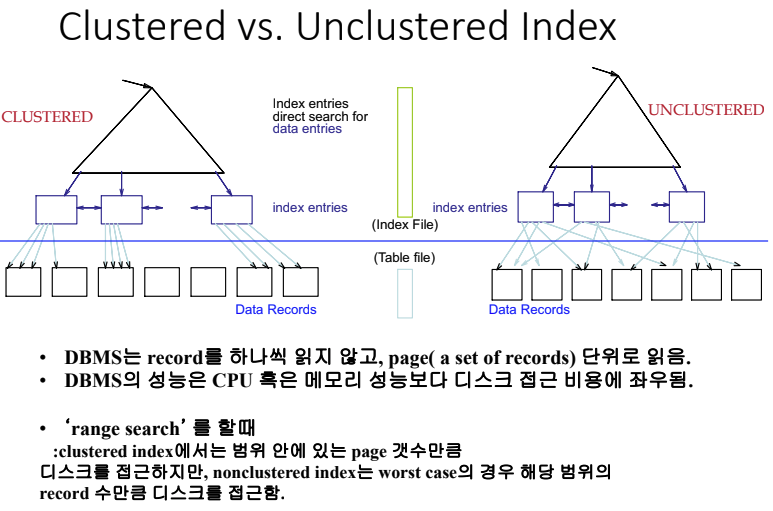
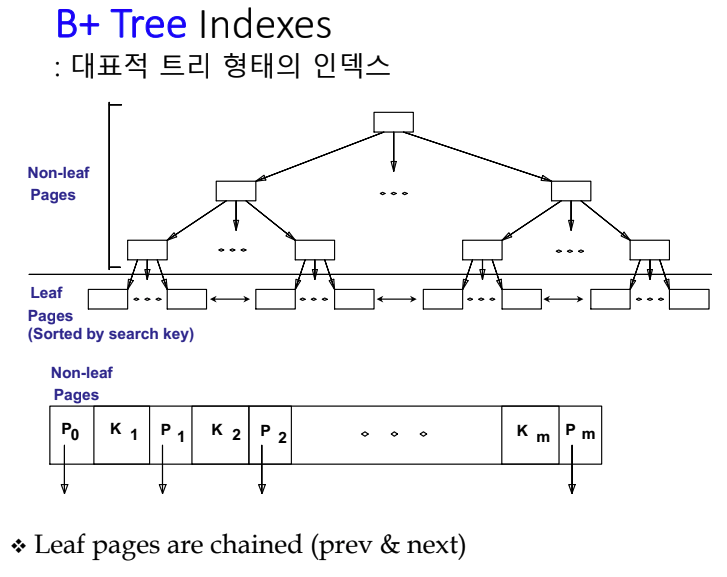

## Database Index

테이블에서 지정한 attr 값에 대하여 Tree or Hash 형태의 보조적인 저장도구로서 attr에 대한 검색을 빠르게 해주는 장치이다.

### 테이블의 물리적 저장 구조

- Heap file : 투플들이 무순서(random order)로 저장됨. 검색 시 Linear searching O(n) 삽입 시 O(1)
- Sorted file : 투플들이 테이블의 특정 Attribute 값의 순으로 정렬되어 저장된다. 검색 시 O(logn) <- Binary Search,

But 이 외 Attribute 값을 이용해 검색을 하면 Linear Search를 하게 되어 O(n)으로 회귀된다.
따라서 Index를 추가적으로 만들어줘 index에서 검색을해 투플을 찾게 할 수 있다.
효율적 검색을 위해서는 주요 Attribute에 대한 Indexing은 필수 요소이다.

### 데이터베이스 성능을 좌우하는 요소

데이터베이스 설계자 관점: 사용자가 결정할 수 있는 요소들

- 테이블의 저장구조: 레코드를 어떤 애트리뷰트 순으로 소팅해서 저장할지 여부 특정
  애트리뷰트에 대하여 대용량의 테이블을 파티션(table partitioning) 할지 여부 등

- 인덱스: 검색 성능. B-tree, Hash

DBMS 성능 관점: 실제 DBMS 프로그램 자체의 성능에 따른다. ex) Oracle의 SQL이 MySQL보단 성능 좋음

- 물리적연산자(physical operator): select, project, join, sort, grouping 등을 실제 구현하는 물리적 연산자의 활용
- 질의최적화(query optimization): 사용자의 질의를 실행가능한 최적화된 형태의 질의수행계획(query execution plan)으로 변환

### Type of Index

- Primary index : index key가 primary key를 포함하는 경우, 테이블에 단 하나의 Primary index 존재
- Secondary(Unique) index : 어떤 Unique한 Attribute에 대한 Index
- Clustered index : data record가 정렬된 순과 index의 순이 동일한 Index
- unClustered index : data record의 index 순서와 실제 저장된 순서가 다른 Index

  
Clustered index의 경우 한 Page 안에 record가 정렬되어 있어 적은 Page 읽는 횟수로 Data Search 가능  
Unclustered index의 경우 record가 unordered로 worst case의 경우 record 수 만큼 Page를 읽어야 하는 경우 발생

### B+ Tree

  
B+ Tree 특징

- Tree는 항상 Balanced되어 있다.
  - 삽입 삭제 후에 균형 유지를 위해 node split/merge 수행
- O(logFM)의 효율적인 탐색, 삽입, 삭제
  - F: fanout, 노드의 child pointer 갯수 의미
- Tree의 depth가 데이터 갯수에 비례하여 서서히 커지도록 설계됨
  - Root와 Leaf를 제외한 internal nodedml fanout이 최소 F/2개, 최대 F개가 되도록 한다.
- Leaf 노드 간의 양방향 연결 구조 : 같은 Leaf Level 노드들간의 순차탐색이 가능
- Range Query를 사용할 때 좋음.

### Hash Based Indexes

- Equality Search에 특화 ex) '홍길동' 인 이름을 가지는 학생
- Bucket들 안에 index entry들을 가지고 있다.
- Hash func h (r) : record r이 저장되는 bucket을 가져옴, h(r)은 search key r을 가지는 record 찾는다.

Static hashing -> bucket들의 수가 고정적으로, overflow 발생 가능성 올라가도 Rehashing 발생 x
hash code에 따라 저장되기에 range search(Sequential Search)를 사용할 수 없다.

### Create index SQL Statement

```
create index IndexName on TableName(AttributeName)
//예시
create index idx_studuent_sname on student(saname) // Student 테이블의 sname Attribute에 대한 인덱스 생성 예
```

- Where 조건문에 자주 사용되는 Attribute에 대한 Index가 효율적이다.
  Exact Match 조건 경우 hash index 형태가 강점을 가진다.
  Range Query 경우 B+ Tree 형태가 강점을 가진다. 특히 Clustering은 Range Query에 큰 도움이 되는데, 이는 많은 중복된 결과를 가지는 Equality Query에 사용의 경우 좋다.
- Multi-Attribute Search가 자주 실행될 경우 여러 Attribute를 같이 묶는 indexing이 효율적이다.

```
Select *
From student
Where name= 'Hong' and dept ='CE'
//이러한 경우 Hong을 만족하는 name을 먼저 검색한 후 CE를 만족하는 dept를 검색하는 2번의 Select 절차를 거친다.
//따라서 두 조건을 묶어 하나의 Index로 나타내면 2번 -> 1번으로 절차를 간소화 가능하다.
```

- Join이 자주되는 Attribute의 경우 Index를 만들어 Index를 Join하게 하면 더 효율적으로 Join query를 실행 가능하다.
- 최대한 많은 Query들 사용에 이득이 될 수 있는 index를 선정한다.
- 테이블 당 하나의 index만 clustered 될 수 있기에, 가능한 제일 중요한 query들 기반으로 index를 clustering 한다. MySQL의 경우 알아서 Primary Key(기본키)를 Clustering하여 따로 설정 불가능.

### Index for query performance

- Exact match query

```
Select *
From student
Where name = 'Hong'
```

- Range query

```
Select *
From student
Where name > 'Hong'

//또 다른 케이스들
UnitPrice > 3.975
LastName Like 'Brown%'
```

Index를 활용할 수 없는 조건

```
Select *
From student
Where name like '%Hong%'

//또 다른 케이스들
ABS(ProductID) = 771 // 함수가 결합된 표현 안됨
UnitPrice +1 < 3.975 // 연산이 들어간 표현 안됨
UPPER(LastName) = 'Allen' // 함수가 결합된 표현 안됨.
```

'Hong'이란 Substring을 가지면 조건을 만족하게 된다. 이와 같은 경우 'Hong'이란 단어가 앞 뿐아니라 중간, 뒤 어느 위치에나 존재할 수 있기에 Index 불가, Full Text 검색을 해야한다.

### Index 성능 확인

항상 Index를 사용한다고 해서 무조건 Query 성능이 좋아지지 않는다.

```
Select E.dno
From Emp E
Where E.age > 40
```

이와 같은 Query의 경우

- Tree or hashing? Tree가 더 이득, Range Query이기에
- Range Query -> B+ Tree를 기반으로 index 작성
- 고려할 점들
  - 조건이 얼마나 선택적이냐?
  - 만약 90% tuple들의 나이가 40이상 이면 선택도가 너무 낮기 때문에 E.age에 Index는 큰 의미가 없다.
  - 만약 10% tuple들의 나이가 40이상 이면 Clustered의 경우 good! Unclustered 경우 10% 해당 되는 tuple들 전부 접근하려고 Page 전체를 scan할 수 있기에 차라리 Table을 다 scan하는게 더 나을 수도 있다.
