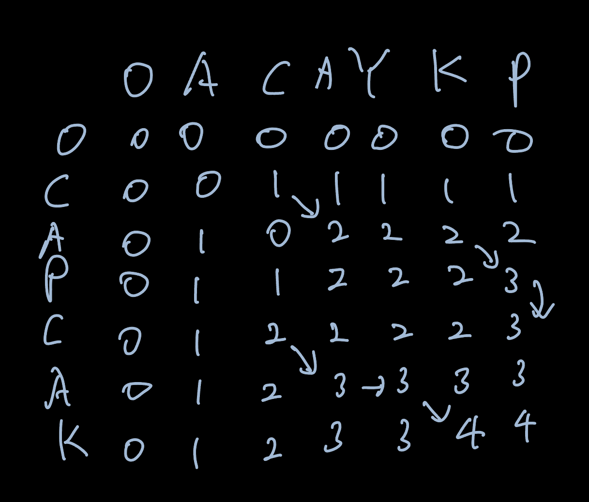

## 문제

| 시간 제한 | 메모리 제한 |
| --------- | ----------- |
| 2 초      | 256 MB      |

LCS(Longest Common Subsequence, 최장 공통 부분 수열)문제는 두 수열이 주어졌을 때, 모두의 부분 수열이 되는 수열 중 가장 긴 것을 찾는 문제이다.

예를 들어, ACAYKP와 CAPCAK의 LCS는 ACAK가 된다.

### 입력

첫째 줄과 둘째 줄에 두 문자열이 주어진다. 문자열은 알파벳 대문자로만 이루어져 있으며, 최대 1000글자로 이루어져 있다.

### 출력

첫째 줄에 입력으로 주어진 두 문자열의 LCS의 길이를 출력한다.

## 풀이

두 문자열을 나열한 2D 배열을 만들고 아래와 같은 규칙을 통해 값을 할당하면 두 문자열 사이의 LCS를 구할 수 있다.

1. 두 문자열의 문자가 일치할 경우 왼쪽 대각선 방향에 있는 값 +1을 할당한다.
2. 두 문자열의 문자가 일치하지 않을 경우 왼쪽 또는 위에 있는 값 중 더 큰 값을 할당한다.

위 과정을 거친 후 가장 오른쪽 하단에 있는 값이 LCS이다.
{: w="500" h="300" }

```python
stringOne = input()
stringTwo = input()

dp = [[0] * (len(stringOne) + 1) for _ in range(len(stringTwo) + 1)]

for i in range(1, len(stringTwo) + 1):
    for j in range(1, len(stringOne) + 1):
        if stringTwo[i - 1] == stringOne[j - 1]:
            dp[i][j] = dp[i - 1][j - 1] + 1
        else:
            dp[i][j] = max(dp[i - 1][j], dp[i][j - 1])

print(dp[len(stringTwo)][len(stringOne)])

```

## 시간 복잡도

두 문자열을 2D array로 만들어 모든 칸을 한번 씩 계산하기에 O(len(stringOne)+1 \* len(stringTwo)+1)이 된다. 문자열을 최대 1000이기에 최종적으로 1001<sup>2</sup> 번의 계산을 수행하게 된다.

## 공간 복잡도

2D array의 크기는 1001<sup>2</sup> \* 4Byte이 되게 된다. 따라서 대략 4\*10<sup>6</sup>Byte 가 나오게 된다.

## 어려웠던 부분

LCS를 계산하는 알고리즘을 모른다면 틀릴 수 밖에 없기에 문제에 따라서 적절히 적용할 줄 알아야 한다.
만약 문제에서 dp를 요구하고 주어지는 두 문자열을 같게 만드는 최소 수정 횟수를 물어볼 경우 LCS를 떠올릴 수 있다.
