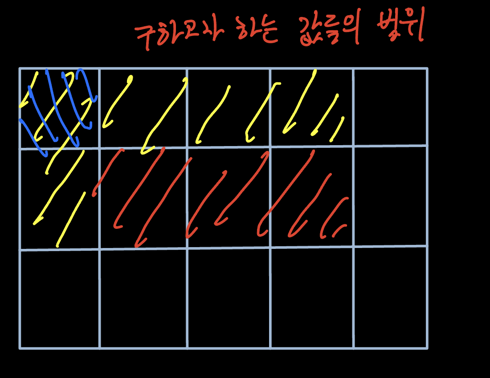

## 문제

| 시간 제한 | 메모리 제한 |
| --------- | ----------- |
| 2 초      | 512 MB      |

네모 왕국의 왕인 진경대왕은 왕국의 영토를 편하게 통치하기 위해서 1X1의 단위 구역을 여러 개 묶어서 하나의 거대 행정구역인 주지수(州地數, 마을의 땅을 셈)를 만들 예정이다. 진경대왕은 주지수를 만들기 위해서 일정한 직사각형 범위 내에 살고 있는 사람 수를 참고 자료로 쓰고 싶어한다.

진경대왕은 굉장히 근엄한 왕이기 때문에 당신에게 4개의 숫자로 직사각형 범위를 알려줄 것이다.

예를 들어, 위와 같이 사람이 살고 있다고 가정할 때 <그림 1>의 직사각형 범위의 사람 수를 알고 싶다면 진경대왕은 네 개의 정수 1 1 3 2를 부를 것이다. 마찬가지로 <그림 2>는 1 1 1 4, <그림 3>은 1 1 4 4가 될 것이다.

진경대왕을 위하여 이 참고 자료를 만들어내는 프로그램을 작성해보자.

### 입력

첫째 줄에 영토의 크기 N, M(1 ≤ N, M ≤ 1,024)이 주어진다.

다음 N개의 줄에는 M개의 정수로 단위 구역 내에 살고 있는 사람 수가 주어진다. 각 단위 구역 내에 살고 있는 사람 수는 100명 이하이며, 각 단위 구역 별 최소 1명의 사람은 살고 있다.

그 다음 줄에는 진경대왕이 인구 수를 궁금해하는 직사각형 범위의 개수 K(1 ≤ K ≤ 100,000)가 주어진다.

다음 K개의 줄에는 네 개의 정수로 직사각형 범위 x1, y1, x2, y2가 주어진다(x1 ≤ x2, y1 ≤ y2).

### 출력

K개의 줄에 순서대로 주어진 직사각형 범위 내에 살고 있는 사람 수의 합을 출력한다.

## 풀이

빠르게 계산을 수행하기 위해 행렬에 존재하는 값들을 더해 누적한 값들을 저장하는 배열 dp를 만든다.  
먼저 행에 대한 덧셈 누적 값들을 계산하여 값을 dp에 저장한다.  
그리고 나서 dp에 저장된 값들을 열에 따라 누적한다. 그러면 아래와 같이 결과가 누적되게 된다.  
dp[i][0]에는 행렬에 [0][0]에서 [i][0]의 값들의 합이 저장된다.  
dp[i][1]에는 행렬에 [0][0]에서 시작해 dp[i][1]까지의 값들의 합이 저장된다.

이제 구하고자 하는 값의 구간이 주어지면 아래 그림과 같이 계산하면 된다.
{: w="500" h="300" }

빨강 부분을 계산하기 위해서 dp[1][3]의 값에서 dp[1][1]과 dp[0][3]의 값을 뺀다.  
dp[1][1]과 dp[0][3]에서 중복되는 부분인 dp[0][0]이 중복되어 빠졌기에 dp[0][0]을 다시 더한다.  
최종적으로 원하는 값의 범위를 dp를 활용해 빠르게 계산할 수 있다.

```python
N, M = map(int, input().split())
board = [list(map(int, input().split())) for _ in range(N)]
dp = [[0] * M for _ in range(N)]

for i in range(N):
    for j in range(M):
        if j == 0:
            dp[i][j] = board[i][j]
        else:
            dp[i][j] = dp[i][j - 1] + board[i][j]

for i in range(1, N):
    for j in range(M):
        dp[i][j] += dp[i - 1][j]

K = int(input())
results = []
for _ in range(K):
    x1, y1, x2, y2 = map(int, input().split())
    result = dp[x2 - 1][y2 - 1]
    if y1 != 1:
        result -= dp[x2 - 1][y1 - 2]
    if x1 != 1:
        result -= dp[x1 - 2][y2 - 1]
    if y1 != 1 and x1 != 1:
        result += dp[x1 - 2][y1 - 2]

    results.append(result)

for result in results:
    print(result)
```

## 시간 복잡도

먼저 행에 대한 값을 누적하면서 행렬의 모든 값을 한번 씩 접근한다.  
그 다음 누적된 값을 다시 열에 대해 누적하기 위해서 모든 값을 한번 씩 접근한다.  
출력 값을 계산하는 과정은 상수로 나타낼 수 있기에 최종적으로 O(2\*N\*M)이 나오게 된다.

## 공간 복잡도

N\*M을 저장하는 배열 두 개를 가지기에 10<sup>6</sup>\*4Byte의 공간을 두 번 사용하게 된다.

## 어려웠던 부분

행을 누적한 값을 저장하여 원하는 값의 범위를 계산하는 방법을 떠올렸지만 이후 누적된 값을 다시 열에 대해 누적하여 더 빠른 계산을 수행할 수 있는 아이디어를 놓쳤다.
